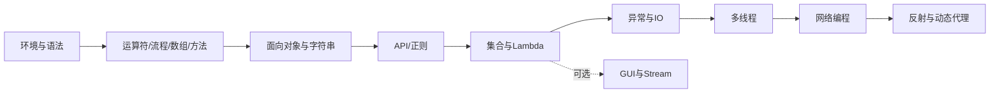
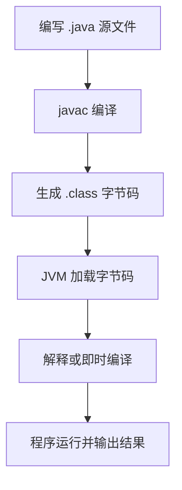

# Java 零基础学习总纲

## 1. 学习目标

完成本套笔记后，你应该能够：

- 使用 JDK 和 IDEA 创建、编译、运行 Java 程序。
- 独立完成变量、分支、循环、数组、方法和类的练习。
- 使用面向对象思想组织代码，理解封装、继承和多态。
- 使用集合、异常、IO 和常用 API 完成小型程序。
- 读懂基础的多线程、网络、反射和动态代理代码。

本套资料来自原笔记的 22 个章节，按“先核心、后拓展”重新归类。GUI、网络、反射和动态代理不影响前面核心内容的学习，可在核心 Java 学完后再阅读。

## 2. 原章节归类

| 新文档 | 对应原章节 | 学习定位 |
| --- | --- | --- |
| [01-开发环境与基础语法](./01-开发环境与基础语法.md) | 一、Java基础；二、Java基础语法 | 核心 |
| [02-运算符流程控制数组与方法](./02-运算符流程控制数组与方法.md) | 三、运算符；四、流程控制语句；五、数组；六、方法 | 核心 |
| [03-面向对象与字符串](./03-面向对象与字符串.md) | 七、面向对象；八、字符串；九、接口和内部类 | 核心 |
| [04-常用API与正则表达式](./04-常用API与正则表达式.md) | 十、常用API；十一、正则表达式 | 核心 |
| [05-数据结构Lambda与集合](./05-数据结构Lambda与集合.md) | 十二、数据结构和Lambda表达式；十三、集合 | 核心 |
| [06-GUI与Stream函数式编程](./06-GUI与Stream函数式编程.md) | 十四、GUI图形化界面；十五、Stream流；十六、方法引用 | 拓展 |
| [07-异常与IO流](./07-异常与IO流.md) | 十七、异常；十八、IO流 | 核心 |
| [08-多线程与网络编程](./08-多线程与网络编程.md) | 十九、多线程；二十、网络编程 | 进阶 |
| [09-反射与动态代理](./09-反射与动态代理.md) | 二十一、反射；二十二、动态代理 | 拓展 |

## 3. 推荐阅读顺序

建议每读完一个分类就完成一个小练习：计算器、学生管理、通讯录、文件复制、文本统计、简单聊天室。练习的重点是把前一阶段的概念组合起来，而不是追求代码量。

## 4. Java 程序运行流程

JDK 提供开发工具，JRE 提供运行环境，JVM 负责执行字节码。现代 JDK 通常将 JRE 的组件一起提供，因此学习时重点掌握 JDK、`javac`、`java` 和 IDEA 的使用即可。

## 5. 阶段检查清单

### 阶段一：能运行程序

- 能解释 JDK、JRE、JVM 的关系。
- 能用命令行和 IDEA 运行 HelloWorld。
- 能正确声明变量并进行键盘输入。

### 阶段二：能解决基础问题

- 能用分支和循环完成计算、统计和菜单程序。
- 能用数组保存一组数据，并完成遍历、查找和排序。
- 能把重复代码提取为方法。

### 阶段三：能组织程序

- 能设计类、对象和构造方法。
- 能使用封装、继承、多态和接口。
- 能正确比较字符串并使用 `StringBuilder`。

### 阶段四：能处理数据和文件

- 能选择合适的 `List`、`Set` 或 `Map`。
- 能用异常保证程序不会因单次输入错误而直接退出。
- 能读写文本和二进制文件。

### 阶段五：理解进阶机制

- 能解释线程安全、线程池和 TCP 通信的基本流程。
- 能看懂通过反射获取成员并调用方法的代码。
- 能说明动态代理如何在调用前后增加公共逻辑。

## 6. 笔记使用方法

1. 先阅读概念和对比表，再手敲最小示例。
2. 修改示例中的变量、条件和输入，观察结果变化。
3. 每个小节结束后合上笔记，用自己的话复述核心规则。
4. 遇到 API 时优先查方法签名、参数、返回值和异常，而不是死记代码。
5. 练习遇到错误时，先阅读编译器报错，再定位到最小可复现代码。

## 7. 总结

Java 入门的主线是：语法表达问题，方法拆分问题，面向对象组织问题，集合和 IO 处理数据，异常和多线程提高程序可靠性。网络、反射和动态代理建立在这条主线上，适合最后学习。
