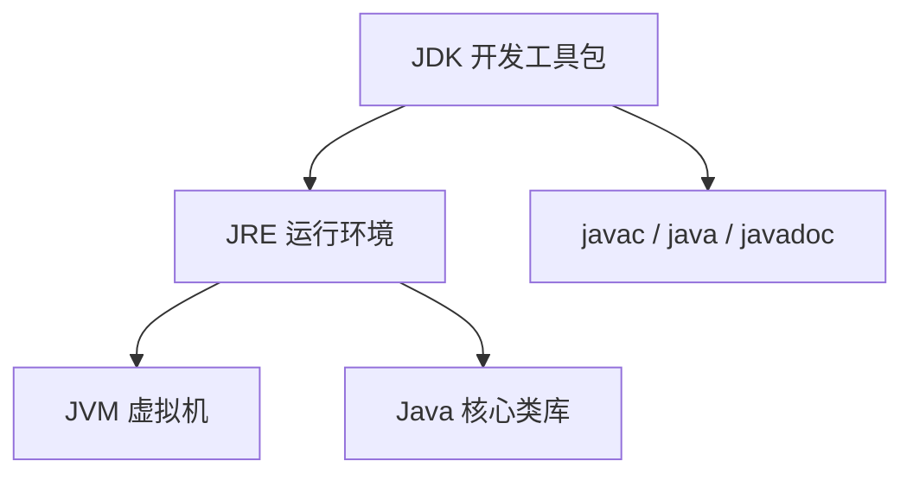

# 开发环境与基础语法

本篇整理原笔记第一、二章，目标是让初学者能创建并运行第一个 Java 程序。

## 1. JDK、JRE 和 JVM

| 名称 | 作用 |
| --- | --- |
| JVM | 执行 Java 字节码的虚拟机 |
| JRE | JVM 加 Java 核心类库，用于运行程序 |
| JDK | JRE 加编译器、调试器等开发工具 |



学习时安装一个长期支持版本（如 JDK 17 或 JDK 21）即可。安装路径建议不包含空格和中文。

## 2. 命令行和环境变量

常用 CMD 命令：

| 命令 | 作用 |
| --- | --- |
| `盘符:` | 切换盘符 |
| `dir` | 查看当前目录 |
| `cd 目录` | 进入目录 |
| `cd ..` | 返回上一级 |
| `cd \` | 返回当前盘符根目录 |
| `cls` | 清屏 |
| `exit` | 退出 CMD |

验证安装：

```bash
java -version
javac -version
```

`JAVA_HOME` 指向 JDK 根目录，`Path` 中加入 `%JAVA_HOME%\bin`。在 CMD 中输入命令时，系统会先搜索当前目录，再按 `Path` 顺序搜索。

## 3. HelloWorld

文件名必须与 `public class` 后面的类名一致：

```java
public class HelloWorld {
    public static void main(String[] args) {
        System.out.println("Hello, Java!");
    }
}
```

在文件所在目录执行：

```bash
javac HelloWorld.java
java HelloWorld
```

编译阶段将源代码转换为字节码，运行阶段由 JVM 加载并执行字节码。

## 4. IDEA 基本概念

- Project：一个完整工程。
- Module：工程中的功能模块。
- Package：用于组织类的命名空间，通常使用小写英文。
- Class：Java 源代码中的类文件。

创建类后，使用包含 `main` 方法的类作为程序入口。IDEA 的运行按钮会自动完成编译和启动，命令行流程仍然值得掌握，因为它能帮助定位环境问题。

## 5. 注释

```java
// 单行注释
/* 多行注释 */
/* 文档注释可配合 javadoc 使用 */
```

注释用于解释意图、限制和关键决策，不要重复描述显而易见的代码。

## 6. 变量和数据类型

变量声明格式：

```java
数据类型 变量名 = 初始值;
```

基本数据类型：

| 类型 | 示例 | 说明 |
| --- | --- | --- |
| `byte` | `byte n = 10;` | 1 字节整数 |
| `short` | `short n = 10;` | 2 字节整数 |
| `int` | `int n = 10;` | 常用整数 |
| `long` | `long n = 10L;` | 大整数，字面量加 `L` |
| `float` | `float n = 1.2F;` | 单精度小数 |
| `double` | `double n = 1.2;` | 双精度小数 |
| `char` | `char c = 'A';` | 单个字符 |
| `boolean` | `boolean ok = true;` | `true` 或 `false` |

引用类型保存对象的引用，例如 `String`、数组和自定义类。字符串使用双引号，字符使用单引号。

## 7. 标识符和命名

硬性规则：不能以数字开头，不能使用关键字，区分大小写，只能包含字母、数字、下划线和美元符号。

建议规范：

- 类名、接口名使用大驼峰：`StudentManager`。
- 变量名、方法名使用小驼峰：`studentCount`。
- 常量使用全大写下划线：`MAX_RETRY`。
- 名称表达含义，避免 `a1`、`test2` 这类无意义命名。

## 8. 键盘录入

```java
import java.util.Scanner;

public class InputDemo {
    public static void main(String[] args) {
        Scanner scanner = new Scanner(System.in);
        System.out.print("请输入姓名：");
        String name = scanner.nextLine();
        System.out.print("请输入年龄：");
        int age = scanner.nextInt();
        System.out.println(name + " 今年 " + age + " 岁");
    }
}
```

`nextInt()` 后继续调用 `nextLine()` 时，要注意残留换行符；初学阶段可以统一使用 `nextLine()` 再进行类型转换。

## 9. 总结

本篇的最低目标是：安装 JDK，理解源代码、字节码和 JVM 的关系，能使用 IDEA 或命令行运行程序，并正确声明变量、输入数据和命名。
