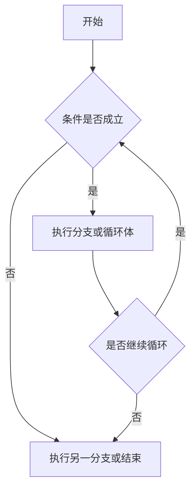
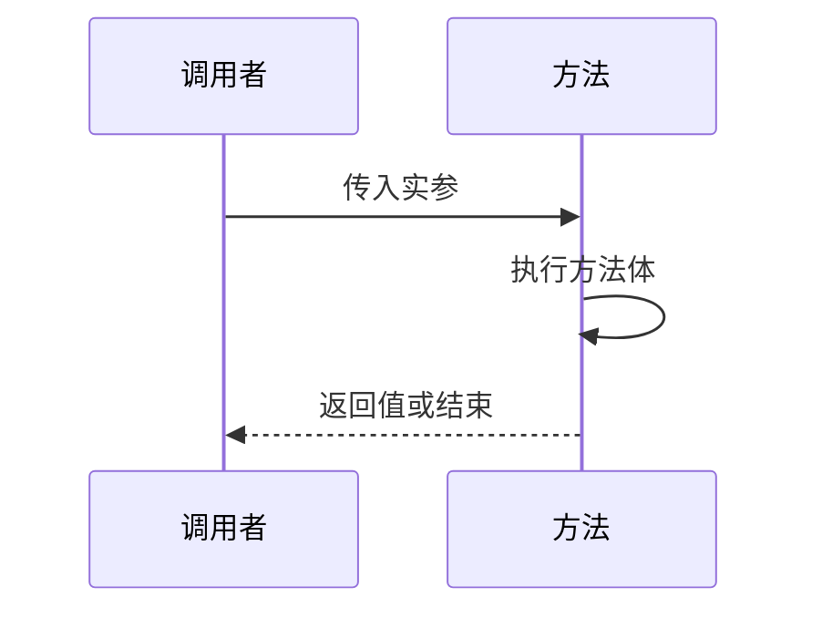

# 运算符、流程控制、数组与方法

本篇整理原笔记第三至六章，是把语法用于解决问题的核心部分。

## 1. 运算符

### 1.1 算术与赋值

`+`、`-`、`*`、`/`、`%` 用于数值计算。整数相除仍是整数，想保留小数需要至少一个操作数为浮点数。

```java
int total = 7;
int count = 2;
double average = total / (double) count;
```

`++` 和 `--` 会使变量加一或减一；`a++` 先取值再加一，`++a` 先加一再取值。`+=`、`-=` 等扩展赋值会隐含类型转换。

### 1.2 比较与逻辑

`==`、`!=`、`>`、`>=`、`<`、`<=` 产生布尔结果。`&&` 表示并且，`||` 表示或者，`!` 表示取反。短路运算会在结果已确定时跳过右侧表达式，因此右侧不应放必须执行的副作用操作。

### 1.3 三元和类型转换

```java
String result = score >= 60 ? "及格" : "不及格";
```

自动转换一般遵循“范围小的类型转为范围大的类型”。强制转换可能丢失精度：

```java
double price = 19.9;
int integerPrice = (int) price;
```

### 1.4 字符串拼接

只要 `+` 两边有一个是字符串，就会按字符串拼接。需要比较内容时使用 `String.equals`，不要用 `==` 比较两个字符串对象。

## 2. 流程控制



### 2.1 条件判断

```java
if (age < 18) {
    System.out.println("未成年");
} else if (age < 60) {
    System.out.println("成年人");
} else {
    System.out.println("老年人");
}
```

`switch` 适合根据一个表达式的离散值选择分支。每个分支通常使用 `break` 防止继续执行后续分支；新版本也可以使用箭头语法。

### 2.2 循环

```java
for (int i = 1; i <= 5; i++) {
    System.out.println(i);
}

int i = 1;
while (i <= 5) {
    System.out.println(i++);
}
```

`do...while` 至少执行一次。`break` 结束当前循环，`continue` 跳过本轮剩余代码。设计无限循环时必须提供明确的退出条件。

### 2.3 随机数

```java
import java.util.Random;

Random random = new Random();
int value = random.nextInt(100); // 0 到 99
```

## 3. 数组

数组保存固定长度、相同类型的元素，索引从 0 开始。访问越界会抛出 `ArrayIndexOutOfBoundsException`。

```java
int[] scores = {80, 92, 76};
for (int score : scores) {
    System.out.println(score);
}
```

动态初始化会得到默认值：整数为 0，浮点数为 0.0，布尔值为 `false`，引用为 `null`。

二维数组本质上是数组的数组：

```java
int[][] matrix = {
    {1, 2},
    {3, 4}
};
for (int[] row : matrix) {
    for (int value : row) {
        System.out.print(value + " ");
    }
    System.out.println();
}
```

需要动态增删元素时，优先考虑集合而不是反复创建新数组。

## 4. 方法

方法用于封装一个可复用的行为：

```java
public static int add(int left, int right) {
    return left + right;
}
```

调用时，实参按顺序传给形参。基本类型传递的是值；引用类型传递的是引用值，方法可以修改引用对象的内容，但不能让调用者的变量指向另一个对象。



方法重载要求同一类中方法名相同、参数列表不同；仅返回值不同不能构成重载。

## 5. 总结

解决基础题时可以按“输入数据 -> 判断或循环 -> 数组保存 -> 方法拆分 -> 输出结果”的顺序设计。先画出流程，再写代码，能明显减少条件和边界错误。
