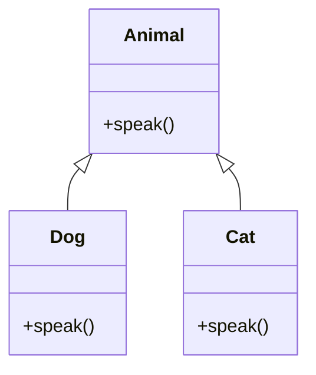

# 面向对象与字符串

本篇整理原笔记第七至九章，重点是用类和对象表达现实中的数据与行为。

## 1. 类和对象

类是对象的模板，对象是类创建出来的实例。成员变量描述状态，成员方法描述行为。

```java
public class Student {
    private String name;
    private int age;

    public Student(String name, int age) {
        this.name = name;
        this.age = age;
    }

    public void introduce() {
        System.out.println(name + "，" + age + " 岁");
    }
}
```

```java
Student student = new Student("小明", 18);
student.introduce();
```

构造方法没有返回值，名称与类名相同。一个规范 JavaBean 通常提供私有成员变量、无参构造、公共 getter 和 setter。

## 2. 封装、继承和多态

### 2.1 封装

使用 `private` 隐藏实现细节，通过公共方法控制访问：

```java
public int getAge() {
    return age;
}

public void setAge(int age) {
    if (age >= 0) {
        this.age = age;
    }
}
```

### 2.2 继承

`extends` 表示“是一个”关系。子类可以复用父类可继承的成员，也可以重写方法。构造子类对象时会先执行父类构造方法。

### 2.3 多态

父类引用指向子类对象时，调用被重写的方法会执行子类版本：

```java
Animal animal = new Dog();
animal.speak();
```



向下转型前使用 `instanceof` 检查实际类型，避免 `ClassCastException`。`static` 成员属于类而不是某个对象；`final` 变量只能赋值一次，`final` 方法不能重写，`final` 类不能继承。

## 3. 抽象类与接口

抽象类可以包含普通方法和抽象方法，不能直接创建对象。接口表达一组能力，一个类可以实现多个接口：

```java
public interface Flyable {
    void fly();
}

public class Bird implements Flyable {
    @Override
    public void fly() {
        System.out.println("飞行");
    }
}
```

接口可以包含 `default` 和 `static` 方法。匿名内部类适合只使用一次的小型实现，Lambda 表达式则适合函数式接口。

## 4. String 与可变字符串

`String` 对象不可变，拼接很多次会产生较多中间对象。比较字符串内容使用：

```java
if ("java".equals(input)) {
    System.out.println("匹配");
}
```

常用方法包括 `length`、`charAt`、`substring`、`contains`、`startsWith`、`endsWith`、`replace`、`split`、`trim` 和 `toLowerCase`。

需要频繁修改时使用 `StringBuilder`：

```java
StringBuilder builder = new StringBuilder();
builder.append("Java").append(" ").append("入门");
String text = builder.toString();
```

`StringJoiner` 适合按照分隔符、前缀和后缀拼接多个元素。

## 5. 关键字速查

| 关键字 | 作用 |
| --- | --- |
| `this` | 当前对象，区分成员变量与参数 |
| `super` | 父类对象，用于访问父类成员或构造方法 |
| `static` | 类级别成员 |
| `abstract` | 声明抽象类或抽象方法 |
| `final` | 禁止再次赋值、重写或继承 |
| `package` | 声明包 |
| `import` | 导入其他包中的类型 |

## 6. 总结

面向对象的学习顺序是：先会定义类和创建对象，再理解封装，最后学习继承、多态、抽象类和接口。字符串是最常用的对象之一，先掌握内容比较和不可变特性，再学习构建和拼接工具。
