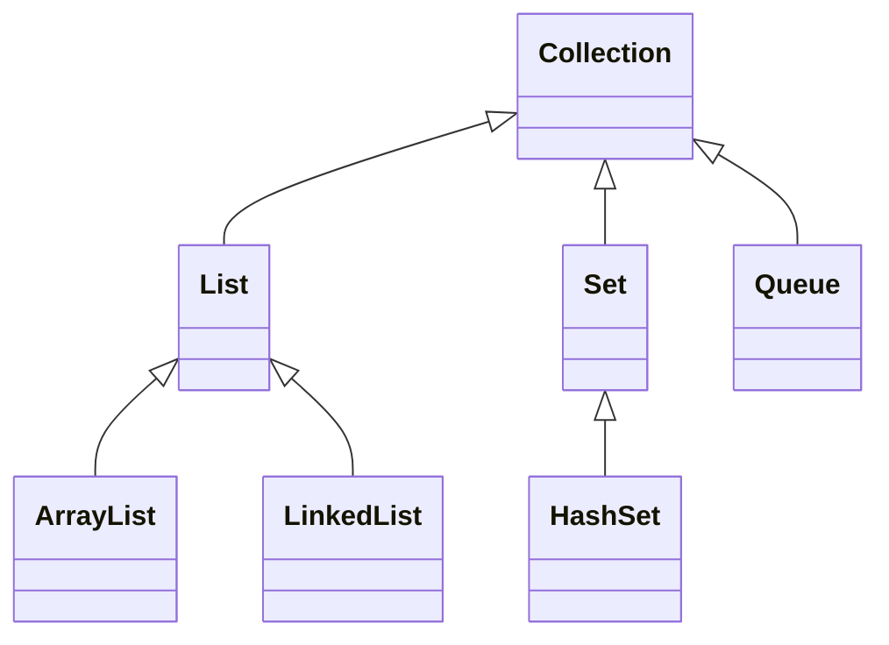

# 数据结构、Lambda 与集合

本篇整理原笔记第十二、十三章。数组长度固定，集合更适合保存数量变化的数据；泛型保证集合中的元素类型安全。

## 1. 查找与排序

常见查找算法：

| 算法 | 前提 | 特点 |
| --- | --- | --- |
| 基本查找 | 无 | 逐个比较，简单但较慢 |
| 二分查找 | 数据有序 | 每次排除一半范围 |
| 哈希查找 | 有哈希结构 | 平均速度快，依赖良好哈希函数 |

常见排序算法包括选择排序、冒泡排序、插入排序和快速排序。学习时先理解“比较、交换、缩小范围”的思想，再使用库方法：

```java
import java.util.Arrays;

int[] numbers = {4, 1, 3, 2};
Arrays.sort(numbers);
System.out.println(Arrays.toString(numbers));
```

二叉树、二叉查找树、平衡树和红黑树用于理解集合和索引的底层结构，初学阶段重点掌握有序、查找和插入的概念。

## 2. 泛型

泛型把类型检查提前到编译阶段：

```java
import java.util.ArrayList;
import java.util.List;

List<String> names = new ArrayList<>();
names.add("小明");
String first = names.get(0);
```

`? extends T` 适合读取某种 `T` 子类型，`? super T` 适合写入 `T` 或其子类型。记忆规则：生产者使用 `extends`，消费者使用 `super`。

## 3. Collection 和 List



`List` 有序、可重复并支持索引。`ArrayList` 随机访问快，尾部添加通常快；`LinkedList` 首尾操作方便，但按索引访问较慢。遍历方式：

```java
for (String name : names) {
    System.out.println(name);
}
names.forEach(System.out::println);
```

## 4. Set

`Set` 不允许重复元素。`HashSet` 不保证顺序，`LinkedHashSet` 保留插入顺序，`TreeSet` 按排序规则保存元素。自定义对象放入哈希集合时，必须正确重写 `equals` 和 `hashCode`。

## 5. Map

`Map` 以键值对保存数据，键不能重复：

```java
import java.util.HashMap;
import java.util.Map;

Map<String, Integer> scores = new HashMap<>();
scores.put("语文", 90);
scores.put("数学", 95);
scores.forEach((subject, score) ->
    System.out.println(subject + ": " + score));
```

`HashMap` 通常提供快速查找，`LinkedHashMap` 保留插入顺序，`TreeMap` 按键排序。使用 `getOrDefault`、`containsKey` 和 `computeIfAbsent` 可以减少空值判断。

## 6. Lambda 和函数式接口

Lambda 只能赋值给函数式接口，即只有一个抽象方法的接口：

```java
import java.util.function.Predicate;

Predicate<Integer> positive = value -> value > 0;
System.out.println(positive.test(3));
```

常用函数式接口：`Predicate<T>` 返回布尔值，`Consumer<T>` 消费数据，`Function<T,R>` 转换数据，`Supplier<T>` 提供数据。

## 7. 不可变集合

不可变集合创建后不能增删改，适合保存不会变化的配置或常量：

```java
import java.util.List;

List<String> levels = List.of("低", "中", "高");
```

调用修改方法会抛出 `UnsupportedOperationException`。需要修改时复制一份可变集合。

## 8. 总结

选择集合时先问三个问题：是否允许重复、是否需要保持顺序、是否需要按键查找。先掌握接口语义，再了解 `ArrayList`、`HashSet` 和 `HashMap` 的实现差异。
