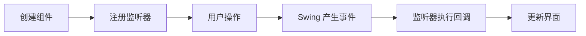

# GUI 与 Stream 函数式编程

本篇整理原笔记第十四至十六章。GUI 是可选拓展，Stream 和方法引用则是集合之后常用的数据处理工具。

## 1. Swing GUI 基础

Swing 通过组件和事件监听器创建桌面界面。常见组件包括 `JFrame`、`JPanel`、`JLabel`、`JButton`、`JTextField`、`JPasswordField` 和 `JDialog`。

```java
import javax.swing.JButton;
import javax.swing.JFrame;

public class WindowDemo {
    public static void main(String[] args) {
        JFrame frame = new JFrame("入门窗口");
        JButton button = new JButton("点击");
        button.addActionListener(event -> button.setText("已点击"));
        frame.add(button);
        frame.setSize(300, 180);
        frame.setDefaultCloseOperation(JFrame.EXIT_ON_CLOSE);
        frame.setVisible(true);
    }
}
```

事件处理流程：



拼图游戏案例可以练习窗口布局、图片切割、按钮监听和状态判断；不理解布局和事件之前，不建议直接复制完整案例。

## 2. Stream 流

Stream 不保存数据，而是描述一条处理数据的流水线。常见操作：

| 类型 | 方法示例 | 作用 |
| --- | --- | --- |
| 获取 | `collection.stream()` | 创建流 |
| 中间操作 | `filter`、`map`、`sorted`、`distinct`、`limit` | 返回新流，可连续调用 |
| 终结操作 | `forEach`、`count`、`collect`、`reduce` | 触发执行并产生结果 |

```java
import java.util.List;
import java.util.stream.Collectors;

List<String> names = List.of("小明", "小红", "阿强");
List<String> result = names.stream()
        .filter(name -> name.length() == 2)
        .sorted()
        .collect(Collectors.toList());
```

Stream 操作通常是延迟执行的，只有遇到终结操作才真正处理数据。一个 Stream 只能消费一次。

## 3. 方法引用

方法引用是 Lambda 的简写，必须满足参数和返回值兼容：

```java
names.forEach(System.out::println);
```

常见形式：

| 形式 | 示例 |
| --- | --- |
| 静态方法 | `Math::abs` |
| 特定对象实例方法 | `System.out::println` |
| 类名引用成员方法 | `String::toUpperCase` |
| 构造方法 | `ArrayList::new` |

## 4. 总结

GUI 重点是组件、布局和事件；Stream 重点是“数据源 -> 中间处理 -> 终结结果”；方法引用只有在 Lambda 足够直观时才使用，复杂逻辑保留完整 Lambda 更易读。
