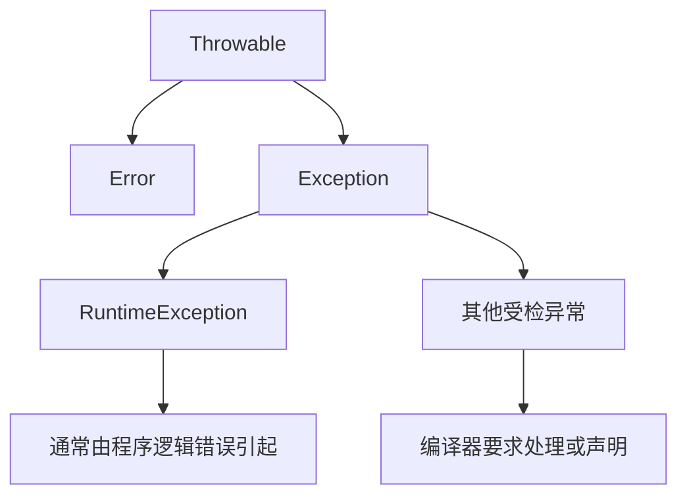
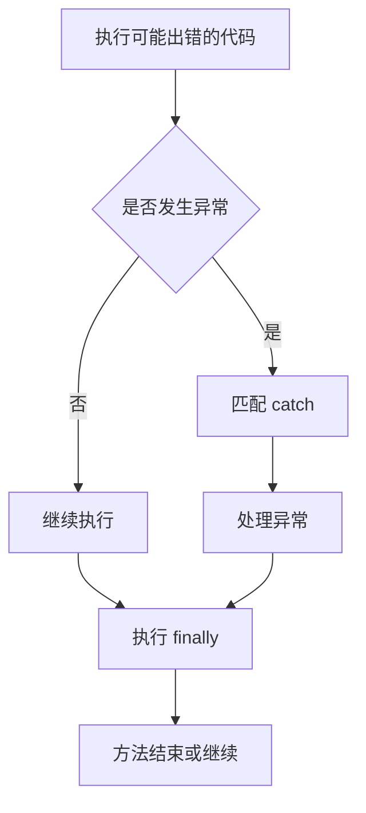

# 异常与 IO 流

本篇整理原笔记第十七、十八章，解决“程序出错时如何处理”和“如何读写外部数据”两个问题。

## 1. 异常体系



`Error` 通常表示严重的系统级问题；`Exception` 是应用程序可以考虑处理的问题。运行时异常常见原因包括空指针、数组越界和类型转换错误。

## 2. 异常处理

```java
try {
    int result = 10 / divisor;
    System.out.println(result);
} catch (ArithmeticException ex) {
    System.out.println("除数不能为 0");
} finally {
    System.out.println("清理工作");
}
```



`throw` 用于主动抛出异常，`throws` 用于在方法声明中说明可能抛出的异常。自定义异常应使用有意义的类名和错误信息，不要捕获后静默忽略。

## 3. File 和流

`File` 表示文件或目录的路径，不代表文件内容。可以使用它判断存在性、创建目录、删除文件和遍历目录。


字节流适合图片、音频等二进制数据；字符流适合文本。缓冲流通过内存缓冲减少底层读写次数。

## 4. 常用 IO 类型

| 类型 | 用途 |
| --- | --- |
| `FileInputStream` / `FileOutputStream` | 字节文件读写 |
| `FileReader` / `FileWriter` | 字符文件读写 |
| `BufferedInputStream` / `BufferedOutputStream` | 缓冲字节流 |
| `BufferedReader` / `BufferedWriter` | 缓冲字符流 |
| `InputStreamReader` / `OutputStreamWriter` | 字节与字符转换 |
| `ObjectInputStream` / `ObjectOutputStream` | 对象反序列化和序列化 |
| `PrintWriter` | 方便地输出文本 |
| `Properties` | 读写键值配置 |

使用 try-with-resources 自动关闭资源：

```java
import java.io.BufferedReader;
import java.io.FileReader;
import java.io.IOException;

try (BufferedReader reader = new BufferedReader(new FileReader("data.txt"))) {
    String line;
    while ((line = reader.readLine()) != null) {
        System.out.println(line);
    }
} catch (IOException ex) {
    System.out.println("文件读取失败：" + ex.getMessage());
}
```

## 5. 编码、压缩和序列化

UTF-8 是常用字符集。编码和解码必须使用同一种字符集，否则会出现乱码。ZIP 操作使用 `ZipInputStream` 和 `ZipOutputStream`，对象序列化需要实现 `Serializable`，但不应把不可信数据直接反序列化。

## 6. 总结

IO 代码的关键是选择正确的流、指定字符集、及时关闭资源并处理 `IOException`。文件复制、文本排序、配置读取和 ZIP 解压是适合练习的四个小案例。
