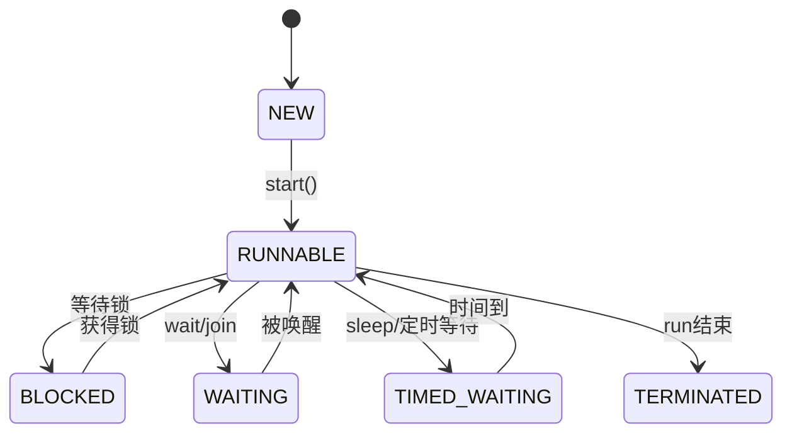
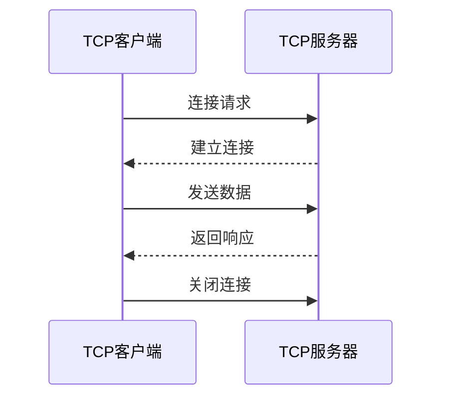

# 多线程与网络编程

本篇整理原笔记第十九、二十章。它们属于核心 Java 之后的进阶内容，学习前应先熟悉类、接口、异常和 IO。

## 1. 创建线程

```java
Thread thread = new Thread(() ->
        System.out.println("在线程中执行"));
thread.start();
```

常见方式：

| 方式 | 特点 |
| --- | --- |
| 继承 `Thread` | 写法直接，但无法再继承其他类 |
| 实现 `Runnable` | 更灵活，任务与线程分离 |
| 实现 `Callable` | 可以返回结果并抛出异常 |
| 使用线程池 | 复用线程，统一管理任务 |

调用 `start()` 才会创建新线程；直接调用 `run()` 只是普通方法调用。

## 2. 生命周期和线程安全



多个线程同时修改共享数据会产生竞态条件。使用 `synchronized`、`Lock` 或线程安全集合保护临界区；锁的范围应尽量小，并按固定顺序获取多把锁以降低死锁风险。

生产者消费者模型可以用 `BlockingQueue` 实现，线程池可用 `ExecutorService` 管理任务：

```java
import java.util.concurrent.ExecutorService;
import java.util.concurrent.Executors;

ExecutorService pool = Executors.newFixedThreadPool(2);
pool.submit(() -> System.out.println("处理任务"));
pool.shutdown();
```

## 3. 网络编程基础

网络通信三要素是 IP 地址、端口号和协议。UDP 面向数据报，速度快但不保证到达；TCP 面向连接，提供可靠、有序的字节流。



TCP 服务端通常按“创建 ServerSocket -> `accept` -> 读写流 -> 关闭资源”的顺序工作；多客户端场景可以为每个连接提交一个任务到线程池。

## 4. UDP 与案例

UDP 使用 `DatagramSocket` 和 `DatagramPacket`。单播发送给一个地址，组播发送给一组订阅者，广播发送给局域网内符合条件的主机。练习可以从本机回环地址开始，再尝试文件上传和多发多收。

## 5. 总结

多线程先解决“任务如何并发执行”，再解决“共享数据如何安全访问”；网络编程先掌握一个客户端和一个服务端的 TCP 通信，再结合线程池扩展到多客户端。
