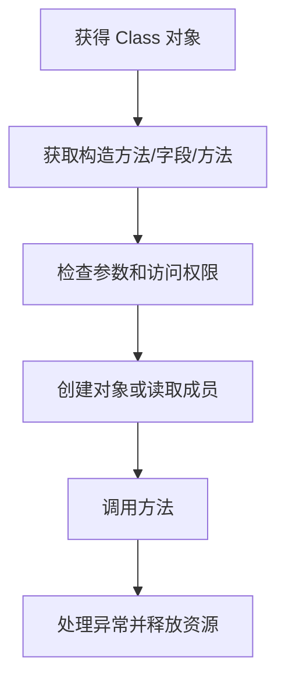
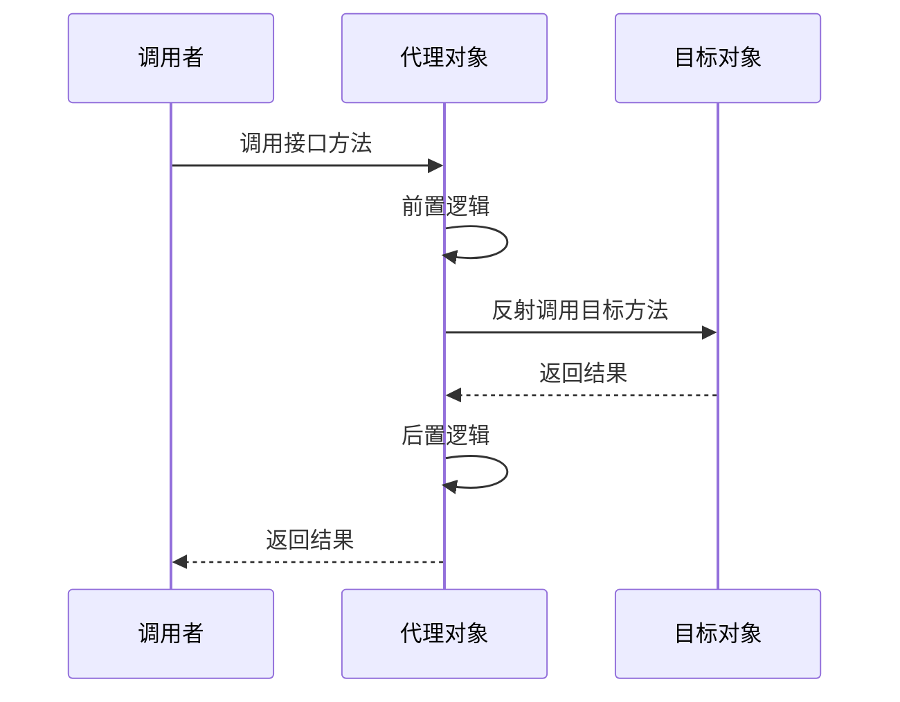

# 反射与动态代理

本篇整理原笔记第二十一、二十二章，是 Java 核心完成后的机制拓展。Spring、MyBatis 等框架会大量使用这些能力。

## 1. 获取和使用 Class

三种常见方式：

```java
Class<?> a = Student.class;
Class<?> b = Class.forName("example.Student");
Class<?> c = student.getClass();
```

反射可以获取构造方法、成员变量和成员方法，并在运行时创建对象、读写字段或调用方法。访问私有成员前需要谨慎使用 `setAccessible(true)`，并考虑模块和安全限制。



## 2. 反射示例

```java
import java.lang.reflect.Constructor;
import java.lang.reflect.Method;

Class<?> type = Class.forName("example.Student");
Constructor<?> constructor = type.getDeclaredConstructor(String.class, int.class);
Object student = constructor.newInstance("小明", 18);
Method method = type.getDeclaredMethod("introduce");
method.invoke(student);
```

反射调用常见异常包括类找不到、构造方法找不到、参数不匹配和目标方法自身抛出的异常。生产代码应尽量缓存重复使用的反射信息。

## 3. 动态代理

动态代理为目标对象创建一个代理对象，在调用目标方法前后增加日志、权限、事务等公共逻辑。基础代理的三个角色是接口、目标对象和代理对象。

```java
import java.lang.reflect.Proxy;

TaskService target = new TaskServiceImpl();
TaskService proxy = (TaskService) Proxy.newProxyInstance(
        TaskService.class.getClassLoader(),
        new Class<?>[]{TaskService.class},
        (object, method, args) -> {
            System.out.println("调用前：" + method.getName());
            Object result = method.invoke(target, args);
            System.out.println("调用后：" + method.getName());
            return result;
        });
proxy.execute();
```



JDK 动态代理要求目标类型有接口；没有接口时通常使用基于子类的代理库。代理逻辑应正确传递参数、返回值和异常，不要吞掉目标方法的错误。

## 4. 总结

反射把“编译期确定的调用”推迟到运行期，灵活但类型安全和性能较弱；动态代理在反射之上增加统一拦截逻辑。理解这两章的目标是能读懂框架代码，不是所有业务都手写反射。
