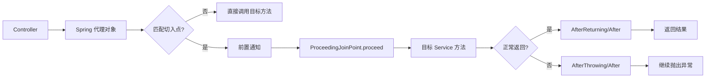
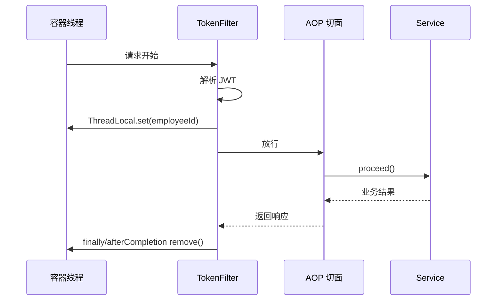

# 13 后端 Web 进阶：AOP

AOP（Aspect Oriented Programming，面向切面编程）用于把日志、权限、耗时统计、事务等“很多方法都需要，但不属于核心业务”的代码集中管理。

## 1. 学习目标与前置知识

### 1.1 学习目标

- 理解连接点、切入点、通知、切面和目标对象。
- 能使用 Spring AOP 编写前置、后置和环绕通知。
- 能读懂 `execution` 与 `@annotation` 切入点表达式。
- 能使用 ThreadLocal 保存当前登录员工。
- 能完成 Tlias 操作日志案例。

### 1.2 前置知识

需要先掌握 Spring IoC/DI、Bean、Controller/Service 分层、异常处理和第 12 章的 JWT 登录校验。

## 2. 为什么需要 AOP

假设部门、员工、登录日志等很多 Service 方法都要记录执行耗时。如果把计时代码复制到每个方法中，就会产生重复、难维护、容易漏记的问题。

AOP 的思路是：把公共逻辑写成一个切面，由框架在目标方法执行前后自动织入。

```java
@Aspect
@Component
public class RecordTimeAspect {
    @Around("execution(* com.example.service.*.*(..))")
    public Object record(ProceedingJoinPoint joinPoint) throws Throwable {
        long start = System.currentTimeMillis();
        Object result = joinPoint.proceed();
        System.out.println(System.currentTimeMillis() - start);
        return result;
    }
}
```

## 3. AOP 核心概念

| 概念 | 含义 | 示例 |
|---|---|---|
| 连接点 JoinPoint | 可以被 AOP 控制的方法执行 | 所有 Service 方法 |
| 切入点 Pointcut | 需要增强的连接点集合 | 所有 `add/update/delete` |
| 通知 Advice | 要执行的公共逻辑 | 记录操作日志 |
| 切面 Aspect | 切入点和通知的组合 | 操作日志切面 |
| 目标对象 Target | 被增强的原始对象 | EmpService |
| 代理对象 Proxy | Spring 生成的增强对象 | 注入到 Controller 的 Bean |

调用链可以理解为：Controller 调用代理对象，代理对象执行通知，再调用目标 Service。

## 4. 通知类型

- `@Before`：目标方法执行前。
- `@After`：目标方法结束后，无论成功还是异常都会执行。
- `@AfterReturning`：目标方法正常返回后。
- `@AfterThrowing`：目标方法抛出异常后。
- `@Around`：完全控制目标方法前后的逻辑，必须调用 `joinPoint.proceed()` 才会真正执行目标方法。

环绕通知常用于耗时统计和操作日志：

```java
@Around("@annotation(com.example.anno.LogOperation)")
public Object log(ProceedingJoinPoint joinPoint) throws Throwable {
    long start = System.currentTimeMillis();
    Object result = joinPoint.proceed();
    long cost = System.currentTimeMillis() - start;
    // 读取方法名、参数、当前用户并保存日志
    return result;
}
```

## 5. 切入点表达式

### 5.1 execution

`execution` 可以根据返回值、包名、类名、方法名和参数匹配：

```text
execution(* com.example.service.*.*(..))
```

含义是匹配 `com.example.service` 包下所有类的所有方法，返回值和参数不限。

常见写法：

```text
execution(* com.example.service.EmpService.add(..))
execution(* com.example.service.*.delete*(..))
```

### 5.2 自定义注解匹配

当目标方法不在同一包或方法名没有规律时，可以自定义注解：

```java
@Target(ElementType.METHOD)
@Retention(RetentionPolicy.RUNTIME)
public @interface LogOperation { }
```

在需要记录的方法上添加 `@LogOperation`，切面使用：

```java
@Around("@annotation(com.example.anno.LogOperation)")
```

注解匹配通常比写很长的 `execution` 更直观。

通知方法可以通过 `JoinPoint` 读取方法签名和参数：

```java
@Before("serviceMethods()")
public void inspect(JoinPoint jp) {
    String method = jp.getSignature().getName();
    Object[] args = jp.getArgs();
}
```

记录参数前应做长度限制和脱敏；对象参数可序列化为 JSON，但要避免把文件内容、密码或完整 Token 写入日志。

## 6. 通知顺序

多个切面同时匹配一个方法时，可以用 `@Order` 控制顺序，数字越小优先级越高。设计切面时应避免相互依赖，并在日志中记录清晰的执行顺序。

## 7. ThreadLocal 与当前登录员工

ThreadLocal 不是“线程”，而是线程的局部变量容器。同一个请求线程可以在 Filter、Interceptor、Service 中共享当前员工信息。

```java
public class BaseContext {
    private static final ThreadLocal<Long> THREAD_LOCAL = new ThreadLocal<>();

    public static void setCurrentId(Long id) {
        THREAD_LOCAL.set(id);
    }

    public static Long getCurrentId() {
        return THREAD_LOCAL.get();
    }

    public static void remove() {
        THREAD_LOCAL.remove();
    }
}
```

在登录校验拦截器中解析 JWT 后保存 ID，在请求完成后清理：

```java
try {
    Long id = JwtUtil.getId(token);
    BaseContext.setCurrentId(id);
    return true;
} finally {
    // 可在 afterCompletion 中清理，避免线程池复用导致数据串请求
}
```

一定要调用 `remove()`。Web 容器使用线程池，线程不会随着请求结束销毁，忘记清理可能造成用户信息泄露或串号。

## 8. Tlias 操作日志案例

### 8.1 需求

记录系统中所有新增、修改、删除接口的：

- 当前登录员工 ID
- 操作时间
- 请求方法
- 请求参数
- 返回结果或异常
- 执行耗时

### 8.2 实现步骤

1. 创建操作日志表和实体类。
2. 定义 `@LogOperation` 注解。
3. 在增删改 Service 方法上添加注解。
4. 编写 `@Aspect` 切面和环绕通知。
5. 从 `BaseContext` 获取当前员工。
6. 调用 `joinPoint.proceed()` 执行业务。
7. 将日志异步或同步写入数据库。

日志记录失败时，要明确它是否应该影响主业务。普通操作日志通常不应因为日志表异常而让员工新增失败，但审计场景可能要求事务一致性，需要根据业务决定。

## 9. 小白易错点

- 环绕通知漏写 `proceed()` 会导致目标方法不执行。
- 切面类必须交给 Spring 管理，通常同时使用 `@Aspect` 和 `@Component`。
- 直接调用同一个类内部方法，可能绕过 Spring 代理，导致 AOP 不生效。
- `@Order` 只影响多个切面的顺序，不会改变业务代码本身的顺序。
- ThreadLocal 必须清理。

## 10. 练习清单

1. 统计所有 Service 方法耗时。
2. 只拦截 `add/update/delete` 方法。
3. 用自定义注解替代复杂的 `execution`。
4. 从 JWT 解析员工 ID，放入 ThreadLocal。
5. 完成 Tlias 操作日志表的新增和查询。

## 11. 资料对应关系

- 《JavaWeb笔记》：第十五章“事务 & AOP”。
- 第 12 章：提供 JWT、Interceptor 和当前用户身份。
- 后续学习事务时，会看到 AOP 如何为 `@Transactional` 提供代理能力。

## 12. 关键补充：代理对象是 AOP 生效的关键

Spring AOP 通常不是修改原始类的字节码，而是创建代理对象。Controller 注入到的往往是代理对象，代理对象先执行通知，再调用目标对象的方法。



### 12.1 用 `@Pointcut` 抽取重复表达式

```java
@Pointcut("execution(* com.example.service..*(..))")
public void serviceMethods() {}

@Before("serviceMethods()")
public void before(JoinPoint joinPoint) { }
```

当前切面内部可以使用 `private` 切点；需要被其他切面引用时，把切点方法声明为 `public`，并使用完整类名引用。切点范围要尽量小，避免把查询、定时任务、日志保存本身也拦进去造成递归或性能问题。

### 12.2 五类通知的异常语义

| 通知 | 目标方法成功 | 目标方法抛异常 | 能否阻止目标方法 |
|---|---|---|---|
| `@Before` | 执行 | 不会执行后续目标方法时可抛异常 | 可以通过抛异常阻止 |
| `@AfterReturning` | 执行 | 不执行 | 不能 |
| `@AfterThrowing` | 不执行 | 执行 | 不能 |
| `@After` | 执行 | 执行 | 不能 |
| `@Around` | 由 `proceed()` 决定 | 可捕获、记录或重新抛出 | 可以 |

环绕通知中必须决定是否调用 `proceed()`；如果忘记调用，目标方法不会运行。记录日志时不要把密码、Token 等敏感参数直接写入日志表。

### 12.3 自调用为什么可能不生效

```java
@Service
class EmpServiceImpl {
    public void outer() { inner(); }

    @LogOperation
    public void inner() { }
}
```

`outer()` 内部的 `inner()` 是 `this.inner()`，没有经过 Spring 代理，因此注解切面可能不会执行。可将 `inner` 拆到另一个 Bean、从外部代理调用，或重新设计事务/日志边界，不建议为了绕过问题直接使用 `AopContext`。

### 12.4 ThreadLocal 的完整请求边界



ThreadLocal 提供的是“每个线程一份值”，不是跨线程传递机制。异步线程、线程池任务和消息队列不能直接假设能读到原请求的 ThreadLocal；需要显式传参或使用适合的上下文传递方案。

### 12.5 操作日志的事务取舍

- **同事务写入**：业务成功日志一定存在，适合审计；日志插入失败可能导致主业务回滚。
- **独立事务/异步写入**：日志故障不影响主业务，吞吐更高；但可能出现业务成功而日志延迟或丢失。
- 日志表至少应有操作者、操作时间、类名/方法名、请求参数摘要、耗时、结果状态和异常摘要，并对敏感字段脱敏。

## 13. 联网核对与延伸阅读

- [Spring AOP 核心概念](https://docs.spring.io/spring-framework/reference/core/aop/introduction-defn.html)
- [Spring AOP 通知类型](https://docs.spring.io/spring-framework/reference/core/aop/ataspectj/advice.html)
