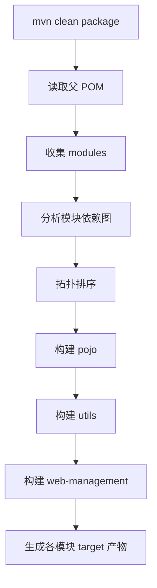
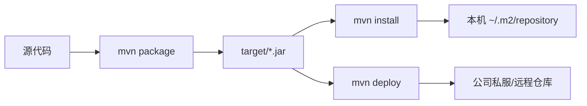

# 14A 后端 Web 进阶：Maven 高级

Maven 基础解决“一个项目如何编译、测试、管理依赖”，Maven 高级进一步解决“多人如何拆分模块、统一版本、构建整个项目和共享内部组件”。

## 1. 学习目标与前置知识

- 会把一个 Tlias 项目拆分成多个 Maven 模块。
- 理解父工程、子工程、继承和聚合。
- 会使用 `dependencyManagement` 统一版本。
- 了解 Maven 私服和企业内部依赖共享。

前置内容是已有 03 文档和《JavaWeb笔记》第九章的 Maven 坐标、依赖、生命周期和 POM 基础。

## 2. 分模块设计

大型项目通常按职责拆分：

```text
tlias-parent              父工程和统一版本
├── tlias-pojo             实体类、DTO、VO
├── tlias-utils            工具类和公共组件
└── tlias-web-management   Controller、Service、Mapper 和启动类
```

拆分的好处：

- 每个模块职责清晰，降低耦合。
- 公共模块可以被多个业务模块复用。
- 团队成员可以并行开发。
- 构建、测试和发布可以按模块进行。

模块边界要按职责划分，不要为了拆分而拆分。小项目先保持简单，等代码规模和团队协作需要出现后再拆分。

## 3. Maven 继承

父工程可以集中管理公共配置，子工程通过 `<parent>` 继承。

```xml
<parent>
    <groupId>com.example</groupId>
    <artifactId>tlias-parent</artifactId>
    <version>1.0.0</version>
</parent>
```

### 3.1 依赖版本锁定

`dependencyManagement` 只负责管理版本，不会自动把依赖加入子工程：

```xml
<dependencyManagement>
    <dependencies>
        <dependency>
            <groupId>org.springframework.boot</groupId>
            <artifactId>spring-boot-dependencies</artifactId>
            <version>3.3.0</version>
            <type>pom</type>
            <scope>import</scope>
        </dependency>
    </dependencies>
</dependencyManagement>
```

子模块仍然需要在 `<dependencies>` 中声明自己实际使用的依赖，但可以省略版本。这样升级版本时只修改父工程。

## 4. Maven 聚合

聚合是把多个模块组织成一个整体，执行一次 Maven 命令即可构建多个子模块：

```xml
<packaging>pom</packaging>

<modules>
    <module>tlias-pojo</module>
    <module>tlias-utils</module>
    <module>tlias-web-management</module>
</modules>
```

聚合关注“统一构建”；继承关注“配置复用”。一个工程可以只继承不聚合，也可以同时具备两者。

## 5. 继承与聚合对比

| 项目 | 继承 | 聚合 |
|---|---|---|
| 目的 | 复用 POM 配置 | 统一构建多个模块 |
| 关系 | 父子关系 | 总体与模块关系 |
| 常见配置 | 版本、插件、公共依赖 | `<modules>` |
| 是否必须同时使用 | 不必须 | 不必须 |

## 6. Maven 私服

私服是公司内部的远程 Maven 仓库，常用于：

- 缓存中央仓库依赖，减少外网下载。
- 保存公司内部开发的公共组件。
- 控制依赖版本和发布权限。
- 让其他项目通过坐标直接引用内部组件。

### 6.1 发布与获取

项目发布通常执行：

```bash
mvn clean deploy
```

其他项目只需在 `repositories` 或企业统一 Maven 配置中声明私服地址，然后按坐标依赖：

```xml
<dependency>
    <groupId>com.example</groupId>
    <artifactId>tlias-utils</artifactId>
    <version>1.0.0</version>
</dependency>
```

发布前要确认版本号、仓库权限和 `distributionManagement` 配置，正式版本不要随意覆盖。

## 7. 小白易错点

- `dependencyManagement` 不会自动引入依赖。
- `parent` 继承和 `<modules>` 聚合是两件事。
- 子模块的相对路径必须正确，模块名大小写也要一致。
- 公共模块不要反向依赖业务模块，避免循环依赖。
- 私服账号密码不要提交到 Git 仓库。

## 8. 练习清单

1. 把一个简单 Spring Boot 项目拆成 `pojo`、`utils`、`web` 三个模块。
2. 在父工程统一管理 Lombok 和 Spring Boot 版本。
3. 使用聚合工程一次执行 `clean package`。
4. 打包一个公共工具模块并在业务模块中引用。
5. 了解 `install` 和 `deploy` 的区别。

## 9. 资料对应关系

- 《JavaWeb笔记》：第九章 Maven 基础、第十七章 Maven 高级。
- 现有 03 文档：Maven 坐标、依赖、生命周期。
- 本章应放在基础项目能独立运行之后学习，不必在刚开始写第一个 Controller 时就掌握私服。

## 10. 关键补充：Maven Reactor 如何构建多模块

聚合工程执行命令时，Maven Reactor 会收集模块、分析依赖关系、排序并按顺序构建。`<modules>` 中的书写顺序不是唯一依据；模块之间真实的依赖关系会优先决定构建顺序。



常用 Reactor 参数：

```bash
mvn -pl tlias-web-management -am package   # 构建指定模块及其依赖
mvn -pl tlias-pojo -amd package            # 构建依赖该模块的模块
mvn -rf :tlias-web-management package      # 从失败模块继续
```

### 10.1 `dependencies`、`dependencyManagement` 和插件管理

- `<dependencies>`：真正把依赖放进当前模块的类路径。
- `<dependencyManagement>`：只提供默认版本、scope 等管理信息，不会自动引入依赖。
- `<pluginManagement>`：只管理插件默认配置；插件仍需在 `<plugins>` 中声明后才执行。

建议把版本集中在父工程的 `<properties>`，把公共版本放进 `dependencyManagement`，但不要把所有依赖无差别地放入父工程，避免每个模块都传递不需要的类库。

### 10.2 `install` 与 `deploy` 的区别



`package` 只生成产物；`install` 安装到当前电脑的本地仓库，供本机其他项目使用；`deploy` 发布到远程仓库，供团队或 CI 使用。版本号带 `-SNAPSHOT` 表示开发中的快照版本，正式发布应使用不可覆盖的 Release 版本。

### 10.3 私服配置和安全

常见仓库角色包括 hosted（保存公司包）、proxy（代理中央仓库）和 group（对开发者提供统一入口）。账号密码应放在 `settings.xml` 的 `<servers>` 中，配合环境隔离或 CI 密钥管理，不要写入项目 `pom.xml`、提交到 Git，也不要在构建日志中打印。

## 11. 联网核对与延伸阅读

- [Maven 多模块与 Reactor](https://maven.apache.org/guides/mini/guide-multiple-modules.html)
- [Maven POM：继承与聚合](https://maven.apache.org/guides/introduction/introduction-to-the-pom.html)
