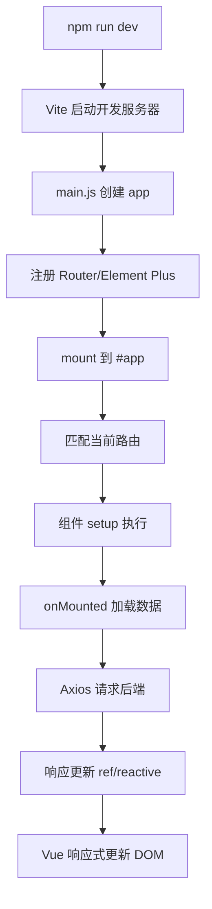
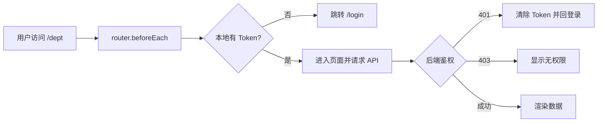

# 15 前端 Web 实战：Vue 工程化与 Element Plus

前面可以直接在 HTML 中引入 `vue.js`、`axios.js`，但真实项目通常需要依赖管理、模块化、构建、路由和组件库。本章把零散的前端代码升级为可维护的 Vue 工程。

## 1. 学习目标与前置知识

- 理解 Node.js、npm 和前端工程化。
- 能创建、启动、构建 Vue 3 项目。
- 能使用组合式 API 编写组件。
- 能使用 Element Plus 的表格、分页、对话框和表单。
- 能配置 Vue Router，并为后续 Tlias 页面准备项目结构。

前置知识对应《JavaWeb笔记》第二至第八章，以及现有 01、02 文档中的 HTML、CSS、JavaScript、Vue、Axios 基础。

## 2. Node.js 与 npm

Node.js 让 JavaScript 可以在浏览器之外运行，npm 是 Node.js 的包管理器。npm 负责下载依赖、执行脚本和管理版本。

常见命令：

```bash
node -v
npm -v
npm install
npm run dev
npm run build
```

`package.json` 描述项目名称、脚本和依赖；`package-lock.json` 锁定依赖的具体版本；`node_modules` 是安装后的依赖目录，通常不提交到 Git。

## 3. 创建 Vue 项目

Vue 官方脚手架可以创建 Vue 3 项目：

```bash
npm create vue@latest
cd tlias-web
npm install
npm run dev
```

典型目录：

```text
src/
├── api/           请求接口封装
├── components/    可复用组件
├── router/        路由
├── utils/         工具类
├── views/         页面
├── App.vue
└── main.js
```

不要把所有代码写在 `App.vue`；页面、请求和通用组件应分别放在清晰的位置。

## 4. Vue 开发方式

### 4.1 组合式 API

```vue
<script setup>
import { ref, onMounted } from 'vue'

const count = ref(0)
onMounted(() => {
  console.log('页面挂载完成')
})
</script>

<template>
  <button @click="count++">点击次数：{{ count }}</button>
</template>
```

`ref` 创建响应式数据，模板中会自动解包；`onMounted` 用于页面挂载后加载数据。`reactive` 适合对象，`computed` 适合派生数据，`watch` 适合监听变化后执行副作用。

### 4.2 选项式 API

选项式 API 通过 `data`、`methods`、`computed`、`watch`、`mounted` 等选项组织代码。旧项目可能仍使用它，阅读代码时要能识别，但新页面可优先使用组合式 API。

### 4.3 组件通信

- 父传子：`props`。
- 子传父：`emit`。
- 跨页面共享：路由参数、状态管理或其他共享方案。

组件应尽量只负责自己的展示和交互，复杂请求可抽到 `api` 或组合函数中。

## 5. Element Plus

Element Plus 是 Vue 3 组件库。安装后在 `main.js` 中注册：

```javascript
import ElementPlus from 'element-plus'
import 'element-plus/dist/index.css'

app.use(ElementPlus)
```

### 5.1 Table

用于展示列表数据。关键是准备好 `data` 数组，并通过列的 `prop` 对应字段。操作列通常放编辑、删除按钮。

### 5.2 Pagination

分页至少需要：当前页 `page`、每页条数 `pageSize`、总记录数 `total`。页码或每页条数变化后重新请求后端。

### 5.3 Dialog

对话框适合新增和编辑。打开前要区分“新增状态”和“编辑状态”，关闭后要重置表单，避免上一次数据残留。

### 5.4 Form

表单由输入框、选择器、单选框等组成。校验规则要和后端校验配合，前端校验用于提升体验，不能代替后端校验。

```javascript
const rules = {
  name: [{ required: true, message: '请输入名称', trigger: 'blur' }]
}
```

## 6. Axios 请求封装

建议建立 `src/utils/request.js`：统一配置 `baseURL`、超时时间、请求拦截器和响应错误处理。页面只关注业务接口：

```javascript
export function listDept() {
  return request.get('/depts')
}
```

这样可以避免每个页面重复写 URL、Token 和错误提示。

## 7. Vue Router

路由把 URL 映射到组件：

```javascript
const routes = [
  { path: '/login', component: () => import('../views/login/index.vue') },
  {
    path: '/',
    component: () => import('../views/layout/index.vue'),
    children: [
      { path: 'dept', component: () => import('../views/dept/index.vue') }
    ]
  }
]
```

登录页面通常不嵌套在管理布局中；部门和员工页面作为管理布局的子路由。

## 8. 打包与部署

```bash
npm run build
```

构建后生成 `dist` 目录，Nginx 负责提供静态文件。部署时需要注意：

- 前端请求的后端地址不能继续使用本机开发地址。
- Vue Router 使用 history 模式时，Nginx 需要配置回退到 `index.html`。
- 跨域、反向代理和 HTTPS 要与后端部署方式一致。

## 9. 小白易错点

- `npm install` 失败时先检查 Node 版本、网络和 npm 镜像配置。
- `ref` 和普通变量不同，脚本中通常通过 `.value` 访问。
- 列表刷新要更新响应式数组，而不是只在控制台打印新数据。
- 分页的 `page`、`pageSize`、`total` 含义不能混淆。
- 前端路由能隐藏页面，但真正的权限必须由后端校验。

## 10. 练习清单

1. 创建一个 Vue 3 项目并启动。
2. 用 Table 展示一组员工数据。
3. 加入分页和分页事件。
4. 用 Dialog 和 Form 完成新增表单。
5. 配置 `/login`、`/dept` 两个路由并构建项目。

## 11. 资料对应关系

- 《JavaWeb笔记》：第四章 Vue、第五章 Ajax、第七章前端工程化、第八章 Element。
- 第 16–18 章会在本章项目结构上继续完成 Tlias 部门和员工管理。

## 12. 关键补充：Vue 页面从启动到请求的链路



### 12.1 `ref`、`reactive`、`computed`、`watch` 怎么选

| API | 适合做什么 | 常见误区 |
|---|---|---|
| `ref` | 基本值、可整体替换的对象/数组 | 在 `<script>` 中忘记 `.value` |
| `reactive` | 需要保持对象引用的表单对象 | 直接把整个对象重新赋值导致引用丢失 |
| `computed` | 根据已有状态计算派生值 | 在 computed 中执行请求等副作用 |
| `watch` | 状态变化后触发请求、同步副作用 | 初始化和分页事件重复触发请求 |

`watch` 默认不会立即执行；需要初始加载时可使用 `{ immediate: true }`，但要避免同时在 `onMounted` 中再调用一次同一接口。

### 12.2 Element Plus 表单校验的三件套

```vue
<el-form ref="formRef" :model="form" :rules="rules">
  <el-form-item prop="name" label="姓名">
    <el-input v-model="form.name" />
  </el-form-item>
</el-form>
```

要点是：`el-form` 绑定 `model` 和 `rules`；每个 `el-form-item` 用 `prop` 指向字段；提交时调用 `await formRef.validate()`。`trigger: 'blur'` 与 `trigger: 'change'` 决定校验时机，动态数组字段需要使用正确的路径，例如 `exprList.0.company`。

### 12.3 路由守卫与后端权限不是一回事



前端守卫只是体验层的提前拦截，任何人都可以直接调用 API，所以真正的认证和授权必须由后端完成。

Vue Router 4 推荐在守卫中直接返回目标路径，而不是在每个分支调用旧式 `next()`：

```javascript
router.beforeEach((to) => {
  const token = localStorage.getItem('token')
  if (to.path !== '/login' && !token) return '/login'
  if (to.path === '/login' && token) return '/'
  return true
})
```

课程压缩包里的依赖版本可能早于当前版本。学习时以项目 `package-lock.json`/`pnpm-lock.yaml` 为准，升级 Vue、Element Plus 或 Vite 时一次只升级一个大版本并重新跑完整验收。

### 12.4 构建、预览、生产部署

```bash
npm run build    # 生成 dist
npm run preview  # 只用于本地预览，不是生产服务器
```

Vite 默认输出 `dist`。开发环境的 `/api` 代理只在 Vite 开发服务器生效，部署到 Nginx 后必须配置反向代理或把生产 API 地址写入环境变量（如 `VITE_API_BASE_URL`）。不要把带密钥的变量放进 `VITE_` 前缀，因为它们会被打包到浏览器端。

## 13. 联网核对与延伸阅读

- [Vue 3 Composition API](https://vuejs.org/guide/extras/composition-api-faq)
- [Vue 生命周期](https://vuejs.org/guide/essentials/lifecycle.html)
- [Element Plus 表单校验](https://element-plus.org/en-US/component/form)
- [Axios 拦截器](https://axios-http.com/docs/interceptors)
- [Vite 静态部署](https://vite.dev/guide/static-deploy.html)
