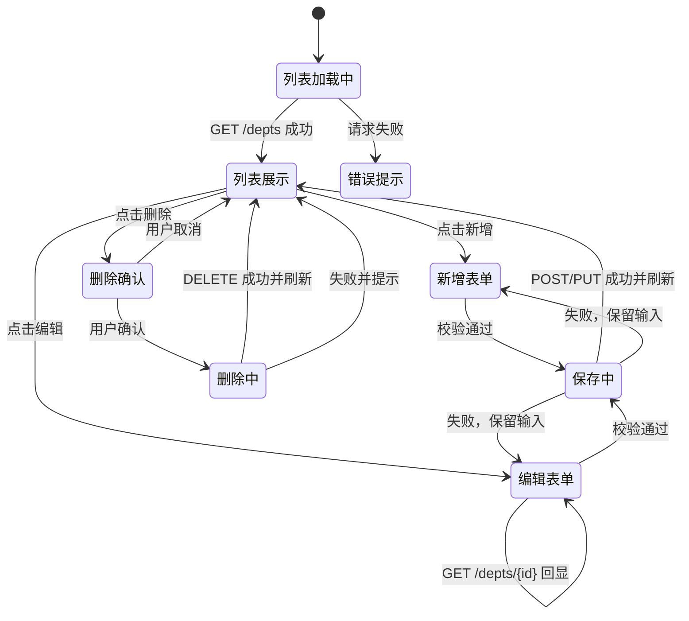
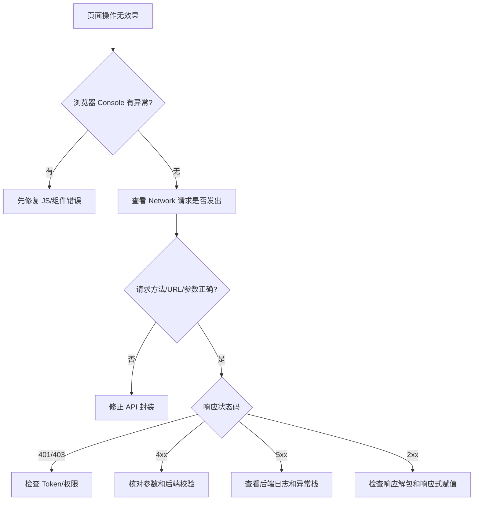

# 16 前端 Web 实战：Tlias 部门管理

本章把 Vue、Axios、Element Plus 和 Vue Router 组合成一个真正可操作的部门管理页面，完成部门列表、新增、修改和删除。

## 1. 学习目标与前置知识

- 理解前后端分离的职责边界。
- 能按接口文档编写前端 API 模块。
- 能使用路由和管理布局组织页面。
- 能完成部门 CRUD 和表单校验。

前置内容是第 15 章，以及现有 07 后端部门管理文档。后端接口约定为 `GET /depts`、`POST /depts`、`GET /depts/{id}`、`PUT /depts`、`DELETE /depts/{id}`。

## 2. 前后端分离

浏览器运行 Vue 前端，后端提供 JSON API。前端负责页面、交互和输入提示；后端负责业务规则、权限、数据库和最终校验。

开发前先确认接口文档：请求方法、路径、参数名、请求体、响应结构和错误状态码。不要只根据页面截图猜接口。

## 3. 页面布局与路由

推荐结构：

```text
src/views/
├── login/index.vue
├── layout/index.vue
└── dept/index.vue
```

`layout` 提供左侧菜单、顶部栏和内容插槽；`dept` 只负责部门页面；`login` 使用独立布局，不应显示管理菜单。

## 4. Axios 请求封装

```javascript
// src/api/dept.js
import request from '@/utils/request'

export const listDept = () => request.get('/depts')
export const addDept = data => request.post('/depts', data)
export const getDept = id => request.get(`/depts/${id}`)
export const updateDept = data => request.put('/depts', data)
export const deleteDept = id => request.delete(`/depts/${id}`)
```

页面不直接拼接所有 URL，接口集中管理后更容易修改和测试。

## 5. 部门列表

页面加载时请求部门列表，并把响应中的数据绑定到 Table：

```vue
<script setup>
import { ref, onMounted } from 'vue'
import { listDept } from '@/api/dept'

const tableData = ref([])

const load = async () => {
  const result = await listDept()
  tableData.value = result.data
}

onMounted(load)
</script>
```

新增、修改、删除成功后都重新调用 `load()`，保证页面展示服务端最新结果。请求失败要给用户明确提示，并保留控制台错误信息便于排查。

## 6. 新增部门

新增流程：

1. 点击“新增部门”。
2. 打开 Dialog 并重置表单。
3. 用户输入名称。
4. 调用 `POST /depts`。
5. 成功后关闭对话框、提示成功并刷新列表。

```javascript
const formRef = ref()
const form = ref({ name: '' })

const save = async () => {
  await formRef.value.validate()
  await addDept(form.value)
  ElMessage.success('新增成功')
  dialogVisible.value = false
  await load()
}
```

表单校验可以限制名称不能为空、长度范围等，但后端仍需再次校验。

## 7. 修改部门

修改通常分两步：

1. 点击编辑，根据 ID 请求 `GET /depts/{id}`。
2. 将返回数据放入表单，用户修改后请求 `PUT /depts`。

新增和修改可以共用一个 Dialog，但必须有明确的 `isEdit` 或表单中的 `id` 来区分操作。

## 8. 删除部门

删除前使用确认框，确认后调用 `DELETE /depts/{id}`。后端可能因为部门下存在员工而拒绝删除，前端应展示后端返回的业务提示，而不是一律提示成功。

```javascript
await ElMessageBox.confirm('确认删除该部门吗？', '提示')
await deleteDept(id)
await load()
```

## 9. 小白易错点

- Dialog 关闭时要重置表单和校验状态。
- 编辑前必须重新查询详情，不能只依赖列表中的简略字段。
- `PUT`、`POST`、`DELETE` 方法和后端接口必须一致。
- 删除成功后不刷新列表，会出现“数据库已删、页面仍显示”的错觉。
- 组件路径和路由路径不是一回事。

## 10. 练习清单

1. 完成部门列表加载。
2. 完成新增并加入必填校验。
3. 完成修改回显和保存。
4. 完成删除确认和刷新。
5. 关闭后重新打开 Dialog，确认不会残留上一次数据。

## 11. 资料对应关系

- 《JavaWeb笔记》：第六章前后台分离、第八章 Element 综合案例。
- 现有 07 文档：后端 REST、Mapper、Service、Controller。
- 下一章员工管理会复用本章的路由、请求封装、表格和表单模式。

## 12. 关键补充：部门 CRUD 的状态机



### 12.1 请求封装的返回值陷阱

如果 Axios 响应拦截器直接返回 `response.data`，页面可以写 `result.data`；如果返回完整 `response`，页面则要写 `result.data.data`（取决于统一响应结构）。项目开始时要统一约定，不要在不同页面混用两种取法。

```javascript
// 推荐：拦截器统一解包业务 data
request.interceptors.response.use(response => response.data)

const result = await listDept()
tableData.value = result.data
```

### 12.2 Dialog 打开、提交、关闭的生命周期

1. 打开新增：创建全新的空表单，清除旧校验结果。
2. 打开编辑：先清空旧数据，再请求详情并回显。
3. 提交：先 `validate`，再发送请求；提交期间禁用按钮，防止重复请求。
4. 成功关闭：提示、关闭 Dialog、重置表单并刷新列表。
5. 失败关闭：保留输入内容，让用户修正后重试。

删除前还要考虑后端约束：部门下存在员工时，后端可能返回业务失败；前端不能仅凭 HTTP 请求发出就提示“删除成功”。

### 12.3 前后端联调排查顺序



## 13. 联网核对与延伸阅读

- [Element Plus Table](https://element-plus.org/en-US/component/table)
- [Vue Router 导航守卫](https://router.vuejs.org/guide/advanced/navigation-guards.html)
