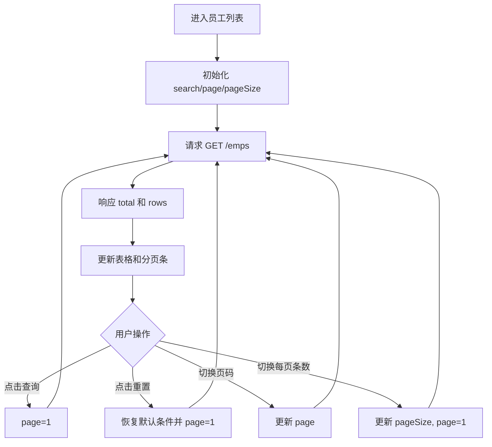
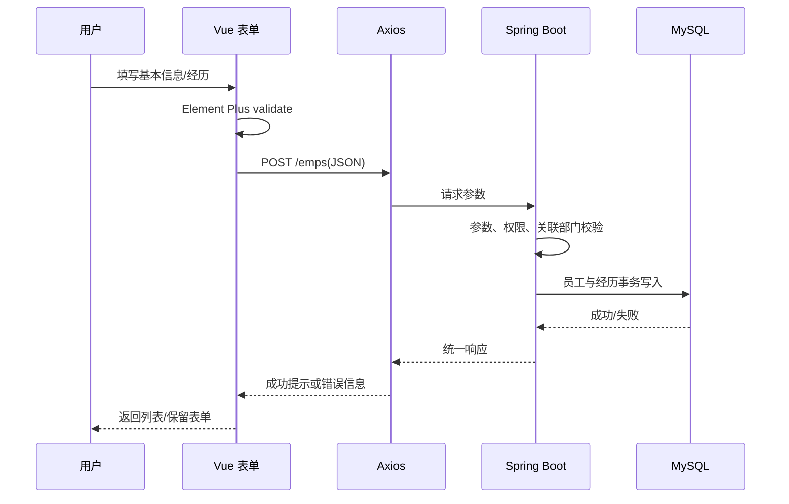
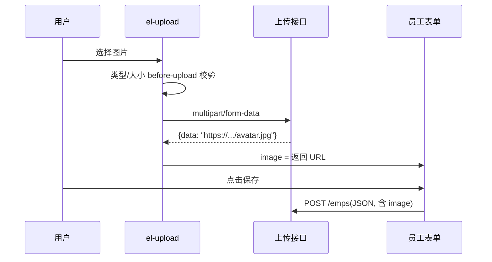

# 17 前端 Web 实战：Tlias 员工管理（一）

本章在部门管理页面的基础上完成员工列表、条件查询、分页、新增员工和动态工作经历表单。重点是理解“页面状态”和“后端查询参数”如何对应。

## 1. 学习目标与前置知识

- 能实现条件分页查询。
- 能使用 `watch` 监听分页和筛选变化。
- 能用 Element Plus Table、Pagination、Form 完成员工页面。
- 能处理数组表单和动态添加/删除工作经历。

前置知识是第 15、16 章、MyBatis 动态 SQL、分页插件和后端员工接口。

## 2. 条件分页查询

员工列表通常同时支持姓名、性别、职位、入职日期等条件，并返回分页结果：

```text
GET /emps?page=1&pageSize=10&name=张&gender=1
```

响应常见结构：

```json
{
  "total": 35,
  "rows": [
    { "id": 1, "name": "张三", "gender": 1 }
  ]
}
```

前端至少维护：

```javascript
const searchForm = ref({ name: '', gender: '', begin: '', end: '' })
const page = ref(1)
const pageSize = ref(10)
const total = ref(0)
const tableData = ref([])
```

## 3. 查询、重置与分页

查询按钮通常把页码重置为 1，再调用列表接口：

```javascript
const search = () => {
  page.value = 1
  load()
}

const reset = () => {
  searchForm.value = { name: '', gender: '', begin: '', end: '' }
  search()
}
```

分页事件修改 `page` 或 `pageSize` 后重新加载。不要把 `total` 当成当前页数据条数；`total` 是符合条件的全部记录数量。

## 4. watch 侦听

如果希望筛选条件变化后自动查询，可以使用 `watch`：

```javascript
watch([page, pageSize], load)
```

初学时建议先使用按钮和分页事件触发请求，等理解响应式数据后再增加自动侦听，避免一个操作触发多次请求。

## 5. 员工表格展示

表格可以展示姓名、头像、性别、职位、部门、入职日期和操作按钮。后端返回的性别值通常是数字，页面需要转换为文字；部门名称可能已经由后端连接查询返回，也可能需要前端字典映射。

展示层转换不要修改原始数据，避免提交编辑时把展示文字当成数据库值。

## 6. 新增员工页面

新增表单通常分为：

- 基本信息：姓名、用户名、密码、手机号、职位、性别、薪资、入职日期、头像。
- 工作经历：公司、职位、开始日期、结束日期等数组项。

建议用一个对象表示员工：

```javascript
const form = ref({
  username: '', name: '', gender: 1, job: '',
  salary: '', entrydate: '', deptId: null,
  exprList: []
})
```

## 7. 动态工作经历

```javascript
const addExpr = () => {
  form.value.exprList.push({
    company: '', job: '', begin: '', end: ''
  })
}

const removeExpr = index => {
  form.value.exprList.splice(index, 1)
}
```

模板中用 `v-for` 渲染数组。删除时使用数组下标只适合页面临时数据；若项目有稳定 ID，应优先使用 ID 作为 `key`，避免复杂表单重排时状态错乱。

## 8. 关联数据加载

部门下拉框、职位和性别选项可以来自接口或前端常量。部门属于数据库动态数据，通常在页面加载时调用部门查询接口；职位和性别属于固定字典时，可以用数组维护。

```javascript
const genderOptions = [
  { label: '男', value: 1 },
  { label: '女', value: 2 }
]
```

## 9. 保存员工

保存流程：

1. 执行前端表单校验。
2. 检查工作经历日期和必填字段。
3. 组装后端要求的 JSON 结构。
4. 调用 `POST /emps`。
5. 成功后提示并返回列表页或重新加载列表。

前端不能只依赖按钮禁用来保证数据正确，后端仍必须校验字段、权限和关联关系。

## 10. 小白易错点

- 分页参数通常从 1 开始，数据库 `LIMIT` 的偏移量不由前端直接计算。
- `v-model` 的值类型要和后端约定一致，数字不要误传成字符串。
- 动态表单删除后要确认数组和页面索引同步。
- 页面展示字段和提交字段可能不同，提交前要检查请求体。
- 请求失败时不要把 `tableData` 清空，先保留旧数据并提示错误。

## 11. 练习清单

1. 根据姓名和性别筛选员工。
2. 完成分页切换和每页条数切换。
3. 完成新增员工基本表单。
4. 添加、删除至少两条工作经历。
5. 用浏览器 Network 面板核对请求参数和响应结构。

## 12. 资料对应关系

- 《JavaWeb笔记》：第八章 Element 综合案例、第十四章分页插件和文件上传。
- 现有 08、09、10 文档：员工多表、分页、新增、事务和文件上传。
- 下一章继续完成员工编辑、删除、登录退出和部署。

## 13. 关键补充：条件分页查询的状态流转



### 13.1 `watch` 日期范围的正确思路

页面上的日期选择器可能绑定一个数组，例如 `date: [begin, end]`，而后端接口需要 `begin`、`end` 两个查询参数。可以监听数组并在请求前转换：

```javascript
watch(() => searchEmp.value.date, value => {
  searchEmp.value.begin = value?.[0] ?? ''
  searchEmp.value.end = value?.[1] ?? ''
})
```

日期变化是否自动触发查询要和“点击搜索”策略二选一，否则一次选择可能触发两次请求。请求参数中的空字符串也要统一处理：前端可以不传，或者后端动态 SQL 使用 `<if test="...">` 忽略。

### 13.2 分页与后端 SQL 的对应关系

前端传 `page=1&pageSize=10`，后端通常计算：

```text
offset = (page - 1) * pageSize
SELECT ... LIMIT offset, pageSize
```

前端不应自行计算 `offset` 并把它和 `page` 同时传递，避免接口含义重复。查询总数和当前页数据必须使用相同筛选条件，否则分页条会显示错误。

### 13.3 动态工作经历的校验和键

动态数组每一项最好有页面临时键：

```javascript
const newExperience = () => ({
  _key: crypto.randomUUID(), company: '', job: '', begin: '', end: ''
})
```

模板使用 `:key="item._key"`，不要把数组下标作为长期身份。提交前检查开始日期不晚于结束日期、必填字段完整，并在组装 payload 时移除 `_key` 这类仅供页面使用的字段。

### 13.4 保存员工的前后端边界



前端校验是用户体验，后端校验才是安全边界；新增员工和工作经历通常应在同一事务中完成，避免只写入员工主表而经历表失败。

### 13.5 头像上传与员工保存的先后关系

`el-upload` 一般先调用 `POST /upload`，后端返回图片 URL，再把 URL 写入员工表单的 `image` 字段，最后才提交 `POST /emps`：



上传校验至少包括 MIME 类型、文件大小和失败提示；服务端还要重新校验扩展名、内容类型和存储路径，避免仅依赖浏览器校验。若上传接口需要登录，记得给 `el-upload` 单独配置 Token（第 18 章会详细排查 401）。

## 14. 联网核对与延伸阅读

- [Vue Watchers](https://vuejs.org/guide/essentials/watchers.html)
- [Element Plus Pagination](https://element-plus.org/en-US/component/pagination)
- [Element Plus Form Validation](https://element-plus.org/en-US/component/form)
