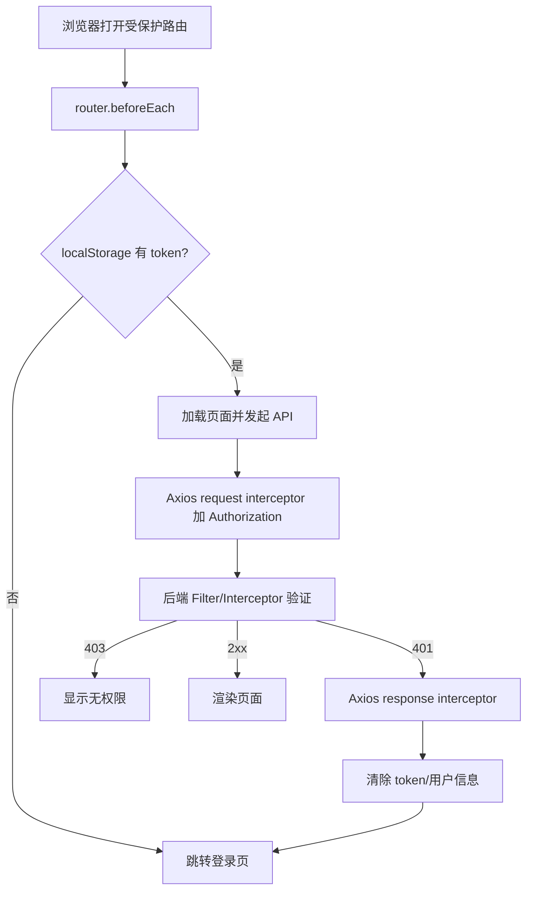
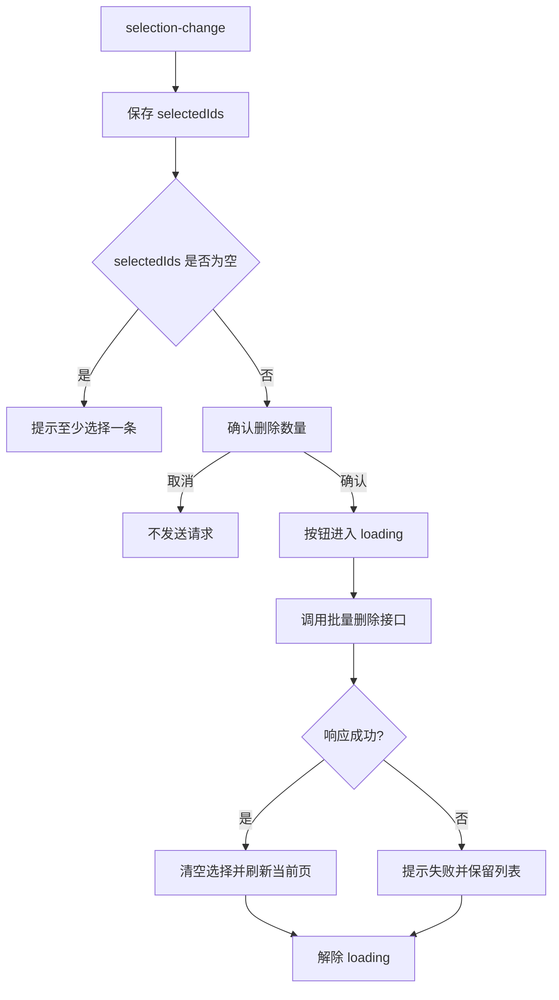

# 18 前端 Web 实战：Tlias 员工管理（二）

本章完成 Tlias 前端的最后一段：员工修改、单个与批量删除、登录退出、Axios Token 处理、401 跳转，以及前端打包部署。

## 1. 学习目标与前置知识

- 能复用新增表单完成员工编辑。
- 能实现单个删除和批量删除。
- 能完成登录、退出和当前用户展示。
- 能在 Axios 拦截器中统一处理 JWT 和 401。
- 能构建前端并部署到 Nginx。

## 2. 修改员工

### 2.1 查询回显

编辑按钮携带员工 ID，先请求详情接口：

```text
GET /emps/{id}
```

收到数据后，把基本信息和 `exprList` 一起赋给表单。日期、性别、部门 ID 等字段要检查类型是否与表单组件匹配。

### 2.2 新增与修改共用表单

可以通过 `form.id` 判断当前操作：

```javascript
if (form.value.id) {
  await updateEmp(form.value)
} else {
  await addEmp(form.value)
}
```

打开新增时必须清空旧的 ID 和经历数组；打开编辑时必须先查询详情，不能直接复用上一条员工数据。

## 3. 删除员工

### 3.1 删除单个

流程是确认、调用 `DELETE /emps/{id}`、提示结果、刷新列表。重复点击应在请求期间禁用按钮，后端也应保证重复请求不会造成错误副作用。

### 3.2 批量删除

Table 通过 `selection-change` 得到选中行：

```javascript
const selectedIds = ref([])

const handleSelectionChange = rows => {
  selectedIds.value = rows.map(row => row.id)
}
```

批量接口可以是 `DELETE /emps?ids=1,2,3`，也可以是 `DELETE /emps` 携带 JSON 数组，必须以接口文档为准。没有选择记录时，前端应直接提示用户，不要发送空请求。

## 4. 登录页面

登录页面收集用户名和密码，调用：

```text
POST /login
```

成功后保存 JWT：

```javascript
const result = await login(form.value)
localStorage.setItem('token', result.data)
router.push('/')
```

Token 的保存位置要和项目安全要求匹配。`localStorage` 使用简单，但一旦页面存在 XSS 漏洞，Token 可能被读取；生产项目需结合安全策略评估。

## 5. Axios 请求拦截器

所有受保护请求都应自动携带 Token：

```javascript
request.interceptors.request.use(config => {
  const token = localStorage.getItem('token')
  if (token) {
    config.headers.Authorization = `Bearer ${token}`
  }
  return config
})
```

请求头名称、是否需要 `Bearer ` 前缀，必须与第 12 章后端校验代码一致。

## 6. 统一处理 401

响应拦截器统一处理未认证：

```javascript
request.interceptors.response.use(
  response => response,
  error => {
    if (error.response?.status === 401) {
      localStorage.removeItem('token')
      router.push('/login')
    }
    return Promise.reject(error)
  }
)
```

401 的常见原因：Token 缺失、过期、签名错误、请求头名称错误或后端密钥变化。排查时先看 Network 中的请求头和响应状态。

## 7. 展示登录用户与退出

登录后可以调用当前用户接口，或从登录响应中取得用户名并显示在顶部栏。退出时清理 Token 和用户信息，再跳转登录页：

```javascript
const logout = () => {
  localStorage.removeItem('token')
  router.push('/login')
}
```

退出只是清理客户端凭证；如果系统要求立即让旧 Token 失效，还需要服务端维护黑名单、短过期时间或其他撤销机制。

## 8. 图片上传 401 问题

普通 Axios 请求会经过请求拦截器，但 Element Plus 的上传组件可能使用自己的请求方式，因此不会自动带上 JWT。解决思路：

- 在上传组件的请求头中显式设置 Token。
- 或使用自定义上传函数，统一调用封装后的 Axios。
- 确认上传接口本身被后端登录校验保护还是允许匿名访问。

```vue
<el-upload
  action="/upload"
  :headers="{ Authorization: `Bearer ${token}` }">
</el-upload>
```

不要把 Token 写死在模板或代码仓库中。

## 9. 打包与 Nginx 部署

```bash
npm run build
```

构建产物在 `dist` 目录。Nginx 配置需要指向 `dist`，并根据前后端分离方式配置反向代理：

```nginx
location / {
    root   D:/nginx/html/tlias;
    try_files $uri $uri/ /index.html;
}

location /api/ {
    proxy_pass http://localhost:8080/;
}
```

实际路径和 API 前缀以项目配置为准。部署后重点验证刷新子路由、登录、图片上传和跨域请求。

## 10. 完整验收流程

1. 未登录访问部门和员工页面，确认跳转登录。
2. 登录成功后确认 Token 保存且列表请求携带 Token。
3. 完成部门 CRUD。
4. 完成员工条件分页、新增、编辑、单删、批删。
5. 退出后确认 Token 清理。
6. 手动让 Token 失效，确认 401 跳转。
7. 上传图片，确认上传请求带 Token。
8. 执行构建并用 Nginx 刷新 `/dept`、`/emp` 等子路由。

## 11. 小白易错点

- 路由跳转成功不代表接口权限正确，必须检查 Network。
- 401 和 403 含义不同：前者是未认证，后者通常是无权限。
- 上传组件可能绕过 Axios 拦截器。
- 批量删除前要处理空选择和重复点击。
- Nginx 部署 history 路由时缺少 `try_files` 会导致刷新 404。

## 12. 资料对应关系

- 《JavaWeb笔记》：第十四章登录认证、文件上传、前端打包部署。
- 第 12 章：后端 JWT、Filter、Interceptor。
- 第 15–17 章：Vue 工程、Element Plus、部门管理和员工新增。

## 13. 关键补充：前端认证的两道门

路由守卫解决“页面能不能进入”，Axios 拦截器解决“请求能不能统一携带凭证和处理失效”。二者缺一不可，但都不能替代后端鉴权。



### 13.1 防止 401 跳转循环

响应拦截器处理 401 时要排除 `/login` 本身，并避免多个并发请求同时跳转：

```javascript
let redirecting = false

if (error.response?.status === 401 && !config.url?.includes('/login')) {
  localStorage.removeItem('token')
  if (!redirecting) {
    redirecting = true
    router.replace('/login').finally(() => { redirecting = false })
  }
}
```

真实项目还要考虑刷新 Token、并发请求排队和多标签页退出同步；初学阶段先把“过期清理 + 回登录”链路跑通。

Axios 的多个拦截器也有顺序：请求拦截器通常按后加先执行（LIFO），响应拦截器按先加先执行（FIFO）。如果同时配置“解包响应”和“统一错误提示”，要明确注册顺序，避免页面拿到的对象层级与预期不一致。

### 13.2 批量删除的安全流程



如果删除当前页最后一条记录，刷新后页码可能超出总页数；后端返回新总数后，前端应把 `page` 调整为不大于最后一页再重新查询。

### 13.3 图片上传 401 的完整排查

1. 看 Network 中上传请求的 URL 是否经过 `/api` 代理。
2. 确认请求头实际叫 `Authorization` 还是项目约定的 `token`。
3. 确认是否需要 `Bearer ` 前缀，且没有多余引号。
4. 检查 `el-upload` 的 `headers` 是否在 Token 变化后重新计算。
5. 检查后端上传接口是否被 Filter/Interceptor 拦截，以及是否正确处理 `OPTIONS`。
6. 继续检查文件大小、MIME 类型、OSS 凭证和返回 JSON；不要把所有上传失败都归结为 401。

### 13.4 Nginx 部署检查表

```mermaid
flowchart LR
    A[npm run build] --> B[dist]
    B --> C[Nginx 静态文件 root]
    C --> D{访问 /dept 并刷新}
    D -- 200 --> E[history 回退正确]
    D -- 404 --> F[补 try_files ... /index.html]
    C --> G[/api/ 请求]
    G --> H[proxy_pass 后端]
    H --> I{浏览器跨域?}
    I -- 是 --> J[统一域名或正确 CORS]
    I -- 否 --> K[联调完成]
```

`vite preview` 只适合验证构建产物，不是生产服务；生产环境要检查静态资源路径、API 反向代理、HTTPS、压缩缓存和日志。若前端使用 history 路由，所有未知页面路径都要回退到 `index.html`，但 `/api/` 必须优先转发给后端。

## 14. 联网核对与延伸阅读

- [Vue Router 导航守卫](https://router.vuejs.org/guide/advanced/navigation-guards.html)
- [Element Plus Table](https://element-plus.org/en-US/component/table)
- [Vite 构建与部署](https://vite.dev/guide/build)
