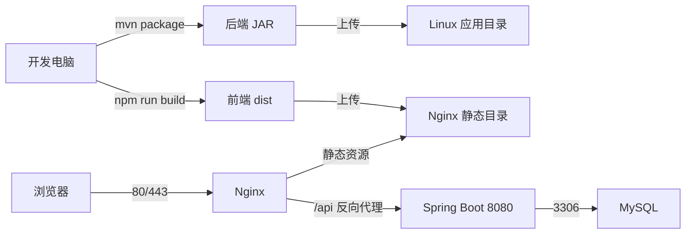
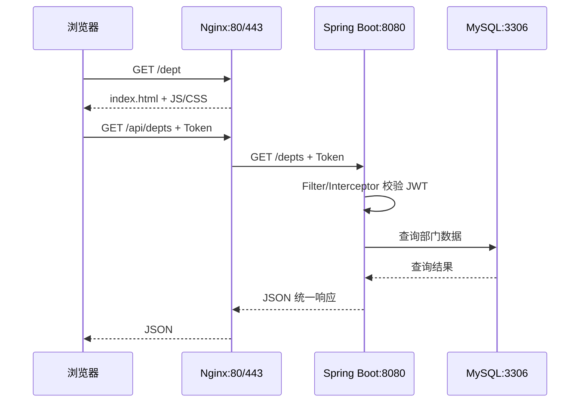
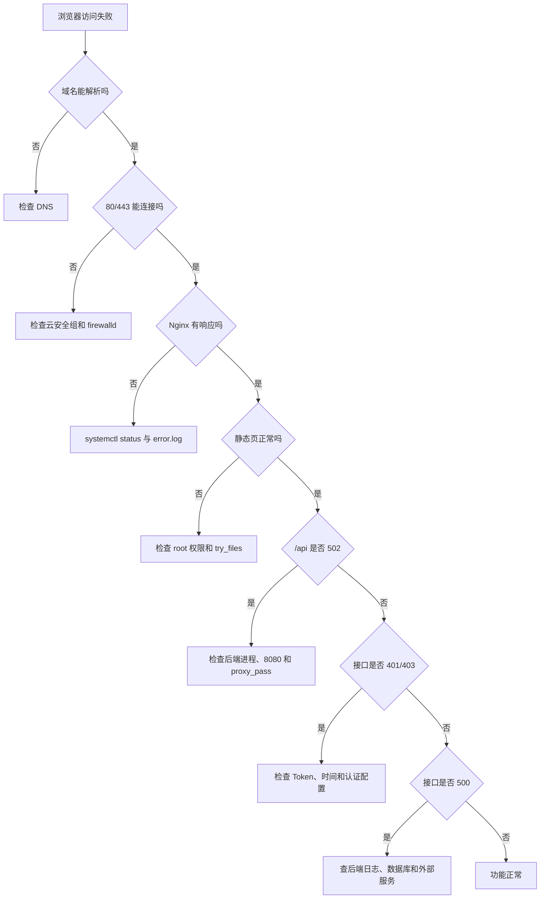
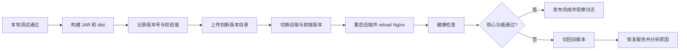

# 19 项目部署：Linux

本章把前面完成的 Tlias 前后端项目部署到 Linux 服务器。重点不是背命令，而是建立一条完整思路：构建产物、传输文件、配置环境、启动服务、放行流量、检查日志、验证功能和准备回滚。

## 1. 学习目标与前置知识

学完本章后，应当能够：

- 说清开发环境、测试环境和生产环境的区别。
- 使用常见 Linux 命令管理目录、文件、权限、进程、端口和日志。
- 把 Spring Boot 项目打成可执行 JAR 并作为系统服务运行。
- 把 Vue 构建产物交给 Nginx，并反向代理后端接口。
- 理解防火墙、SELinux、最小权限和敏感配置外置。
- 按照从外到内的顺序排查“网页打不开”和“接口请求失败”。

前置知识：第 03 章 Maven、第 04 章 Spring Boot、第 12 章登录认证，以及第 15 至 18 章 Vue 工程化和 Tlias 前端项目。

## 2. 部署到底在做什么

开发时，IDE、数据库和浏览器通常都在自己的电脑上；部署后，应用要离开 IDE，在服务器上长期、稳定地运行。



部署不是简单地“把源码复制过去”。服务器真正运行的是：

| 部分 | 构建产物 | 运行者 |
| --- | --- | --- |
| Vue 前端 | `dist` 中的 HTML、CSS、JavaScript | Nginx |
| Spring Boot 后端 | 可执行 JAR | JVM |
| MySQL | 表结构和业务数据 | MySQL Server |
| 配置 | 环境变量或外部配置文件 | 应用启动时读取 |

## 3. Linux 使用前的基本认识

### 3.1 路径与目录

- `/` 是根目录，所有文件都从这里向下组织。
- `/home` 通常存放普通用户目录。
- `/etc` 通常存放系统和服务配置。
- `/var/log` 通常存放日志。
- `/opt` 适合放置额外安装的软件或业务应用。
- `/tmp` 是临时目录，不能把长期数据放在这里。
- `.` 表示当前目录，`..` 表示上级目录，`~` 表示当前用户的家目录。

生产部署可以约定：

```text
/opt/tlias/
├── app/
│   └── tlias.jar
├── config/
│   └── tlias.env
├── releases/
│   ├── tlias-20260921-1.jar
│   └── tlias-20260921-2.jar
└── logs/
```

目录约定的意义是让安装、更新、日志和回滚都有固定位置。

### 3.2 用户与权限

Linux 权限分为所有者、所属组和其他用户，每组都有读 `r`、写 `w`、执行 `x` 三种权限。

```bash
ls -l /opt/tlias
chmod 750 /opt/tlias
chown -R tlias:tlias /opt/tlias
```

不要长期使用 `root` 运行 Java 应用。更稳妥的做法是创建专用低权限用户：

```bash
sudo useradd --system --create-home --shell /sbin/nologin tlias
sudo mkdir -p /opt/tlias/{app,config,releases,logs}
sudo chown -R tlias:tlias /opt/tlias
```

`chmod 777` 虽然可能暂时消除权限错误，却会让任何本机用户都能修改文件，不应作为通用解决方法。

## 4. 常用命令按任务学习

### 4.1 查看和切换目录

```bash
pwd
ls -lah
cd /opt/tlias
```

### 4.2 创建、复制、移动和删除

```bash
mkdir -p /opt/tlias/app
touch notes.txt
cp source.jar backup.jar
mv backup.jar /opt/tlias/releases/
rm notes.txt
```

执行 `rm` 前先用 `pwd` 和 `ls` 确认位置。不要对不确定的变量、通配符或根目录执行递归删除。

### 4.3 查看文件与日志

```bash
cat application.yml
less /var/log/nginx/error.log
tail -n 100 /opt/tlias/logs/app.log
tail -f /opt/tlias/logs/app.log
```

`tail -f` 会持续跟踪新增日志，适合在另一个终端发请求时观察后端行为，按 `Ctrl+C` 退出。

### 4.4 搜索文件和内容

```bash
find /opt/tlias -name '*.jar'
grep -n 'ERROR' /opt/tlias/logs/app.log
grep -R 'server.port' /opt/tlias/config
```

### 4.5 压缩和解压

```bash
tar -czf dist.tar.gz dist/
tar -xzf dist.tar.gz
```

### 4.6 进程、端口和资源

```bash
ps -ef | grep java
ss -lntp
ss -lntp | grep 8080
free -h
df -h
top
```

端口监听只说明进程已经绑定端口，不代表业务接口一定正常；还要使用 `curl` 验证 HTTP 响应。

## 5. 先在本地构建和验证

### 5.1 后端构建

在后端工程目录运行：

```bash
mvn clean package
```

测试成功后，`target` 目录中会生成 JAR。Spring Boot Maven 插件可以把应用及其依赖打成能够通过 `java -jar` 启动的归档。

先在本地验证构建产物：

```bash
java -jar target/tlias-web-management.jar
```

如果需要跳过测试，应先明确测试为何不能运行，而不是把 `-DskipTests` 当作固定习惯。

### 5.2 前端构建

在前端工程目录运行：

```bash
npm ci
npm run build
```

`npm ci` 根据锁文件安装确定版本，适合自动化构建。构建后先用预览命令检查资源路径和路由：

```bash
npm run preview
```

预览服务器用于检查构建结果，不作为生产 Web 服务器。

## 6. 上传文件与版本目录

可以用 `scp` 从开发电脑上传：

```bash
scp target/tlias-web-management.jar deploy@example.com:/tmp/
scp dist.tar.gz deploy@example.com:/tmp/
```

登录服务器后，把产物移动到版本目录，再更新当前版本：

```bash
sudo mv /tmp/tlias-web-management.jar /opt/tlias/releases/tlias-20260921-1.jar
sudo chown tlias:tlias /opt/tlias/releases/tlias-20260921-1.jar
sudo ln -sfn /opt/tlias/releases/tlias-20260921-1.jar /opt/tlias/app/tlias.jar
```

保留最近几个可用版本，可以在新版本失败时快速把软链接切回旧 JAR。

## 7. 后端配置外置

数据库密码、JWT 密钥和对象存储密钥不能写进 Git 仓库或 JAR。Spring Boot 支持外部配置文件、环境变量和命令行参数。

例如创建 `/opt/tlias/config/tlias.env`：

```text
DB_URL=jdbc:mysql://127.0.0.1:3306/tlias?useUnicode=true&characterEncoding=UTF-8&serverTimezone=Asia/Shanghai
DB_USERNAME=tlias_app
DB_PASSWORD=请在服务器安全设置
JWT_SECRET=请使用足够长的随机值
```

限制文件权限：

```bash
sudo chown root:tlias /opt/tlias/config/tlias.env
sudo chmod 640 /opt/tlias/config/tlias.env
```

在 `application.yml` 中读取环境变量：

```yaml
spring:
  datasource:
    url: ${DB_URL}
    username: ${DB_USERNAME}
    password: ${DB_PASSWORD}

jwt:
  secret: ${JWT_SECRET}
```

## 8. 使用 systemd 管理后端

临时学习可以用 `java -jar`，长期运行则应交给服务管理器。systemd 可以统一处理启动、停止、开机自启、异常重启和日志查询。

创建 `/etc/systemd/system/tlias.service`：

```ini
[Unit]
Description=Tlias Web Application
After=network-online.target
Wants=network-online.target

[Service]
Type=simple
User=tlias
Group=tlias
WorkingDirectory=/opt/tlias/app
EnvironmentFile=/opt/tlias/config/tlias.env
ExecStart=/usr/bin/java -jar /opt/tlias/app/tlias.jar --spring.profiles.active=prod
SuccessExitStatus=143
Restart=on-failure
RestartSec=5

[Install]
WantedBy=multi-user.target
```

加载并启动：

```bash
sudo systemctl daemon-reload
sudo systemctl enable --now tlias.service
sudo systemctl status tlias.service
```

常用管理命令：

```bash
sudo systemctl restart tlias.service
sudo systemctl stop tlias.service
sudo journalctl -u tlias.service -n 100 --no-pager
sudo journalctl -u tlias.service -f
```

`enable` 表示设置开机自启，`start` 表示本次立即启动，二者含义不同；`enable --now` 同时完成两件事。

## 9. 使用 Nginx 部署前端

解压前端文件并放到静态目录，例如 `/var/www/tlias`。Nginx 同时完成三件事：

1. 返回 Vue 的静态资源。
2. 为 history 路由回退到 `index.html`。
3. 将 `/api/` 请求反向代理到 Spring Boot。

示例配置：

```nginx
server {
    listen 80;
    server_name example.com;

    root /var/www/tlias;
    index index.html;

    location / {
        try_files $uri $uri/ /index.html;
    }

    location /api/ {
        proxy_pass http://127.0.0.1:8080/;
        proxy_set_header Host $host;
        proxy_set_header X-Real-IP $remote_addr;
        proxy_set_header X-Forwarded-For $proxy_add_x_forwarded_for;
        proxy_set_header X-Forwarded-Proto $scheme;
    }
}
```

注意 `proxy_pass` 末尾斜杠会影响转发后的路径。例如 `/api/depts` 是否变成 `/depts`，必须和后端接口路径及 Axios `baseURL` 一起核对。

修改配置后先检查语法，再平滑加载：

```bash
sudo nginx -t
sudo systemctl reload nginx
```

不要在未执行 `nginx -t` 的情况下直接重启，否则语法错误可能导致服务无法恢复。

## 10. 一次请求在服务器中的路径



浏览器通常只需要访问 80 或 443。后端 8080 和数据库 3306 可以只监听内网或本机，减少暴露面。

## 11. 防火墙、SELinux 与安全边界

### 11.1 防火墙

使用 `firewalld` 的系统可以只放行业务需要的服务：

```bash
sudo firewall-cmd --permanent --add-service=http
sudo firewall-cmd --permanent --add-service=https
sudo firewall-cmd --reload
sudo firewall-cmd --list-all
```

不建议直接向公网开放 MySQL 3306。若确实需要远程管理，应限制来源地址，并使用专用账号和强认证。

### 11.2 SELinux

出现“文件权限看起来正确，但 Nginx 仍然 403”或“反向代理连接被拒绝”时，要检查 SELinux 上下文和审计日志，而不是直接永久关闭 SELinux。

```bash
getenforce
sudo ausearch -m AVC -ts recent
```

SELinux 的具体配置与发行版、目录和服务有关，应根据审计信息修复上下文或策略。

### 11.3 基本安全清单

- 使用普通部署用户和专用服务用户，限制 `sudo`。
- 使用 SSH 密钥登录，关闭不需要的密码登录和端口。
- 密钥、密码和生产配置不进入 Git。
- 对外使用 HTTPS，JWT 不在明文 HTTP 中传输。
- 定期更新系统安全补丁，并备份数据库和配置。
- 日志中不要打印密码、完整 Token 或云服务密钥。

## 12. 从外到内排查部署故障



服务器内部可以依次验证：

```bash
curl -i http://127.0.0.1:8080/depts
curl -i http://127.0.0.1/api/depts
curl -I http://127.0.0.1/
```

第一条失败，优先查后端；第一条成功而第二条失败，优先查 Nginx；服务器本机成功而外部失败，优先查安全组、防火墙、DNS 和公网入口。

## 13. 发布、验证与回滚流程



发布后的最小验收包括：

1. 首页能打开并刷新路由不出现 404。
2. 登录成功，受保护接口能携带 Token。
3. 部门和员工查询、新增、修改、删除正常。
4. 图片上传正常。
5. 重启服务器后 Nginx、后端和数据库能够恢复。
6. 日志没有持续出现异常，磁盘和内存仍有余量。

数据库变更比 JAR 回滚更复杂。上线前应备份，并让数据库脚本尽量向后兼容，不能假设切回旧 JAR 就能自动恢复旧表结构。

## 14. 小白易错点

- 把源码传到服务器，却忘记构建或缺少运行时。
- JAR 本地能启动，服务器因 Java 版本不同而失败。
- 后端仍连接开发电脑的 `localhost` 数据库。
- 只启动进程，没有配置开机自启和异常重启。
- Nginx 的 `proxy_pass` 路径多一个或少一个 `/`。
- Vue history 路由刷新后 404，遗漏 `try_files`。
- 只看浏览器错误，不检查 Nginx 和后端日志。
- 直接开放 8080、3306 和所有防火墙端口。
- 把数据库密码写入仓库，或在日志中打印完整 Token。
- 发布时覆盖唯一的旧文件，出现问题后无法快速回滚。

## 15. 练习清单

1. 在 Linux 虚拟机中创建专用 `tlias` 用户和应用目录。
2. 把后端打成 JAR，并先用命令行验证，再改成 systemd 服务。
3. 构建 Vue 项目，用 Nginx 提供静态资源和 `/api` 代理。
4. 故意写错数据库地址，根据日志定位并修复。
5. 故意停止后端，观察 Nginx 返回的状态码和错误日志。
6. 保留两个 JAR 版本，练习更新和回滚。
7. 重启虚拟机，检查所有必要服务能否自动恢复。

## 16. 本章总结

- Linux 部署的核心链路是“构建、上传、配置、运行、暴露、验证、监控、回滚”。
- Vue 构建产物由 Nginx 提供，Spring Boot JAR 由 JVM 运行，Nginx 把 API 请求转给后端。
- systemd 比手工后台命令更适合长期管理 Java 服务。
- 配置与代码分离，密码和密钥通过受保护的外部配置注入。
- 排错应从 DNS、端口、Nginx、后端到数据库逐层缩小范围。
- 能启动不等于部署完成，还必须考虑权限、安全、日志、重启和回滚。

## 17. 联网核对与延伸阅读

- [Spring Boot 可执行归档](https://docs.spring.io/spring-boot/maven-plugin/packaging.html)
- [Spring Boot 外部化配置](https://docs.spring.io/spring-boot/reference/features/external-config.html)
- [Nginx 初学者指南](https://nginx.org/en/docs/beginners_guide.html)
- [Red Hat systemd 管理](https://docs.redhat.com/en/documentation/red_hat_enterprise_linux/8/html/configuring_basic_system_settings/managing-systemd_configuring-basic-system-settings)
- [Red Hat firewalld 配置](https://docs.redhat.com/en/documentation/red_hat_enterprise_linux/8/html/configuring_and_managing_networking/using-and-configuring-firewalld_configuring-and-managing-networking)
