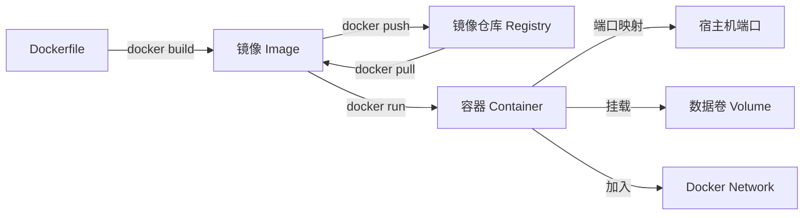
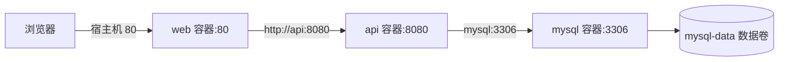
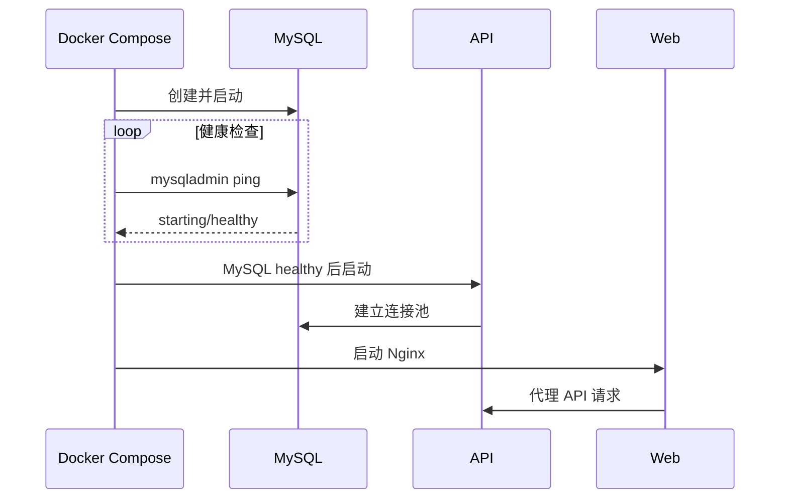
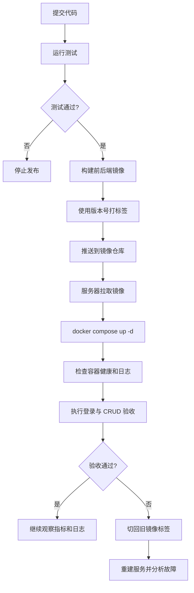
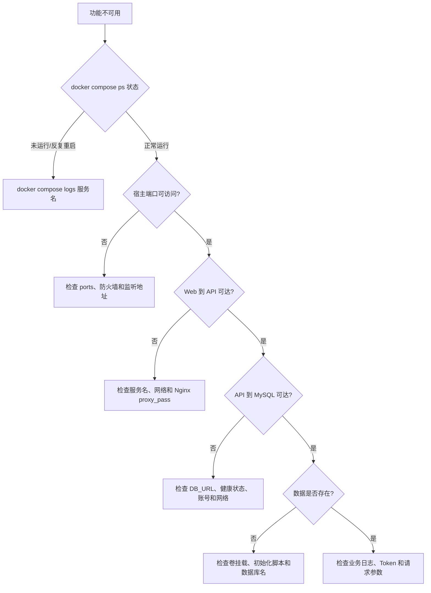

# 20 项目部署：Docker

上一章把 Java、Nginx、MySQL 和项目文件直接安装到 Linux。Docker 进一步把应用及运行环境包装成镜像，用容器启动，让开发、测试和生产更容易保持一致。本章使用 Tlias 的前端、后端和数据库建立一个完整的多容器部署模型。

## 1. 学习目标与前置知识

学完本章后，应当能够：

- 区分镜像、容器、仓库、Dockerfile、数据卷和网络。
- 使用常用命令完成镜像和容器的生命周期管理。
- 为 Spring Boot 后端和 Vue 前端编写 Dockerfile。
- 正确处理端口映射、容器间通信和 MySQL 数据持久化。
- 使用 Docker Compose 编排前端、后端和数据库。
- 完成版本更新、日志检查、健康检查和回滚。
- 按照容器状态、日志、网络、配置和数据的顺序排错。

前置知识：第 19 章 Linux 项目部署，以及 Maven、Spring Boot、Vue、Nginx、MySQL 和环境变量基础。

## 2. 为什么使用 Docker

传统部署要在服务器上逐个安装并配置 Java、Nginx、MySQL，不同机器的版本和配置容易不一致。Docker 把应用和运行所需文件组成镜像，再从镜像创建隔离进程，也就是容器。

| 对比项 | 传统部署 | Docker 部署 |
| --- | --- | --- |
| 环境准备 | 手工安装运行时和依赖 | 根据镜像创建容器 |
| 一致性 | 容易出现版本差异 | 同一镜像内容一致 |
| 隔离 | 多个应用共享宿主环境 | 进程、文件系统和网络有隔离 |
| 更新 | 覆盖文件并重启 | 用新镜像重建容器 |
| 数据 | 通常直接写宿主目录 | 需要明确使用卷或绑定挂载 |
| 排错 | 查宿主机进程和日志 | 查容器状态、日志、网络和挂载 |

容器不是完整虚拟机。多个 Linux 容器共享宿主机内核，因此通常比每个应用运行一套完整操作系统更轻量。

## 3. Docker 的核心对象



### 3.1 镜像

镜像是只读模板，包含运行应用所需的文件、运行时和默认配置。镜像由不可变的分层组成，修改应用后通常构建新镜像，而不是进入旧镜像手工修改。

### 3.2 容器

容器是镜像的运行实例。同一个镜像可以创建多个容器。删除容器会删除它自己的可写层，因此业务数据不能只保存在容器内部。

### 3.3 镜像仓库

仓库用于保存和分发镜像，例如 Docker Hub 或公司私有仓库。完整镜像名通常包含仓库、命名空间、名称和标签：

```text
registry.example.com/study/tlias-api:1.0.0
```

### 3.4 Dockerfile 与 Compose

- Dockerfile 描述“一个镜像怎样构建”。
- Compose 文件描述“多个服务怎样一起运行”。

可以把 Dockerfile 理解成单个服务的制作说明，把 Compose 理解成整个系统的运行清单。

## 4. 安装后先做的检查

不同 Linux 发行版的安装步骤不同，应优先使用 Docker 官方对应发行版文档。安装后检查：

```bash
docker version
docker info
sudo systemctl enable --now docker
docker run --rm hello-world
```

若普通用户需要执行 Docker 命令，可以按官方步骤加入 `docker` 组，但要理解：能控制 Docker daemon 的用户通常具备接近 root 的主机控制能力，不能随意授权。

现代 Compose 使用子命令形式：

```bash
docker compose version
```

旧教程中的 `docker-compose` 是早期独立命令，不要在同一项目中混淆两套调用方式。

## 5. 镜像和容器常用命令

### 5.1 镜像操作

```bash
docker pull nginx:alpine
docker image ls
docker image inspect nginx:alpine
docker image rm nginx:alpine
```

不要只依赖 `latest`。生产部署应使用明确版本标签，最好还能记录不可变的镜像摘要。

### 5.2 创建与查看容器

```bash
docker run -d --name web -p 8080:80 nginx:alpine
docker ps
docker ps -a
docker inspect web
```

`-d` 表示后台运行，`--name` 指定容器名，`-p 8080:80` 表示把宿主机 8080 转发到容器 80。

### 5.3 停止、启动和删除

```bash
docker stop web
docker start web
docker restart web
docker rm web
```

镜像和容器不是同一个对象。容器仍存在时可能无法删除其镜像；删除容器也不会自动删除镜像。

### 5.4 日志与容器内命令

```bash
docker logs --tail 100 web
docker logs -f web
docker exec -it web sh
docker stats
```

进入容器适合诊断，不应把手工修改容器当作正式发布方式，因为重建后这些改动会消失。

### 5.5 Docker 常用命令速查表

表格中的 `<镜像>`、`<容器>`、`<网络>` 和 `<数据卷>` 都是占位符，使用时替换为自己的名称或 ID。镜像通常写成 `名称:标签`，例如 `tlias-api:1.0.0`。

#### Docker 基本信息

| 命令 | 作用 | 常用场景或注意事项 |
| --- | --- | --- |
| `docker version` | 查看客户端和服务端版本 | 同时验证 Docker daemon 是否可访问 |
| `docker info` | 查看 Docker 整体运行信息 | 可检查存储驱动、镜像数、容器数和运行状态 |
| `docker --help` | 查看顶层命令帮助 | 不确定命令名称时先查帮助 |
| `docker <命令> --help` | 查看某个命令的参数 | 例如 `docker run --help` |
| `docker system df` | 查看镜像、容器、卷和构建缓存占用 | 磁盘空间不足时先查看，不要直接清理 |

#### 镜像命令

| 命令 | 作用 | 常用场景或注意事项 |
| --- | --- | --- |
| `docker pull <镜像>` | 从镜像仓库下载镜像 | 例如 `docker pull nginx:alpine` |
| `docker image ls` | 列出本地镜像 | 也可以使用 `docker images` |
| `docker build -t <镜像> .` | 根据当前目录的 Dockerfile 构建镜像 | 最后的 `.` 表示构建上下文 |
| `docker build --no-cache -t <镜像> .` | 不使用构建缓存重新构建 | 仅在确认缓存导致问题时使用，构建会更慢 |
| `docker tag <原镜像> <新镜像>` | 为镜像增加新名称或标签 | 常用于增加仓库地址或版本号 |
| `docker image inspect <镜像>` | 查看镜像详细信息 | 可查看入口命令、环境变量、层和摘要 |
| `docker history <镜像>` | 查看镜像构建层历史 | 用于分析镜像体积和 Dockerfile 层次 |
| `docker push <镜像>` | 上传镜像到仓库 | 需要先登录并正确添加仓库名称 |
| `docker image rm <镜像>` | 删除本地镜像 | 若仍有容器引用该镜像，通常要先处理容器 |
| `docker save -o app.tar <镜像>` | 把镜像导出为归档文件 | 适合离线传输镜像，不等同于导出容器数据 |
| `docker load -i app.tar` | 从归档文件导入镜像 | 与 `docker save` 配合使用 |

#### 容器生命周期命令

| 命令 | 作用 | 常用场景或注意事项 |
| --- | --- | --- |
| `docker run <镜像>` | 创建并启动一个新容器 | 每执行一次都会创建新容器 |
| `docker run -d --name <容器> <镜像>` | 后台创建并启动命名容器 | `-d` 表示后台运行，名称应保持唯一 |
| `docker run --rm <镜像>` | 容器退出后自动删除 | 适合一次性测试，不适合需要保留容器的服务 |
| `docker run -p 8080:80 <镜像>` | 把宿主机 8080 映射到容器 80 | 顺序是“宿主机端口:容器端口” |
| `docker run -e KEY=value <镜像>` | 向容器传入环境变量 | 敏感值不建议直接出现在命令历史中 |
| `docker run --env-file .env <镜像>` | 从文件读取环境变量 | 环境文件应限制权限并加入 `.gitignore` |
| `docker ps` | 查看正在运行的容器 | 默认不显示已停止容器 |
| `docker ps -a` | 查看所有容器 | 排查“容器启动后立即退出”时常用 |
| `docker start <容器>` | 启动已有的已停止容器 | 不会创建新容器，也不会采用新镜像配置 |
| `docker stop <容器>` | 正常停止容器 | 会先发送终止信号并等待进程退出 |
| `docker restart <容器>` | 重启现有容器 | 只是重启旧容器，不等于用新镜像重新创建 |
| `docker kill <容器>` | 强制终止容器 | 正常 `stop` 无法结束时才考虑使用 |
| `docker rm <容器>` | 删除已停止容器 | 删除前确认其中没有未持久化数据 |
| `docker rm -f <容器>` | 强制停止并删除容器 | 破坏性更强，不应作为常规停止方式 |
| `docker rename <旧名> <新名>` | 修改容器名称 | 修改后相关脚本和配置也要同步更新 |

#### 容器诊断与文件操作

| 命令 | 作用 | 常用场景或注意事项 |
| --- | --- | --- |
| `docker logs <容器>` | 查看容器标准输出日志 | 应用应尽量把运行日志输出到标准输出 |
| `docker logs --tail 100 <容器>` | 查看最后 100 行日志 | 快速查看最近错误，避免一次输出全部日志 |
| `docker logs -f <容器>` | 持续跟踪日志 | 按 `Ctrl+C` 退出跟踪，不会停止容器 |
| `docker inspect <容器>` | 查看容器完整配置和状态 | 可检查网络、挂载、环境变量和退出码 |
| `docker exec -it <容器> sh` | 在运行中的容器执行交互式 Shell | 精简镜像可能只有 `sh`，没有 `bash` |
| `docker exec <容器> <命令>` | 在容器中执行单条命令 | 适合连通性或配置检查 |
| `docker cp <本地路径> <容器>:<路径>` | 从宿主机复制文件到容器 | 临时诊断可用，正式发布应重新构建镜像或挂载 |
| `docker cp <容器>:<路径> <本地路径>` | 从容器复制文件到宿主机 | 可临时取出诊断文件，不代替持久化方案 |
| `docker stats` | 实时查看容器 CPU、内存和网络资源 | 按 `Ctrl+C` 退出 |
| `docker stats --no-stream` | 输出一次资源使用情况后退出 | 适合脚本或快速检查 |
| `docker top <容器>` | 查看容器中的进程 | 用于确认主进程是否存在 |
| `docker port <容器>` | 查看容器端口映射 | 排查宿主机端口与容器端口对应关系 |

#### 网络命令

| 命令 | 作用 | 常用场景或注意事项 |
| --- | --- | --- |
| `docker network ls` | 列出 Docker 网络 | 查看 Compose 网络或自定义网络是否存在 |
| `docker network create <网络>` | 创建用户自定义网络 | 同一网络中的容器可以通过名称通信 |
| `docker network inspect <网络>` | 查看网络详细信息 | 可查看子网、网关和已连接容器 |
| `docker network connect <网络> <容器>` | 把运行中的容器加入网络 | 一个容器可以加入多个网络 |
| `docker network disconnect <网络> <容器>` | 断开容器与网络的连接 | 断开前确认不会中断业务依赖 |
| `docker network rm <网络>` | 删除未使用的网络 | 有容器连接时通常无法删除 |

#### 数据卷命令

| 命令 | 作用 | 常用场景或注意事项 |
| --- | --- | --- |
| `docker volume ls` | 列出数据卷 | 检查数据库数据卷是否存在 |
| `docker volume create <数据卷>` | 创建命名数据卷 | 例如 `docker volume create mysql-data` |
| `docker volume inspect <数据卷>` | 查看数据卷详细信息 | 可确认挂载点和使用范围 |
| `docker run -v <数据卷>:<容器路径> <镜像>` | 把命名卷挂载到容器 | 数据生命周期独立于容器 |
| `docker run -v <宿主路径>:<容器路径>:ro <镜像>` | 以只读方式绑定宿主文件或目录 | 适合配置文件和静态资源 |
| `docker volume rm <数据卷>` | 删除指定数据卷 | 删除前必须确认数据已备份且不再使用 |
| `docker volume prune` | 删除所有未使用的数据卷 | 高风险命令，执行前逐个确认并备份 |

#### Docker Compose 命令

| 命令 | 作用 | 常用场景或注意事项 |
| --- | --- | --- |
| `docker compose version` | 查看 Compose 版本 | 现代版本使用空格形式，不是 `docker-compose` |
| `docker compose config` | 解析并校验 Compose 配置 | 输出可能包含展开后的敏感变量，不要公开 |
| `docker compose build` | 构建 Compose 中需要构建的镜像 | Dockerfile 或源码变化后使用 |
| `docker compose pull` | 拉取服务使用的远程镜像 | 发布前获取新版本镜像 |
| `docker compose up -d` | 创建或更新并后台启动整套服务 | 配置或镜像变化时会按需重建容器 |
| `docker compose up -d <服务>` | 只启动或更新指定服务 | 例如 `docker compose up -d api` |
| `docker compose ps` | 查看本项目服务状态 | 排查服务是否 healthy、running 或 exited |
| `docker compose logs <服务>` | 查看指定服务日志 | 例如 `docker compose logs api` |
| `docker compose logs -f <服务>` | 持续跟踪指定服务日志 | 联调和发布观察时常用 |
| `docker compose exec <服务> sh` | 进入正在运行的服务容器 | 使用服务名，不一定是实际容器名 |
| `docker compose start` | 启动已存在的服务容器 | 不重新创建容器 |
| `docker compose stop` | 停止服务但保留容器 | 后续可使用 `start` 恢复 |
| `docker compose restart <服务>` | 重启指定服务的现有容器 | 不会自动构建或采用新镜像 |
| `docker compose down` | 停止并删除本项目容器和默认网络 | 默认不删除命名卷和镜像 |
| `docker compose down -v` | 停止项目并删除声明的数据卷 | 极高风险，可能直接删除 MySQL 数据 |

#### 清理命令

| 命令 | 作用 | 常用场景或注意事项 |
| --- | --- | --- |
| `docker container prune` | 删除所有已停止容器 | 执行前先用 `docker ps -a` 检查 |
| `docker image prune` | 删除悬空镜像 | 不等于删除所有未使用镜像 |
| `docker builder prune` | 删除未使用的构建缓存 | 后续构建可能需要重新下载和构建 |
| `docker network prune` | 删除所有未使用网络 | 确认没有暂时停止但仍需保留的环境 |
| `docker system prune` | 综合清理未使用对象 | 影响范围大，不能把它当作日常固定命令 |

速查时先判断操作对象：镜像使用 `docker image`，容器使用 `docker container` 或常用简写，网络使用 `docker network`，数据卷使用 `docker volume`，整套项目使用 `docker compose`。涉及 `rm`、`prune`、`down -v` 时，必须先检查对象和备份。

## 6. 端口与网络：最容易混淆的地方

### 6.1 端口映射

```text
-p 宿主机端口:容器端口
```

例如 `-p 8080:80`：浏览器访问宿主机 8080，流量进入容器 80。容器内部服务必须监听容器端口，而不是宿主机端口。

### 6.2 容器中的 localhost

每个容器都有自己的网络空间。后端容器中的 `localhost:3306` 指向后端容器自己，不是 MySQL 容器，也不是宿主机。

在用户自定义网络中，可以用容器名或服务名访问：

```bash
docker network create tlias-net
```

```text
jdbc:mysql://mysql:3306/tlias
```

这里的 `mysql` 是同一 Docker 网络中的服务名。不要把容器动态 IP 写死到配置文件。



通常只需要向公网发布 Web 的 80/443。后端和数据库只在内部网络通信，无须映射到宿主机公网端口。

## 7. 数据持久化

容器删除后，其可写层也会消失。MySQL 数据、上传文件和必须保留的业务内容应放到容器生命周期之外。

### 7.1 数据卷

```bash
docker volume create mysql-data
docker volume ls
docker volume inspect mysql-data
```

运行 MySQL 时挂载：

```bash
docker run -d \
  --name mysql \
  --network tlias-net \
  -e MYSQL_ROOT_PASSWORD="${MYSQL_ROOT_PASSWORD}" \
  -e MYSQL_DATABASE=tlias \
  -v mysql-data:/var/lib/mysql \
  mysql:8.4
```

数据卷由 Docker 管理，适合数据库等持久数据。删除容器后卷仍可保留，但执行 `docker volume rm` 或带卷删除时仍可能丢失数据。

### 7.2 绑定挂载

绑定挂载把宿主机明确路径映射进容器，适合需要直接编辑或备份的配置：

```bash
docker run --rm \
  -v /opt/tlias/nginx.conf:/etc/nginx/conf.d/default.conf:ro \
  nginx:alpine nginx -t
```

`:ro` 表示容器只读。绑定挂载依赖宿主机目录结构，而命名卷更容易由 Docker 统一管理。

## 8. 为 Spring Boot 编写 Dockerfile

### 8.1 先由 Maven 构建 JAR

最简单的 Dockerfile 使用已经构建好的 JAR：

```dockerfile
FROM eclipse-temurin:17-jre

WORKDIR /app
COPY target/tlias-web-management.jar app.jar

EXPOSE 8080
USER 10001
ENTRYPOINT ["java", "-jar", "/app/app.jar"]
```

基础镜像的 Java 版本必须和项目 `pom.xml` 一致。`EXPOSE` 是镜像元数据，不会自动向宿主机发布端口；真正发布端口仍需 `-p` 或 Compose 的 `ports`。

### 8.2 多阶段构建

多阶段构建可以在构建阶段使用 Maven，在最终镜像中只保留 JRE 和 JAR：

```dockerfile
FROM maven:3.9-eclipse-temurin-17 AS build
WORKDIR /src

COPY pom.xml .
COPY src ./src
RUN mvn -B clean package -DskipTests

FROM eclipse-temurin:17-jre
WORKDIR /app
COPY --from=build /src/target/*.jar app.jar

EXPOSE 8080
USER 10001
ENTRYPOINT ["java", "-jar", "/app/app.jar"]
```

教学示例中使用 `-DskipTests` 是为了突出镜像构建流程；正式流水线应在构建镜像前单独运行测试并阻止失败版本发布。

### 8.3 `.dockerignore`

构建上下文不应包含 Git 元数据、IDE 配置、日志和无关文件：

```text
.git
.idea
*.iml
logs
README.md
```

构建并运行：

```bash
docker build -t tlias-api:1.0.0 .
docker run -d \
  --name api \
  --network tlias-net \
  -e DB_URL='jdbc:mysql://mysql:3306/tlias?serverTimezone=Asia/Shanghai' \
  -e DB_USERNAME=tlias_app \
  -e DB_PASSWORD="${DB_PASSWORD}" \
  -e JWT_SECRET="${JWT_SECRET}" \
  tlias-api:1.0.0
```

敏感值从服务器环境、受保护的环境文件或密钥系统注入，不要写进 Dockerfile，因为镜像层可能被检查。

## 9. 为 Vue 前端编写 Dockerfile

前端可以在 Node 阶段构建，再把 `dist` 复制到 Nginx 阶段：

```dockerfile
FROM node:20-alpine AS build
WORKDIR /app

COPY package.json package-lock.json ./
RUN npm ci
COPY . .
RUN npm run build

FROM nginx:alpine
COPY nginx.conf /etc/nginx/conf.d/default.conf
COPY --from=build /app/dist /usr/share/nginx/html

EXPOSE 80
```

对应的 `nginx.conf`：

```nginx
server {
    listen 80;
    server_name _;

    root /usr/share/nginx/html;
    index index.html;

    location / {
        try_files $uri $uri/ /index.html;
    }

    location /api/ {
        proxy_pass http://api:8080/;
        proxy_set_header Host $host;
        proxy_set_header X-Real-IP $remote_addr;
        proxy_set_header X-Forwarded-For $proxy_add_x_forwarded_for;
        proxy_set_header X-Forwarded-Proto $scheme;
    }
}
```

这里 `api` 不是域名，而是 Compose 网络中的后端服务名。浏览器只访问 Nginx，Nginx 在容器网络内部访问后端。

## 10. Docker Compose 编排 Tlias

单独执行多个 `docker run` 容易遗漏参数。Compose 用一个 YAML 文件声明服务、网络、卷、环境变量和依赖关系。

```yaml
services:
  mysql:
    image: mysql:8.4
    environment:
      MYSQL_ROOT_PASSWORD: ${MYSQL_ROOT_PASSWORD}
      MYSQL_DATABASE: tlias
      MYSQL_USER: tlias_app
      MYSQL_PASSWORD: ${DB_PASSWORD}
    volumes:
      - mysql-data:/var/lib/mysql
      - ./mysql/init:/docker-entrypoint-initdb.d:ro
    healthcheck:
      test: ["CMD-SHELL", "mysqladmin ping -h 127.0.0.1 -uroot -p$${MYSQL_ROOT_PASSWORD}"]
      interval: 10s
      timeout: 5s
      retries: 10
    restart: unless-stopped

  api:
    build:
      context: ./backend
    image: tlias-api:1.0.0
    environment:
      DB_URL: "jdbc:mysql://mysql:3306/tlias?useUnicode=true&characterEncoding=UTF-8&serverTimezone=Asia/Shanghai"
      DB_USERNAME: tlias_app
      DB_PASSWORD: ${DB_PASSWORD}
      JWT_SECRET: ${JWT_SECRET}
    depends_on:
      mysql:
        condition: service_healthy
    restart: unless-stopped

  web:
    build:
      context: ./frontend
    image: tlias-web:1.0.0
    ports:
      - "80:80"
    depends_on:
      - api
    restart: unless-stopped

volumes:
  mysql-data:
```

在 Compose 文件旁创建不提交到 Git 的 `.env`：

```text
MYSQL_ROOT_PASSWORD=请设置强密码
DB_PASSWORD=请设置应用数据库密码
JWT_SECRET=请设置足够长的随机值
```

并在 `.gitignore` 中加入：

```text
.env
```

常用操作：

```bash
docker compose config
docker compose build
docker compose up -d
docker compose ps
docker compose logs -f api
docker compose down
```

`docker compose config` 可以在启动前展开并检查配置。输出中可能包含解析后的敏感值，因此不要把输出贴到公开位置。

## 11. 启动顺序不等于服务就绪

数据库容器进入 running 状态时，MySQL 可能仍在初始化。`depends_on` 的短写法只表达启动顺序，不代表依赖已经可接受连接；需要通过 `healthcheck` 和 `condition: service_healthy` 等待就绪。



健康检查不能代替应用本身的重试机制。网络会抖动，数据库也可能在运行期间重启，后端应能合理重连并输出清晰日志。

## 12. 构建、发布与运行的完整流程



课程练习可以在服务器直接 `build`，但实际团队通常在 CI 中测试和构建，然后服务器只拉取已经确认的镜像，减少服务器环境差异。

## 13. 更新与回滚

### 13.1 使用明确版本

```text
tlias-api:1.0.0
tlias-api:1.0.1
tlias-web:1.0.1
```

不要反复覆盖唯一的 `latest`，否则无法明确当前运行内容，也不利于回滚。

### 13.2 更新单个服务

镜像来自仓库时：

```bash
docker compose pull api
docker compose up -d --no-deps api
docker compose logs --tail 100 api
```

本机构建时：

```bash
docker compose build api
docker compose up -d --no-deps api
```

### 13.3 回滚

把 Compose 中的镜像标签改回上一个已验证版本，再执行：

```bash
docker compose up -d --no-deps api
```

容器回滚不会自动回滚数据库。涉及表结构变化时，应准备可审查、可备份、尽量向后兼容的迁移方案。

## 14. 容器部署排错路线



常用诊断命令：

```bash
docker compose ps
docker compose logs --tail 200 api
docker inspect tlias-api-1
docker network ls
docker volume ls
docker exec -it tlias-api-1 sh
docker exec -it tlias-web-1 wget -qO- http://api:8080/depts
```

排错时先确认实际容器名，Compose 生成的名称可能带项目名前缀和序号。

## 15. 安全与稳定性

- 尽量使用官方或可信基础镜像，并固定合适版本。
- 最终镜像只保留运行所需内容，多阶段构建减少工具和源码残留。
- 应用容器尽量使用非 root 用户。
- 数据库不映射公网端口，只连接内部网络。
- 密码不写入 Dockerfile、Compose 仓库或镜像层。
- 生产环境优先使用密钥管理方案；`.env` 只是入门方案。
- 设置重启策略、健康检查和合理的 CPU、内存限制。
- 日志应输出到标准输出或统一日志系统，并配置轮转，避免磁盘写满。
- 定期备份并实际演练恢复 MySQL 数据卷。
- 发布前扫描镜像漏洞，及时更新基础镜像和应用依赖。

不要在不了解影响时执行下面这类清理操作：

```text
docker system prune
docker volume prune
docker compose down -v
```

其中 `down -v` 会删除 Compose 声明的卷，可能直接删除数据库数据。清理前必须确认目标、备份和恢复方案。

## 16. 小白易错点

- 把镜像当作正在运行的容器，或把容器当作不会变化的虚拟机。
- 后端容器使用 `localhost` 连接 MySQL 容器。
- 只写 `EXPOSE 8080`，却以为端口已发布到宿主机。
- 直接写死容器 IP，而不是使用服务名。
- MySQL 没有挂载数据卷，重建容器后数据消失。
- 把密码写进 Dockerfile，或把 `.env` 提交到 Git。
- 使用 `depends_on` 后仍启动失败，却没有健康检查。
- 前端 Nginx 中把 `proxy_pass` 写成宿主机错误地址。
- 修改镜像后只执行 `restart`；重启旧容器不会自动采用新镜像。
- 只使用 `latest`，发布后无法判断版本和快速回滚。
- 为释放空间盲目执行 prune，误删镜像、缓存或数据卷。

## 17. 练习清单

1. 运行一个 Nginx 容器，解释 `8080:80` 两个端口分别属于谁。
2. 创建用户自定义网络，让两个容器通过名称互相访问。
3. 删除并重建 MySQL 容器，验证数据卷中的数据仍存在。
4. 为 Tlias 后端编写多阶段 Dockerfile，并比较两个阶段的作用。
5. 为 Vue 前端构建 Nginx 镜像，实现 history 回退和 `/api` 代理。
6. 使用 Compose 启动三项服务，完成登录、部门和员工管理验收。
7. 故意把 `DB_URL` 写成 `localhost`，通过日志定位并修复。
8. 构建两个版本镜像，完成一次升级和一次回滚。
9. 备份 MySQL 数据并在一个新数据卷中完成恢复演练。

## 18. 本章总结

- 镜像是不可变模板，容器是镜像的运行实例，仓库用于分发镜像。
- Dockerfile 负责构建单个镜像，Compose 负责组织多服务应用。
- 容器间通过同一网络和服务名通信，容器中的 `localhost` 只代表自己。
- 持久数据必须放到卷或合适的绑定挂载中，不能依赖容器可写层。
- Tlias 可以拆成 Web、API、MySQL 三个容器，只对外暴露 Web 入口。
- 生产发布要使用明确镜像版本，并具备健康检查、日志、备份和回滚能力。
- Docker 简化了环境交付，但不会自动解决配置、安全、数据库迁移和监控问题。

## 19. 联网核对与延伸阅读

- [Docker 概览](https://docs.docker.com/get-started/docker-overview/)
- [Docker 容器概念](https://docs.docker.com/get-started/docker-concepts/the-basics/what-is-a-container/)
- [Docker 镜像概念](https://docs.docker.com/get-started/docker-concepts/the-basics/what-is-an-image/)
- [Docker 多阶段构建](https://docs.docker.com/build/building/multi-stage/)
- [Docker 数据卷](https://docs.docker.com/engine/storage/volumes/)
- [Docker 网络](https://docs.docker.com/engine/network/)
- [Docker Compose 网络](https://docs.docker.com/compose/how-tos/networking/)
- [Compose 启动顺序和健康检查](https://docs.docker.com/compose/how-tos/startup-order/)
