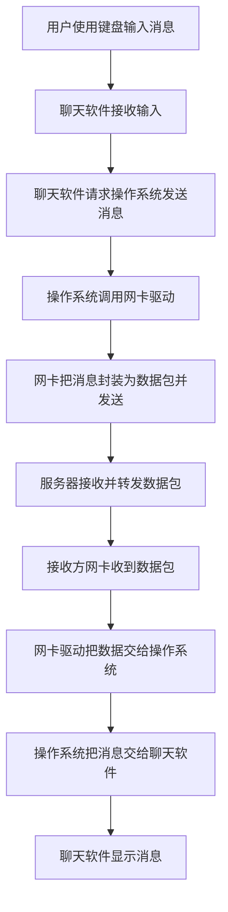
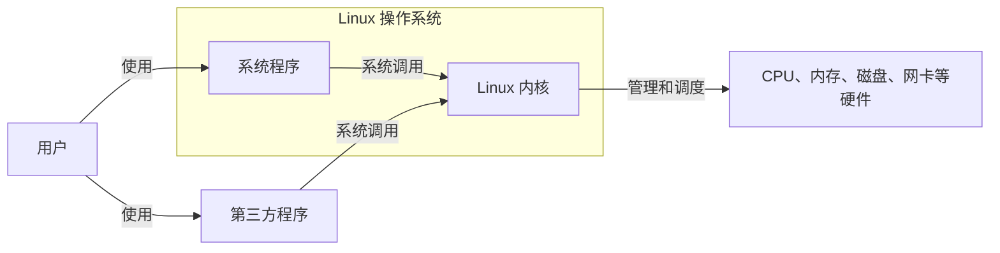

# 初识 Linux（1）：操作系统与 Linux 概念

> 学习目标：知道 Linux 在计算机中做什么，理解“内核”和“发行版”的区别。

## 1. 计算机、软件与操作系统

计算机可以分成两部分：

- 硬件：看得见、摸得着的物理设备，例如 CPU、内存、硬盘、显示器和网卡。
- 软件：让人能够使用硬件的程序，例如浏览器、微信、播放器和操作系统。

操作系统（Operating System，OS）是最基础的一类软件。它站在用户和硬件之间：用户通过应用发出需求，操作系统负责协调硬件来完成工作。

例如，发一条微信消息时，应用程序不必自己管理网络设备、CPU 或存储；它向操作系统请求服务，再由操作系统调度相应硬件。

从这个过程可以看出，操作系统会调度键盘完成文字输入、调度显示器显示内容、调度 CPU 和内存运行应用，也会调度网卡发送和接收网络数据。

### 1.1 应用发送网络消息的过程

下面以聊天软件发送和接收消息为例。应用程序负责接收用户操作，操作系统负责调用驱动程序并调度网卡，服务器负责转发数据。



操作系统在这个过程中会同时调度 CPU、内存、键盘、显示器和网卡。应用程序只需调用操作系统提供的接口，无需了解每种硬件的具体控制方式。

常见操作系统：

| 使用场景 | 例子 |
| --- | --- |
| 个人电脑 | Windows、Linux、macOS |
| 移动设备 | Android、iOS、鸿蒙系统 |

## 2. Linux 由什么组成

一个可使用的 Linux 系统可以简单理解为：

```text
Linux 系统 = Linux 内核 + 系统级应用程序
```

### 2.1 Linux 内核

内核（kernel）是操作系统的核心，直接负责管理和调度硬件资源，主要包括：

- 调度 CPU：决定哪个程序在什么时候运行；
- 管理内存：给程序分配和回收内存；
- 管理文件系统：让文件能够保存、读取和组织；
- 管理网络通信：收发网络数据；
- 管理 I/O：协调键盘、磁盘、显示器等输入输出设备。

无论你用的是系统自带音乐播放器还是第三方播放器，最终播放声音都需要经由内核使用相关硬件。

调用关系可以记为：用户使用系统程序或第三方程序；程序调用内核；内核调度硬件。



图中系统程序属于 Linux 系统的一部分，第三方程序虽然不属于系统本身，但也必须通过内核访问硬件。

### 2.2 系统级应用程序

系统级应用程序是随操作系统提供的基础工具，例如文件管理器、任务管理器、图片查看器和音乐播放器。它们方便用户完成日常操作，但通常不直接操作硬件，而是通过内核请求服务。

### 2.3 Linux 发行版

Linux 内核是开源、免费的。不同组织或社区会把内核与安装程序、桌面、软件管理工具和系统工具整合为完整系统，这个完整系统称为 Linux 发行版（distribution）。

常见发行版包括：

- Ubuntu：对初学者较友好，资料多，WSL 中常用；
- CentOS 7：本课程原文以 CentOS 7.6 为例；
- 其他发行版：Debian、Fedora、Rocky Linux、openSUSE 等。

要记住：内核不是完整系统；发行版才是可以安装和使用的 Linux 系统。

原文提供的内核官网：[kernel.org](https://www.kernel.org/)。

## 3. 本部分要记住的词

| 词语 | 用自己的话理解 |
| --- | --- |
| 硬件 | 真正完成计算、存储、显示、联网的设备 |
| 软件 | 指挥硬件完成任务的程序 |
| 操作系统 | 管理硬件、为应用提供基础服务的软件 |
| 内核 | 操作系统中最核心的资源管理部分 |
| 发行版 | 内核加上各种工具、安装程序和应用组成的完整 Linux 系统 |

## 4. 自测

1. 浏览器访问网页时，为什么不需要自己驱动网卡？
2. Linux 内核和 Ubuntu 有什么关系？
3. “Linux 发行版”为什么不能只理解为 Linux 内核？
