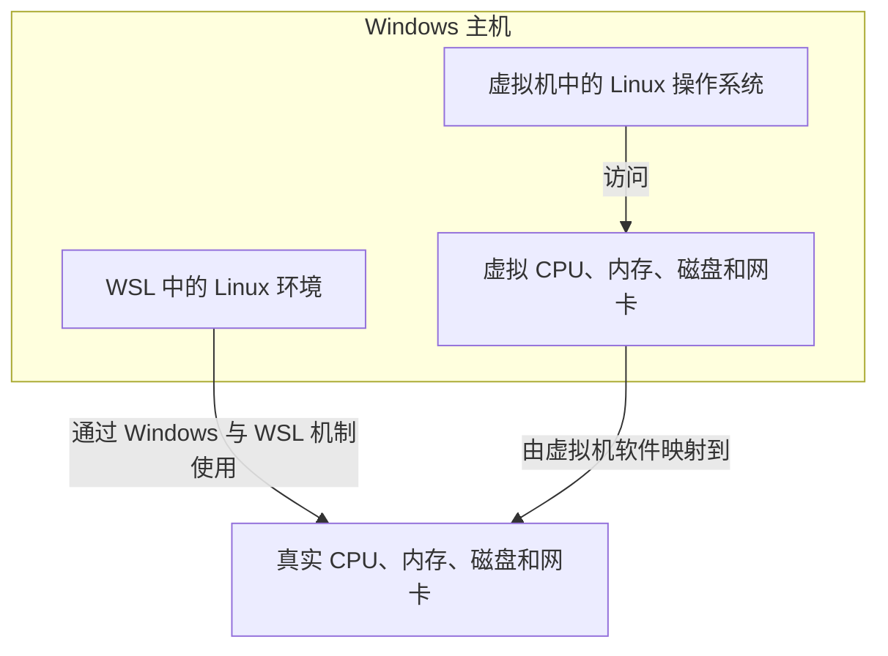

# 初识 Linux（3）：WSL 与虚拟机快照

> 学习目标：知道 WSL 和虚拟机两种学习环境的区别，并学会在动手前创建虚拟机快照。

## 1. WSL：Windows 中的 Linux 环境

WSL（Windows Subsystem for Linux）是 Windows 提供的 Linux 子系统。它让你在 Windows 中安装并运行 Linux 发行版，通常用于命令行学习、开发和日常工具使用。

原文将 WSL 的特点概括为：不需要先用 VMware 虚拟出完整硬件，即可在 Windows 上得到 Linux 环境。

WSL 可以理解为直接使用 Windows 主机硬件资源的 Linux 环境；完整虚拟机则会额外模拟 CPU、内存、磁盘、显示器等硬件。

这张图表示资源使用关系：WSL 与 Windows 的集成更直接；虚拟机先使用虚拟硬件，再由虚拟机软件把操作映射到真实硬件。

### 1.1 WSL 与 VMware 虚拟机怎么选

| 场景 | 更适合的选择 | 原因 |
| --- | --- | --- |
| 初学命令、写代码、使用 Git | WSL | 启动快，与 Windows 文件和终端协作方便 |
| 学习完整 Linux 系统、网络或多机实验 | VMware 虚拟机 | 环境更独立，便于模拟完整主机 |
| 害怕误操作 | 两者都可以 | WSL 可重装发行版；虚拟机可用快照恢复 |

## 2. 部署 WSL 与 Ubuntu

原文的图形化操作流程如下：

1. 右键开始菜单，依次打开“应用和功能” → “程序和功能” → “启用或关闭 Windows 功能”；勾选“适用于 Linux 的 Windows 子系统”，确认后按提示重启；
2. 在 Microsoft Store 获取并安装 Ubuntu；
3. 第一次启动 Ubuntu 时，设置 Linux 用户名；
4. 输入两次密码完成用户创建；
5. 使用 Windows Terminal 作为更方便的终端工具。

在 Microsoft Store 搜索 `Ubuntu`，选择所需版本并点击“获取”。首次启动会解压发行版并要求创建默认 UNIX 用户；该用户名不需要与 Windows 用户名相同。

注意：Linux 终端输入密码时，屏幕通常不会显示星号或其他反馈。这是正常的；确认输入后直接按 Enter 即可。

安装成功后，终端提示符通常会显示为 `用户名@计算机名:~$`。需要管理员权限时可在命令前加 `sudo`，例如 `sudo apt update`。在 Microsoft Store 搜索并安装 Windows Terminal，打开后通过下拉菜单选择 Ubuntu，也可以将 Ubuntu 设为默认启动配置文件。

## 3. 虚拟机快照

快照（snapshot）是某一时刻虚拟机状态的保存点。以后可以把虚拟机恢复到这个保存点。

它特别适合学习 Linux：在安装完成且一切正常时先拍一个快照；进行高风险实验前再拍一个。发生错误后可以恢复，不必从头重装系统。

### 3.1 创建快照

在 VMware Workstation Pro 中，打开快照相关功能，填写快照名称和描述，然后执行“拍摄快照”。名称应能说明当时状态，例如：`01-刚安装完成`、`02-网络配置成功`。

先关闭虚拟机，再从 VMware 的“快照”菜单打开“快照管理器”。选择“拍摄快照”，填写名称和描述后确认。

### 3.2 恢复快照

需要回退时，选择目标快照并执行恢复。恢复会使虚拟机回到拍摄快照时的状态，因此快照之后创建的文件和配置可能会丢失。

在快照管理器中选中目标快照，点击“转到”即可恢复。恢复提示会明确说明：恢复后，当前状态将丢失；确认前先保存快照之后的重要文件。

## 4. 动手建议

1. 只学习常用命令：优先尝试 WSL + Ubuntu。
2. 需要跟随课程中的 VMware 截图：使用 VMware，并在安装成功后立即创建第一个快照。
3. 每次做可能影响网络、用户权限或系统配置的实验前，先拍快照。

## 5. 自测

1. WSL 和 VMware 虚拟机的用途有什么不同？
2. 为什么输入 Linux 密码时屏幕没有字符显示？
3. 恢复快照后，快照创建之后的数据可能发生什么？
