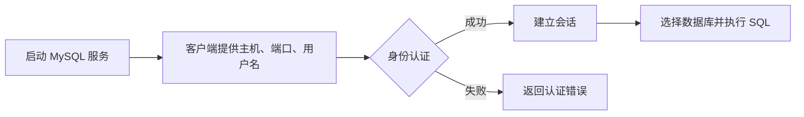

# MySQL概述

> 本章建立数据库和 MySQL 的基本认识，并完成本地安装、启动与连接。

## 1.数据库相关概念

**数据库（DB）**：按照一定的数据结构来组织、存储和管理数据的仓库

**数据库管理系统(DBMS)**：一种操纵和管理数据库的大型软件，用于创建、使用和维护数据库

**关系型数据库（RDBMS）**：由多张相互连接的二维表组成的数据库

**非关系型数据库**：泛指非关系型数据库，是对关系型数据库的补充

**结构化查询语言（SQL）**：一种操作关系型数据库的编程语言，定义了一套操作关系型数据库统一SQL标准

## 2.MySQL数据库概述

### 2.1 安装和卸载

下载地址：

[MySQL 官方下载页面](https://dev.mysql.com/downloads/windows/installer/8.0.html)

Windows 和 Linux 的安装步骤请以 [MySQL 官方文档](https://dev.mysql.com/doc/refman/8.0/en/installing.html) 为准。不同发行版的包管理器命令可能不同，安装前请确认目标系统和 MySQL 版本。

### 2.2 启动与停止

1.管理员连接（以管理员方式打开命令行窗口）：

启动：`net start mysql80`

停止：`net stop mysql80`

- 默认mysql是开机自动启动的

2.客户端连接：

方式一：开始菜单找到MySQL提供的客户端命令行工具`MySQL 8.0 Command Line Client`

方式二：系统自带的命令行工具执行指令`mysql [-h 127.0.0.1] [-P 3306] -u root -p`

- 方式二需要配置环境变量`C:\Program Files\MySQL\MySQL Server 8.0\bin\`
### MySQL 客户端连接流程

客户端连接成功只代表身份认证通过；执行具体 SQL 还需要目标数据库存在，并且当前用户拥有相应权限。

## 小练习

安装并连接 MySQL 8.0，依次执行 `SELECT VERSION();`、`SHOW DATABASES;` 和 `SELECT DATABASE();`，记录每条命令的作用。
