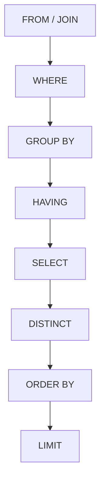
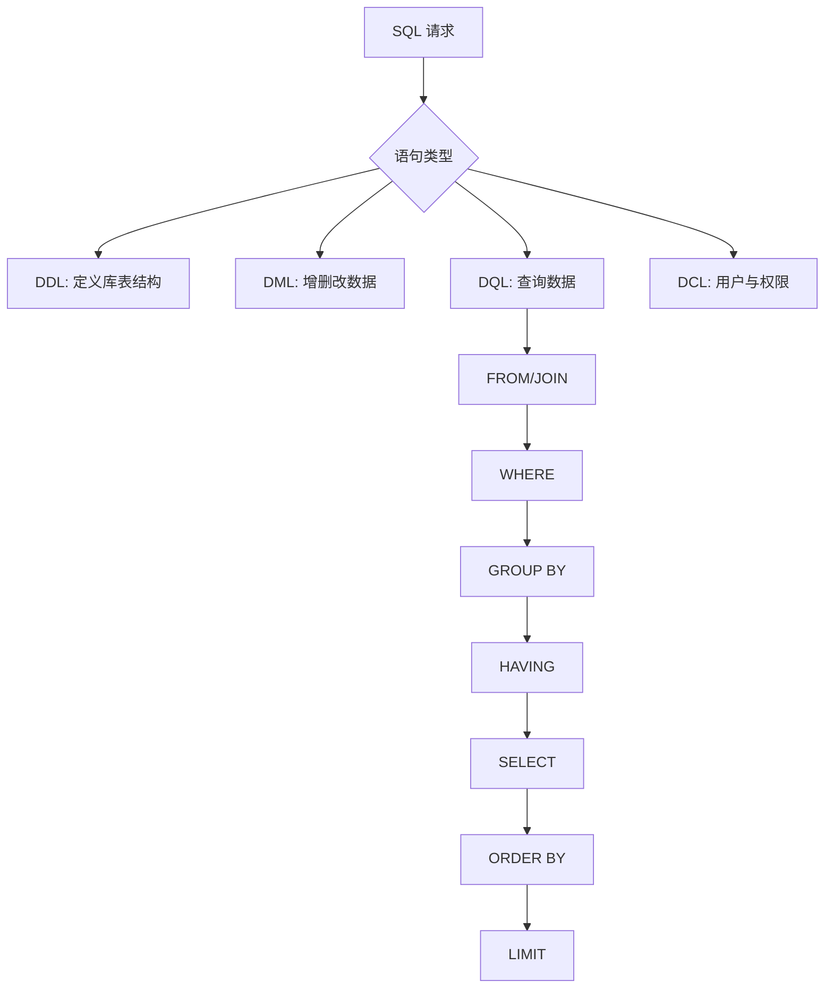

# SQL

> 本章是学习 MySQL 的主线：从建库建表开始，逐步掌握增删改查、约束和多表查询。


## 1.SQL通用语法

1. SQL语句可以单行或多行书写，以分号结尾

2. SQL语句可以使用空格/缩进来增强语句的可读性

3. 不区分大小写，关键字建议使用大写

4. 注释

    - 单行注释：`-- 注释内容` 或 `# 注释内容`(MySQL特有)

    - 多行注释： `/* 注释内容 */`

> 下文标记为语法模板的方括号表示可选部分，竖线表示多选一，尖括号或中文名称表示需要替换的实际值；不要将这些占位符原样执行。

## 2.SQL分类

1. DDL：数据定义语言，用来定义数据库对象(数据库，表，字段)

2. DML：数据操作语言，用来对数据库表中的数据进行增删改

3. DQL：数据查询语言，用来查询数据库中表的记录

4. DCL：数据控制语言，用来创建数据库用户、控制数据库的访问权限

## 3.数据定义语言DDL

### 3.1 DDL-数据库操作

查询所有数据库

```SQL
SHOW DATABASES;
```

查询当前数据库

```SQL
SELECT DATABASE();
```

创建数据库

```SQL
CREATE DATABASE [IF NOT EXISTS] 数据库名 [DEFAULT CHARSET 字符集] [COLLATE 排序规则];
```

> 默认的字符集和排序规则分别是utf8mb4字符集和utf8mb4_unicode_ci排序规则，也是推荐使用的字符集和排序规则

删除数据库

```SQL
DROP DATABASE [IF EXISTS] 数据库名;
```

使用数据库

```SQL
USE 数据库名;
```

### 3.2 DDL-表操作-查询

查询当前数据库所有表

```SQL
SHOW TABLES;
```

查询表结构

```SQL
DESC 表名;
```

查询指定表的建表语句

```SQL
SHOW CREATE TABLE 表名;
```

### 3.3 DDL-表操作-创建

> 下面语法中的方括号表示“可选部分”，实际执行时不要把方括号一起输入。

```SQL
CREATE TABLE 表名(
    字段1 字段1类型 [COMMENT 字段1注释],
    字段2 字段2类型 [COMMENT 字段2注释],
    ...
    字段n 字段n类型 [COMMENT 字段n注释]
)[COMMENT 表注释];
```

### 3.4 DDL-表操作-数据类型

#### 3.4.1 数值类型

##### 整数类型：

- **TINYINT**：1字节，小整数，范围：-128 ~ 127（有符号）或 0 ~ 255（无符号）

- **SMALLINT**：2字节，大整数，范围：-32,768 ~ 32,767（有符号）或 0 ~ 65,535（无符号）

- **MEDIUMINT**：3字节，大整数，范围：-8,388,608 ~ 8,388,607（有符号）或 0 ~ 16,777,215（无符号）

- **INT或INTEGER**：4字节，大整数，范围：-2,147,483,648 ~ 2,147,483,647（有符号）或 0 ~ 4,294,967,295（无符号）

- **BIGINT**：8字节，极大整数，范围：-9,223,372,036,854,775,808 ~ 9,223,372,036,854,775,807（有符号）或 0 ~ 18,446,744,073,709,551,615（无符号）

##### 浮点数类型：

- **FLOAT**：4字节，单精度浮点数，范围：-3.402823466 E+38 ~ 3.402823466351 E+38（有符号）或 0 和 1.175494351 E-38 ~ 3.402823466 E+38，近似值

- **DOUBLE**：8字节，双精度浮点数，范围：-1.7976931348623157 E+308 ~ 1.7976931348623157 E+308 或 0 和 2.2250738585072014 E-308 ~ 1.7976931348623157 E+308，近似值

- **DECIMAL(M, D)**：精确值，M 是总位数，D 是小数位数。例如，DECIMAL(5, 2)可以存储 123.45

#### 3.4.2 字符串类型

- **CHAR(N)**：固定长度字符串，最多 255 个字符

- **VARCHAR(N)**：可变长度字符串，最多 65,535 个字符

- **TINYBLOB**：不超过 255 个字符的二进制数据

- **TINYTEXT**：短文本字符串，最多 255 个字符

- **BLOB**：二进制形式的长文本数据，最多 65,535 个字符

- **TEXT**：长文本数据，最多65,535个字符

- **MEDIUMBLOB**：二进制形式的中等长度文本数据，最多 16,777,215 个字符

- **MEDIUMTEXT**：中等长度文本数据，最多 16,777,215 个字符

- **LONGBLOB**：二进制形式的极大文本数据，最多 4,294,967,295 个字符

- **LONGTEXT**：极大文本数据，最多 4,294,967,295 个字符

#### 3.4.3 日期时间类型

- **DATE**：日期值，3字节，格式为YYYY-MM-DD，范围是1000-01-01 至 9999-12-31

- **TIME**：时间值或持续时间，3字节，格式为HH:MM:SS，范围是-838:59:59 至 838:59:59

- **YEAR**：年份值，1字节，格式为YYYY，范围是1901 至 2155

- **DATETIME**：混合日期和时间值，8字节，格式为YYYY-MM-DD HH:MM:SS，范围是1000-01-01 00:00:00 至 9999-12-31 23:59:59

- **TIMESTAMP**：混合日期和时间值，时间戳，4字节，格式为YYYY-MM-DD HH:MM:SS，范围是1970-01-01 00:00:01 至 2038-01-19 03:14:07

#### 3.4.4 布尔类型

- **BOOLEAN或BOOL**：底层会自动转换成TINYINT(1)，赋值时可以用FALSE和TRUE，也可以使用0和1

#### 3.4.5 枚举类型

- **ENUM**：示例`ENUM('value1', 'value2', ..., 'valueN')`

    - 只能存字符串，列的值只能是预定义列表中的一个

    - 如果没有指定默认值，那么可以取空值NULL，指定默认值后会默认取默认值，如果未指定默认值且不能为空，会默认取第一个值

    - 索引会按照列表顺序从1开始，空字符串 `''` 的索引为 0（如果允许空值）

#### 3.4.6 MySQL 8.0 常用补充类型

- **JSON**：保存结构化 JSON 文档，适合字段结构不固定但仍需要数据库管理的场景。
- **BINARY/VARBINARY**：保存二进制字节串，不按字符集进行比较，适合哈希值、加密结果等数据。
- **BIT**：保存位值，常用于位标志；如果只是表示真假，通常使用 `BOOLEAN` 更直观。
- **生成列（Generated Column）**：列值由表达式计算得到，可以是 `VIRTUAL`（查询时计算）或 `STORED`（写入时保存）。

```SQL
CREATE TABLE user_profile(
    id BIGINT PRIMARY KEY,
    name VARCHAR(100) NOT NULL,
    preferences JSON,
    name_lower VARCHAR(100)
        GENERATED ALWAYS AS (LOWER(name)) STORED
);
```

数据类型的完整分类、范围和存储要求可参考 [MySQL 8.0 数据类型](https://dev.mysql.com/doc/refman/8.0/en/data-types.html)。

### 3.5 DDL-表操作-修改

添加字段

```SQL
ALTER TABLE 表名 ADD 字段名 类型(长度) [COMMENT 注释] [约束];
```

修改数据类型

```SQL
ALTER TABLE 表名 MODIFY 字段名 新数据类型(长度);
```

修改字段名和字段类型

```SQL
ALTER TABLE 表名 CHANGE 旧字段名 新字段名 类型(长度) [COMMENT 注释] [约束];
```

删除字段

```SQL
ALTER TABLE 表名 DROP 字段名;
```

修改表名

```SQL
ALTER TABLE 表名 RENAME TO 新表名;
```

### 3.6 DDL-表操作-删除

删除表

```SQL
DROP TABLE [IF EXISTS] 表名;
```

删除指定表，并重新创建该表

```SQL
TRUNCATE TABLE 表名;
```

## 4.数据操作语言DML

### 4.1 DML-添加数据

给指定字段添加数据

```SQL
INSERT INTO 表名 (字段名1,字段名2,...) VALUES (值1,值2,...);
```

给全部字段添加数据

```SQL
INSERT INTO 表名 VALUES (值1,值2,...);
```

批量添加数据

```SQL
INSERT INTO 表名 (字段名1,字段名2,...) VALUES (值1,值2,...),(值1,值2,...),...,(值1,值2,...);
INSERT INTO 表名 VALUES (值1,值2,...),(值1,值2,...),...,(值1,值2,...);
```

插入数据时，指定的字段顺序需要与值的顺序是一一对应的

字符串和日期型数据应该包含在单引号中

插入的数据大小，应该在字段的规定范围内

### 4.2 DML-修改数据

```SQL
UPDATE 表名 SET 字段1=值1,字段2=值2,...[WHERE 条件];
```

如果没有条件，会修改整张表的所有数据

### 4.3 DML-删除数据

```SQL
DELETE FROM 表名 [WHERE 条件];
```

DELETE如果没有指定条件，会删除整张表的所有数据

DELETE不能删除某一个字段的值（可以使用UPDATE）

DELETE仅仅删除表中的数据，DROP会把整张表和数据一起删除

## 5.数据查询语言DQL

### 5.1 DQL-语法

```SQL
SELECT
        字段列表
FROM
        表名列表
WHERE 
        条件列表
GROUP BY
        分组字段列表
HAVING
        分组后条件列表
ORDER BY
        排序字段列表
LIMIT
        分页参数
```

### 5.2 DQL-基本查询

查询多个字段

```SQL
SELECT 字段1,字段2,... FROM 表名;
SELECT * FROM 表名; -- *代表所有字段，因为不够直观，不建议使用
```

设置别名

```SQL
SELECT 字段1 [AS 别名1],字段2 [AS 别名2]... FROM 表名; -- AS可以省略
```

去除重复记录

```SQL
SELECT DISTINCT 字段列表 FROM 表名;
```

### 5.3 DQL-条件查询

```SQL
SELECT 字段列表 FROM 表名 WHERE 条件列表;
```

条件：

|比较运算符|说明|
|---|---|
|\>|大于|
|\>=|大于等于|
|\<|小于|
|\<=|小于等于|
|=|等于|
|\<\>或\!=|不等于|
|BETWEEN 最小值 AND 最大值|在最小值和最大值之间（包含最小值和最大值）|
|IN(...)|在in之后的列表中的值，多选一|
|LIKE 占位符|模糊匹配（_匹配单个字符, %匹配任意个字符）|
|IS NULL|是NULL|
|IS NOT NULL|不是NULL|

|逻辑运算符|说明|
|---|---|
|AND 或 \&\&|并且 (多个条件同时成立)|
|OR 或 \|\||或者 (多个条件任意一个成立)|
|NOT 或 \!|非 , 不是|

LIKE 后如果要表示单纯的`_`或`%`，需要用到转义字符`\`

### 5.4 DQL-聚合函数

```SQL
SELECT 聚合函数(字段列表) FROM 表名;
```

常见聚合函数

|函数|功能|
|---|---|
|COUNT|统计个数|
|MAX|最大值|
|MIN|最小值|
|AVG|平均值|
|SUM|求和|

NULL值不参与聚合函数的运算

### 5.5 DQL-分组查询

```SQL
SELECT 字段列表 FROM 表名 [WHERE 条件] GROUP BY 分组字段名 [HAVING 分组后的过滤条件];
```

#### WHERE和HAVING的区别

1. 执行时机不同：执行时机不同：WHERE是分组之前进行过滤，不满足WHERE条件，不参与分组；而HAVING是分组之后对结果进行过滤

2. 判断条件不同：WHERE不能对聚合函数进行判断，而HAVING可以

执行顺序: where \> 聚合函数 \> having

### 5.6 DQL-排序查询

```SQL
SELECT 字段列表 FROM 表名 ORDER BY 字段1 排序方式1,字段2 排序方式2...;
```

排序方式：ASC升序排列（默认值），DESC降序排列

> 如果是多字段排序，当第一个字段值相同时，才会根据第二个字段进行排序

### 5.7 DQL-分页查询

```SQL
SELECT 字段列表 FROM 表名 LIMIT 起始索引,查询记录数;
```

- 起始索引从0开始，起始索引 = （查询页码 - 1）\* 每页显示记录数

- 分页查询是数据库的方言，不同的数据库有不同的实现，MySQL中是LIMIT

- 如果查询的是第一页数据，起始索引可以省略，直接简写为 limit 10

### 5.8 DQL-执行顺序

一条查询语句的书写顺序与逻辑执行顺序不同。理解下面的顺序，有助于判断别名、聚合函数以及 `WHERE` 和 `HAVING` 的可用范围。



关键点：`WHERE` 在分组前过滤行，`HAVING` 在分组后过滤组；`ORDER BY` 和 `LIMIT` 发生在结果集生成之后。

## 6.数据控制语言DCL

### 6.1 DCL-管理用户

查询用户

```SQL
USE mysql;
SELECT * FROM user;
```

创建用户

```SQL
CREATE USER '用户名'@'主机名' IDENTIFIED BY '密码';
```

修改用户密码

```SQL
-- MySQL 5.7.6 及以上版本使用
ALTER USER '用户名'@'主机名' IDENTIFIED [WITH mysql_native_password] BY '新密码';

-- MySQL 5.7.6 以下版本使用
SET PASSWORD FOR '用户名'@'主机名' = PASSWORD('new_password');
```

修改用户名和主机名

```SQL
RENAME USER '用户名'@'主机名' TO '新用户名'@'新主机名';
```

删除用户

```SQL
DROP USER '用户名'@'主机名';
```

主机名可以用%通配，表示所有主机

localhost代表当前主机

这类语言主要是DBA使用

### 6.2 DCL-权限控制

|权限|说明|
|---|---|
|ALL, ALL PRIVILEGES|所有权限|
|SELECT|查询数据|
|INSERT|插入数据|
|UPDATE|修改数据|
|DELETE|删除数据|
|ALTER|修改表|
|DROP|删除数据库/表/视图|
|CREATE|创建数据库/表|

查询权限

```SQL
SHOW GRANTS FOR '用户名'@'主机名';
```

授予权限

```SQL
GRANT 权限列表 ON 数据库名.表名 TO '用户名'@'主机名';
```

撤销权限

```SQL
REVOKE 权限列表 ON 数据库名.表名 FROM '用户名'@'主机名';
```

- 多个权限之间，使用逗号分隔

- USAGE代表用户没有任何权限，创建一个用户后用户权限默认是USAGE

- 授权时，数据库名或表名可以使用`*`通配符，代表所有数据库或表

### 6.3 函数

函数就是一段可以直接被另一段程序调用的程序或代码。

#### 6.3.1 字符串函数

|函数|说明|
|---|---|
|CONCAT(S1,S2,...,Sn)|字符串拼接，将S1,S2,...,Sn拼接成一个字符串|
|LOWER(str)|将字符串str全部转为小写|
|UPPER(str)|将字符串str全部转为大写|
|LPAD(str,n,pad)|左填充，用字符串pad对str的左边进行填充，达到n个字符串长度|
|RPAD(str,n,pad)|右填充，用字符串pad对str的右边进行填充，达到n个字符串长度|
|TRIM(str)|去掉字符串头部和尾部的空格|
|SUBSTRING(str,start,len)|返回从字符串str的start位置开始的len个长度的字符串（默认索引从1开始）|

```SQL
SELECT 函数(参数);
```

#### 6.3.2 数值函数

|函数|功能|
|---|---|
|CEIL(x)|向上取整|
|FLOOR(x)|向下取整|
|MOD(x,y)|返回x/y的模|
|RAND()|返回0~1内的随机数|
|ROUND(x,y)|求参数x的四舍五入的值，保留y位小数|

#### 6.3.3 日期函数

|函数|功能|
|---|---|
|CURDATE()|返回当前日期（yyyy-mm-dd）|
|CURTIME()|返回当前时间（hh:mm:ss）|
|NOW()|返回当前日期和时间（yyyy-mm-dd hh:mm:ss）|
|YEAR(date)|获取指定date的年份|
|MONTH(date)|获取指定date的月份|
|DAY(date)|获取指定date的日期（每月的第几号）|
|DATE_ADD(date,INTERVAL expr type)|返回一个日期/时间值加上一个时间间隔expr后的时间值|
|DATEDIFF(date1,date2)|返回起始时间date1和结束时间date2之间的天数（date1减date2）|

**DATE_ADD(date,INTERVAL expr type)函数细节：**

1. expr如果是正数，表示从时间date向后推，如果是负数就表示往前推，如果是0就表示是date本身

2. type常用的类型：YEAR(年)、MONTH(月)、DAY(天)、HOUR(小时)、MINUTE(分钟)、SECOND(秒)

#### 6.3.4 流程函数

|函数|功能|
|---|---|
|IF(value, t, f)|如果value为true，则返回t，否则返回f|
|IFNULL(value1, value2)|如果value1不为空，返回value1，否则返回value2|
|CASE WHEN [ val1 ] THEN [ res1 ] … ELSE [ default ] END|如果val1为true，返回res1，… 否则返回default|
|CASE [ expr ] WHEN [ val1 ] THEN [ res1 ] … ELSE [ default ] END|如果expr的值等于val1，返回res1，… 否则返回default|

## 7.约束

约束是作用于表中字段上的规则，用于限制存储在表中的数据，目的是保证数据库中数据的正确、有效性和完整性

|约束|描述|关键字|
|---|---|---|
|非空约束|限制该字段的数据不能为null|NOT NULL|
|唯一约束|保证该字段的所有数据都是唯一、不重复的|UNIQUE|
|主键约束|主键是一行数据的唯一标识，要求非空且唯一|PRIMARY KEY|
|默认约束|保存数据时，如果未指定该字段的值，则采用默认值|DEFAULT|
|检查约束（8.0.16版本后）|保证字段值满足某一个条件|CHECK(自定义条件)|
|自动增长|添加数据时如果没有为字段设置值，会自动增长1个单位|AUTO_INCREMENT|
|外键约束|用来让两张表的数据之间建立连接，保证数据的一致性和完整性|FOREIGN KEY|

- 约束是作用于表中字段上的，可以在创建表/修改表的时候添加约束

MySQL 8.0.16 起，`CHECK` 约束会真正验证新插入或更新的数据；更早版本可能只接受语法而不执行检查。约束表达式为 `FALSE` 时操作失败，为 `TRUE` 或 `UNKNOWN`（例如涉及 `NULL`）时可以通过。详见 [CHECK_CONSTRAINTS 表](https://dev.mysql.com/doc/refman/8.0/en/information-schema-check-constraints-table.html)。

- 有些情况下，虽然数据没有成功添加，但仍然会占用自动增长一个值，比如事务回滚；违反约束条件或数据类型不匹配等导致插入操作失败

示例：

```SQL
create table user(
        id int primary key auto_increment,
        name varchar(10) not null unique,
        age int check(age > 0 and age < 120),
        status char(1) default '1',
        gender char(1)
);
```

### 外键约束

外键用来让两张表之间建立连接，从而保证数据的一致性和完整性

#### 1.语法

添加外键

```SQL
CREATE TABLE 表名(
        字段名 字段类型,
        ...
        [CONSTRAINT] [外键名称] FOREIGN KEY(外键字段名) REFERENCES 主表(主表列名)
);
ALTER TABLE 表名 ADD CONSTRAINT 外键名称 FOREIGN KEY (外键字段名) REFERENCES 主表(主表列名);
```

删除外键

```SQL
ALTER TABLE 表名 DROP FOREIGN KEY 外键名称;
```

#### 2.删除/更新行为

|行为|说明|
|---|---|
|NO ACTION|当在父表中删除/更新对应记录时，首先检查该记录是否有对应外键，如果有则不允许删除/更新（与RESTRICT一致）|
|RESTRICT|当在父表中删除/更新对应记录时，首先检查该记录是否有对应外键，如果有则不允许删除/更新（与NO ACTION一致）|
|CASCADE|当在父表中删除/更新对应记录时，首先检查该记录是否有对应外键，如果有则也删除/更新外键在子表中的记录|
|SET NULL|当在父表中删除/更新对应记录时，首先检查该记录是否有对应外键，如果有则设置子表中该外键值为null（要求该外键允许为null）|
|SET DEFAULT|父表有变更时，子表将外键设为一个默认值（Innodb不支持）|

```SQL
ALTER TABLE 表名 ADD CONSTRAINT 外键名称 FOREIGN KEY (外键字段) REFERENCES 主表名(主表字段名) ON UPDATE 行为 ON DELETE 行为;
```

## 8.多表查询

### 8.1 多表关系

#### 8.1.1 一对多（多对一）

案例：部门与员工
关系：一个部门对应多个员工，一个员工对应一个部门
实现：**在多的一方建立外键，指向一的一方的主键**

#### 8.1.2 多对多

案例：学生与课程
关系：一个学生可以选多门课程，一门课程也可以供多个学生选修
实现：**建立第三张中间表，中间表至少包含两个外键，分别关联两方主键**

#### 8.1.3 一对一

案例：用户与用户详情
关系：一对一关系，多用于单表拆分，将一张表的基础字段放在一张表中，其他详情字段放在另一张表中，以提升操作效率
实现：**在任意一方加入外键，关联另外一方的主键，并且设置外键为唯一的**（UNIQUE）

### 8.2 查询

笛卡尔积：表1和表2的笛卡尔积等于表1的每一行和表2的所有行合并和的新的表，假设表1有m行，表2有n行，则笛卡尔积有mn行

```SQL
select * from 表1, 表2;
```

- 多个表的笛卡尔积就是所有的可能结合构成的表，笛卡尔积的行数是各个表行数的乘积

- 一般笛卡尔积是没有意义的，我们会加上WHERE条件筛选

### 8.3 内连接查询

内连接查询的是两张表交集的部分

隐式内连接：

```SQL
SELECT 字段列表 FROM 表1, 表2 WHERE 条件 ...;
```

显式内连接：

```SQL
SELECT 字段列表 FROM 表1 [ INNER ] JOIN 表2 ON 连接条件 ...;
```

- 如果已经为表起了别名，执行顺序之后的语句只能通过表的别名访问表，不能通过表名访问表

- 隐式内连接和显式内连接仅仅是代码上的区别，功能上完全一致

### 8.4 外连接查询

**左外连接**

查询左表所有数据，以及两张表交集部分数据

```SQL
SELECT 字段列表 FROM 表1 LEFT [ OUTER ] JOIN 表2 ON 条件 ...;
```

相当于查询表1的所有数据，包含表1和表2交集部分数据

**右外连接**

查询右表所有数据，以及两张表交集部分数据

```SQL
SELECT 字段列表 FROM 表1 RIGHT [ OUTER ] JOIN 表2 ON 条件 ...;
```

- 左外连接可以查询到左边表的null字段，右外连接可以查询到右边表的null字段

### 8.5 自连接查询

当前表与自身的连接查询，自连接必须使用表别名

```SQL
SELECT 字段列表 FROM 表A 别名A JOIN 表A 别名B ON 条件 ...;
```

自连接查询，可以是内连接查询，也可以是外连接查询

### 8.6 联合查询-union, union all

把多次查询的结果合并，形成一个新的查询集

```SQL
SELECT 字段列表 FROM 表A ...
UNION [ALL]
SELECT 字段列表 FROM 表B ...
```

- UNION ALL 会有重复结果，UNION 不会

- 联合查询多张表的查询列要一致，否则会出错

- 联合查询比使用or效率高，不会使索引失效

### 8.7 子查询

SQL语句中嵌套SELECT语句，称为嵌套查询，又称子查询

```SQL
SELECT * FROM t1 WHERE 列名 = ( SELECT 列名 FROM t2);
```

- 子查询外部的语句可以是 INSERT / UPDATE / DELETE / SELECT 的任何一个

#### 8.7.1 子查询分类

1.根据子查询结果可以分为：

- 标量子查询（子查询结果为单个值）

- 列子查询（子查询结果为一列）

- 行子查询（子查询结果为一行）

- 表子查询（子查询结果为多行多列）

2.根据子查询位置可分为：

- WHERE 之后

- FROM 之后

- SELECT 之后

#### 8.7.2 标量子查询

子查询返回的结果是单个值（数字、字符串、日期等）

常用操作符：= \<\> \> \>= \< \<=

#### 8.7.3 列子查询

返回的结果是一列（可以是多行）

常用操作符：

|操作符|描述|
|---|---|
|IN|在指定的集合范围内，多选一|
|NOT IN|不在指定的集合范围内|
|ANY|子查询返回列表中，有任意一个满足即可|
|SOME|与ANY等同，使用SOME的地方都可以使用ANY|
|ALL|子查询返回列表的所有值都必须满足|

#### 8.7.4 行子查询

返回的结果是一行（可以是多列）

常用操作符：=    \<    \>    IN    NOT IN

#### 8.7.5 表子查询

返回的结果是多行多列

常用操作符：IN

示例：

```SQL
-- 查询与xxx1，xxx2的职位和薪资相同的员工
select * from employee where (job, salary) in (select job, salary from employee where name = 'xxx1' or name = 'xxx2');
-- 查询入职日期是2006-01-01之后的员工，及其部门信息
select e.*, d.* from (select * from employee where entrydate > '2006-01-01') as e left join dept as d on e.dept = d.id;
```
### SQL 分类与查询执行顺序



书写顺序与逻辑执行顺序不同，这是理解别名、聚合函数和 `WHERE`/`HAVING` 区别的关键。

## 小练习

创建一个演示数据库和两张有关联的表，完成一次插入、条件查询、分组统计、排序分页和连接查询。
