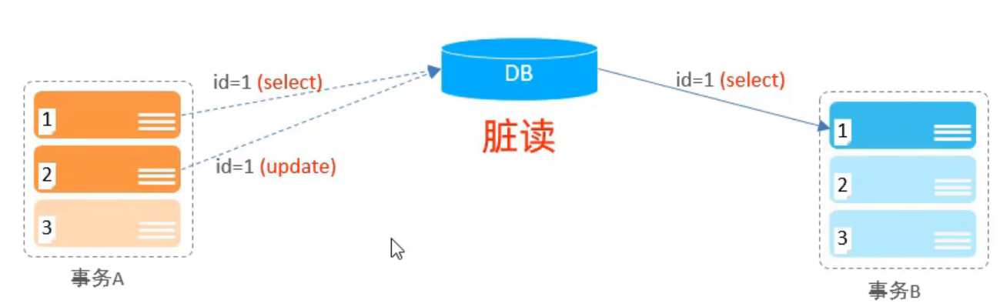
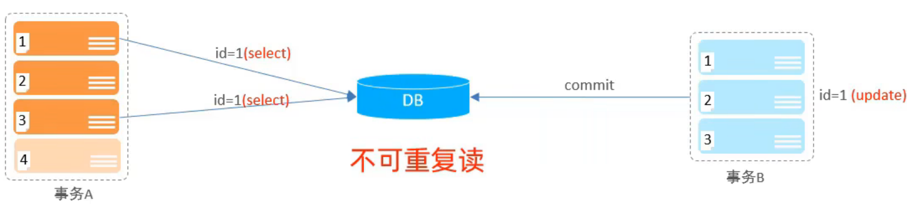
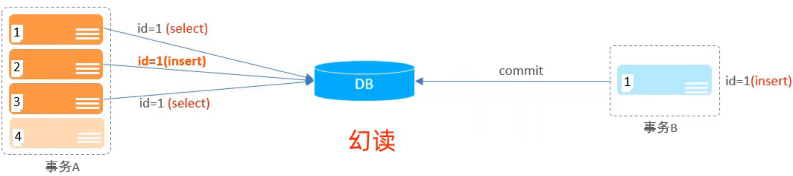
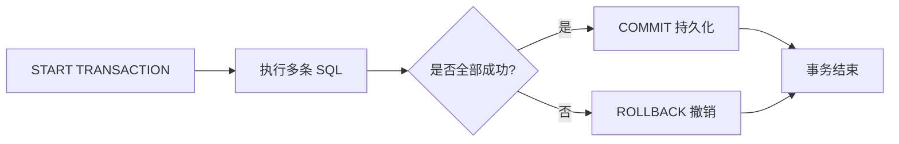
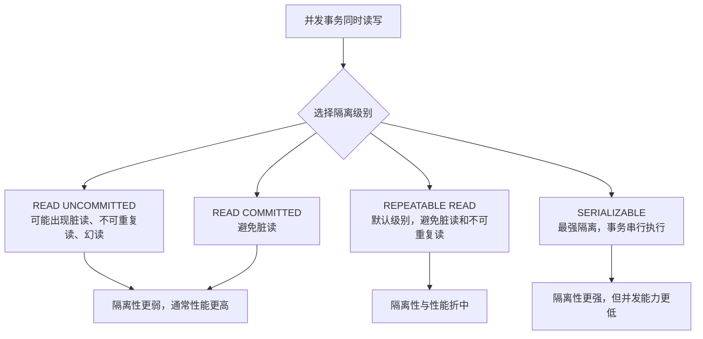

# 事务

> 本章说明如何把多条 SQL 作为一个整体执行，并理解并发访问下的数据一致性问题。


事务是一组操作的集合，事务会把所有操作作为一个整体一起向系统提交或撤销操作请求，即这些操作要么同时成功，要么同时失败。

## 1.代码设置

### 1.1 方式一

查看/设置事务提交方式

```SQL
SELECT @@AUTOCOMMIT;
SET @@AUTOCOMMIT = 0;
```

- @@AUTOCOMMIT的值有两种：1为自动提交，0为手动提交，该设置只对当前会话有效

提交事务

```SQL
COMMIT;
```

回滚事务

```SQL
ROLLBACK;
```

### 1.2 方式二

开启事务

```SQL
START TRANSACTION 或 BEGIN [TRANSACTION];
```

提交事务

```SQL
COMMIT;
```

回滚事务

```SQL
ROLLBACK;
```

## 2.事务的四大特性(ACID)

- 原子性(**A**tomicity)：事务是不可分割的最小操作单元，要么全部成功，要么全部失败

- 一致性(**C**onsistency)：事务完成时，必须使所有数据都保持一致状态

- 隔离性(**I**solation)：数据库系统提供的隔离机制，保证事务在不受外部并发操作影响的独立环境下运行

- 持久性(**D**urability)：事务一旦提交或回滚，它对数据库中的数据的改变就是永久的

## 3.并发事务问题

|问题|描述|
|---|---|
|脏读|一个事务读到另一个事务还没提交的数据|
|不可重复读|一个事务先后读取同一条记录，但两次读取的数据不同|
|幻读|一个事务按照条件查询数据时，没有对应的数据行，但是再插入数据时，又发现这行数据已经存在|







## 4.事务隔离级别

|隔离级别|脏读|不可重复读|幻读|
|---|---|---|---|
|Read uncommitted|√|√|√|
|Read committed|×|√|√|
|Repeatable Read(默认)|×|×|视读类型而定|
|Serializable|×|×|×|

查看事务隔离级别

```SQL
SELECT @@TRANSACTION_ISOLATION;
```

设置事务隔离级别

```SQL
SET SESSION TRANSACTION ISOLATION LEVEL READ COMMITTED;
-- 或对之后建立的会话设置全局默认值
SET GLOBAL TRANSACTION ISOLATION LEVEL READ COMMITTED;
```

- SESSION 是会话级别，表示只针对当前会话有效，GLOBAL 表示对所有会话有效

- 上例以 READ COMMITTED 为例，可按需要替换为 READ UNCOMMITTED、REPEATABLE READ 或 SERIALIZABLE。InnoDB 的普通一致性读和 `FOR UPDATE` 等锁定读在幻读表现上不同，不能只根据隔离级别表格判断。

- 事务隔离级别越高，数据安全性越安全，但是性能越低，Read uncommitted事务隔离级别最低，Serializable事务隔离级别最高

### 保存点

保存点可以在一个事务内部建立局部回滚位置，不必撤销整个事务：

```SQL
SAVEPOINT sp1;
ROLLBACK TO SAVEPOINT sp1;
RELEASE SAVEPOINT sp1;
```

`ROLLBACK TO SAVEPOINT` 只撤销保存点之后的操作，事务仍然保持活动状态；最终仍需要 `COMMIT` 或 `ROLLBACK` 结束事务。

MySQL 8.0 的 InnoDB 默认隔离级别是 `REPEATABLE READ`。普通 `SELECT` 通常是非加锁的一致性读；需要读取最新版本并阻止并发修改时，才使用 `FOR UPDATE` 等锁定读。详见 [InnoDB Transaction Model](https://dev.mysql.com/doc/refman/8.0/en/innodb-transaction-model.html)。
### 事务生命周期



事务边界要明确；如果开启了自动提交，每条写入语句可能都会单独提交。

### 隔离级别与并发问题



隔离级别越高，通常需要更多锁或更严格的版本控制；实际选择应结合一致性要求和并发压力。

## 小练习

关闭自动提交，模拟一次转账：先执行更新，再分别测试 `COMMIT` 和 `ROLLBACK` 的效果。
