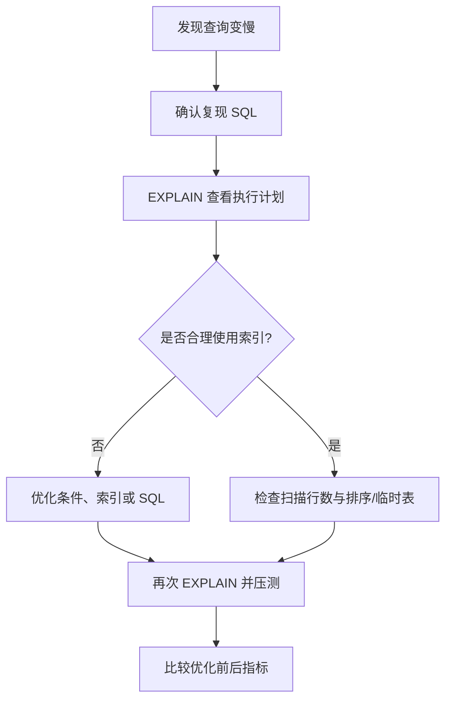

# 性能分析

> 本章介绍从执行频次、慢查询日志到 `EXPLAIN` 的基础性能诊断方法。


## 1.查看执行频次

MySQL客户端连接成功后，通过`show [session|global] status`命令可以提供服务器状态信息，通过以下指令可以查看当前数据库的 INSERT, UPDATE, DELETE, SELECT 访问频次

```SQL
SHOW GLOBAL STATUS LIKE 'Com_%';
-- 或
SHOW SESSION STATUS LIKE 'Com_%';
```

## 2.慢查询日志

慢查询日志记录了所有执行时间超过指定参数（long_query_time，单位：秒，默认10秒）的所有SQL语句的日志。

查看慢查询日志开关状态（ON为开启，OFF为关闭）

```SQL
show variables like 'slow_query_log';
```

启用慢查询日志（重启后失效）

```SQL
SET GLOBAL slow_query_log = 'ON';
```

MySQL的慢查询日志默认没有开启，需要在MySQL的配置文件（/etc/my.cnf）中配置如下信息（重启后不会失效）

1.开启慢查询日志开关

```Properties
slow_query_log=1
```

2.设置慢查询日志的时间（例如2秒），SQL语句执行时间超过2秒，就会视为慢查询，记录慢查询日志

```Properties
long_query_time=2
```

- 在执行这两条命令前，需要以管理员身份打开慢查询日志文件，具体操作可以上网搜索

- 更改后记得重启MySQL服务，日志文件位置：/var/lib/mysql/localhost-slow.log

## 3.profile

show profile 能在做SQL优化时帮我们了解时间都耗费在哪里。通过 have_profiling 参数，能看到当前 MySQL 是否支持 profile 操作

查看当前 MySQL 是否支持 profile 操作

```SQL
SELECT @@have_profiling;
```

查看当前profiling是否开启

```SQL
select @@profiling;
```

profiling 默认关闭，可以通过set语句在session/global级别开启 profiling

```SQL
SET profiling = 1;
```

查看所有语句的耗时

```SQL
show profiles;
```

查看指定query_id（SQL语句的编号）的SQL语句各个阶段的耗时

```SQL
show profile for query query_id;
```

查看指定query_id（SQL语句的编号）的SQL语句CPU的使用情况

```SQL
show profile cpu for query query_id;
```

## 4.explain

EXPLAIN 或者 DESC 命令获取 MySQL 如何执行 SELECT 语句的信息，包括在 SELECT 语句执行过程中表如何连接和连接的顺序

语法（直接在select语句之前加上关键字 explain / desc）

```SQL
EXPLAIN SELECT 字段列表 FROM 表名 WHERE 条件;
-- 或
DESC SELECT 字段列表 FROM 表名 WHERE 条件;
```
### EXPLAIN 各字段含义:

- **id**：select 查询的序列号，表示查询中执行 select 子句或者操作表的顺序（id相同，执行顺序从上到下（多表查询）；id不同，值越大越先执行（子查询））

- **select_type**：表示 SELECT 的类型，常见取值有 SIMPLE（简单表，即不使用表连接或者子查询）、PRIMARY（主查询，即外层的查询）、UNION（UNION中的第二个或者后面的查询语句）、SUBQUERY（SELECT/WHERE之后包含了子查询）等

- **type**：表示连接类型，性能由好到差的连接类型为 NULL、system、const、eq_ref、ref、range、index、all

    - NULL：查询不访问任何表时出现，一般不会出现

    - system：当访问系统表或表中仅有一行记录时出现

    - const：使用 `PRIMARY KEY` 或者 `UNIQUE` 索引进行精确匹配，且只匹配到一行记录时会出现

    - eq_ref：在连接查询里使用 `PRIMARY KEY` 或者 `UNIQUE` 索引进行连接，且对于每个来自前面表的记录，在当前表中都能通过索引找到唯一匹配的记录时出现

    - ref：使用非唯一性索引查询时会出现

    - range：使用索引进行范围查询时出现

    - index：查询需要扫描整个索引树来获取数据时出现（不一定扫描全表）

    - all：扫描全表数据时出现

- 从优到劣：NULL\> system \> const \> eq_ref \> ref \> range \> index \> ALL

- **possible_key**：可能应用在这张表上的索引，一个或多个

- **Key**：实际使用的索引，如果为 NULL，则没有使用索引

- **Key_len**：表示索引中使用的字节数，该值为索引字段最大可能长度，并非实际使用长度，在不损失精确性的前提下，长度越短越好

- **rows**：MySQL认为必须要执行的行数，在InnoDB引擎的表中，是一个估计值，可能并不总是准确的

- **filtered**：表示返回结果的行数占需读取行数的百分比，filtered的值越大越好

### EXPLAIN ANALYZE（MySQL 8.0.18+）

`EXPLAIN` 展示优化器估算的执行计划；`EXPLAIN ANALYZE` 会实际执行 `SELECT`，并在 `TREE` 格式中补充迭代器的实际耗时、返回行数和循环次数。它适合用来比较“估算值”和“真实执行情况”，但会产生真实查询开销，不要在不了解影响的情况下对生产大查询直接尝试。

```SQL
EXPLAIN ANALYZE
SELECT id, name FROM employee WHERE department_id = 10 ORDER BY id;
```

更多字段解释见 [EXPLAIN Statement](https://dev.mysql.com/doc/refman/8.0/en/explain.html) 和 [EXPLAIN Output Format](https://dev.mysql.com/doc/refman/8.0/en/explain-output.html)。
### 查询性能分析流程



## 小练习

对一条带条件和排序的查询执行 `EXPLAIN`，记录 `type`、`key`、`rows` 和 `Extra` 字段的含义。
