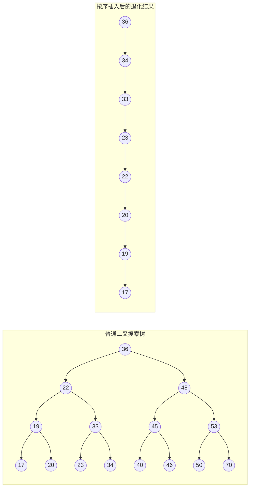
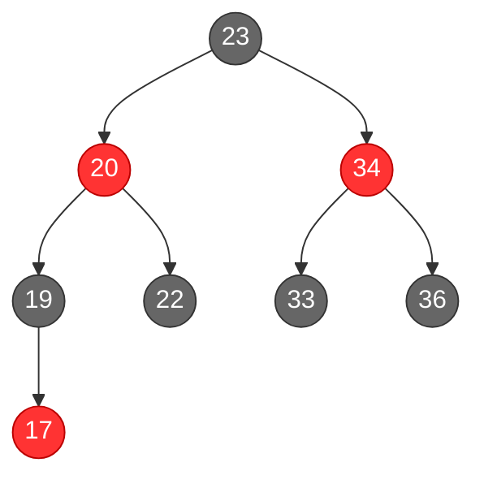
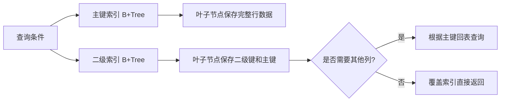
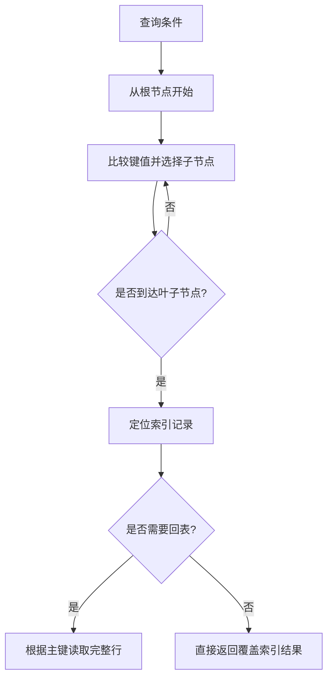

# 索引

> 本章从索引结构和分类出发，掌握建立、使用和设计索引的基本原则。


## 1.概述

索引是帮助 MySQL **高效获取数据**的**数据结构（有序）**。在数据之外，数据库系统还维护着满足特定查找算法的数据结构，这些数据结构以某种方式引用（指向）数据，这样就可以在这些数据结构上实现高级查询算法，这种数据结构就是索引。

**优点**：

- 提高数据检索效率，降低数据库的IO成本

- 通过索引列对数据进行排序，降低数据排序的成本，降低CPU的消耗

**缺点**：

- 索引列也是要占用空间的

- 索引大大提高了查询效率，但降低了更新的速度，比如 INSERT、UPDATE、DELETE

## 2.索引结构

|索引结构|描述|
|---|---|
|**B+Tree**|最常见的索引类型，大部分引擎都支持B+树索引|
|Hash|底层数据结构是用哈希表实现，只有精确匹配索引列的查询才有效，不支持范围查询|
|R-Tree(空间索引)|空间索引是 MyISAM 引擎的一个特殊索引类型，主要用于地理空间数据类型，通常使用较少|
|Full-Text(全文索引)|是一种通过建立倒排索引，快速匹配文档的方式，类似于 Lucene, Solr, ES|

|索引|InnoDB|MyISAM|Memory|
|---|---|---|---|
|B+Tree索引|支持|支持|支持|
|Hash索引|不支持|不支持|支持|
|R-Tree索引|不支持|支持|不支持|
|Full-text|5.6版本后支持|支持|不支持|

### 2.1 B+Tree
在介绍 B+Tree 之前，先看两种常见的树结构为什么仍然不适合直接作为大规模数据索引。

#### 二叉搜索树可能退化

二叉搜索树通常要求左子节点小于父节点、右子节点大于父节点。数据按照有序顺序插入时，树会退化成链表，查找复杂度从平均 `O(log n)` 下降到最坏 `O(n)`：



#### 红黑树的平衡约束

红黑树通过给节点增加颜色并在插入、删除时进行旋转和变色，限制最长路径长度。它能避免普通二叉搜索树退化，但节点仍然只保存一个或少量键值，大数据量下树高依然可能比 B+Tree 更高：



红黑树的关键约束包括：根节点为黑色；红色节点不能连续出现；从任意节点到其所有后代空节点的路径包含相同数量的黑色节点。数据库索引更偏好 B+Tree，是因为 B+Tree 一个节点可以保存大量有序键值，树高更低，且叶子节点通过链表连接，适合范围查询。

> **适用条件与常见误区**：红黑树适合内存中的动态集合，能够在插入和删除后维持较稳定的查找复杂度；它并不是“完全平衡树”，也不能替代面向磁盘页优化的 B+Tree。看到“树高度低”时，还要结合节点大小、磁盘 I/O 和范围扫描能力判断索引结构。

### 2.2 B-Tree（多路平衡查找树）

以一棵最大度数（max-degree，指一个节点的子节点个数）为5（5阶）的 b-tree 为例（每个节点最多存储4个key，5个指针）：
- 每一个节点都存储数据

演示网站：

[B-Tree 可视化](https://www.cs.usfca.edu/~galles/visualization/BTree.html)

### 2.3 B+Tree
- 所有的数据都会出现在叶子节点

- 叶子节点形成一个单向链表

演示网站：

[B+Tree 可视化](https://www.cs.usfca.edu/~galles/visualization/BPlusTree.html)

MySQL 索引数据结构对经典的 B+Tree 进行了优化。在原 B+Tree 的基础上，增加一个指向相邻叶子节点的链表指针，就形成了带有顺序指针的 B+Tree，提高区间访问的性能：
### 2.4 Hash

哈希索引就是采用一定的hash算法，将键值换算成新的hash值，映射到对应的槽位上，然后存储在hash表中。

- 如果两个（或多个）键值，映射到一个相同的槽位上，他们就产生了hash冲突（也称为hash碰撞），可以通过链表来解决
**特点**：

- Hash索引只能用于对等比较（=、in），不支持范围查询（between、\>、\<、…）

- 无法利用索引完成排序操作

- 查询效率高，通常只需要一次检索就可以了，效率通常要高于 B+Tree 索引

**存储引擎支持**：

在MySQL中，支持hash索引的是Memory引擎，而InnoDB中具有自适应hash功能，hash索引是存储引擎根据 B+Tree 索引在指定条件下自动构建的。

### 2.5 思考

为什么 InnoDB 存储引擎选择使用 B+Tree 索引结构？

1. 相对于二叉树，层级更少，搜索效率高

2. 对于 B-Tree，无论是叶子节点还是非叶子节点，都会保存数据，这样导致一页中存储的键值减少，指针也跟着减少，要同样保存大量数据，只能增加树的高度，导致性能降低

3. 相对于 Hash 索引，B+Tree 支持范围匹配及排序操作

## 3.索引分类

### 3.1 分类

|分类|含义|特点|关键字|
|---|---|---|---|
|主键索引|针对于表中主键创建的索引|默认自动创建，只能有一个|PRIMARY|
|唯一索引|避免同一个表中某数据列中的值重复|可以有多个|UNIQUE|
|常规索引|快速定位特定数据|可以有多个||
|全文索引|全文索引查找的是文本中的关键词，而不是比较索引中的值|可以有多个|FULLTEXT|

在 InnoDB 存储引擎中，根据索引的存储形式，又可以分为以下两种：

|分类|含义|特点|
|---|---|---|
|聚集索引(Clustered Index)|将数据存储与索引放一块，索引结构的叶子节点保存了行数据|必须有，而且只有一个|
|二级索引(Secondary Index)|将数据与索引分开存储，索引结构的叶子节点关联的是对应的主键|可以存在多个|

### 3.2 演示图



主键索引的叶子节点就是完整数据行，通常称为聚集索引；二级索引叶子节点保存主键值，需要其他列时再回到主键索引读取，这就是“回表”。

### 3.3 聚集索引选取规则

- 如果存在主键，主键索引就是聚集索引

- 如果不存在主键，将使用第一个唯一(UNIQUE)索引作为聚集索引

- 如果表没有主键或没有合适的唯一索引，则 InnoDB 会自动生成一个 rowid 作为隐藏的聚集索引

### 3.4 思考

（1）以下 SQL 语句，哪个执行效率高？为什么？

```SQL
select * from user where id = 10;
select * from user where name = 'Arm';
-- 备注：id为主键，name字段创建的有索引
```

答：第一条语句，因为第二条需要回表查询，相当于两个步骤。

（2）InnoDB 主键索引的 B+Tree 高度为多少？

答：假设一行数据大小为1k，一页中可以存储16行这样的数据。InnoDB 的指针占用6个字节的空间，主键假设为bigint，占用字节数为8.
可得公式：`n * 8 + (n + 1) * 6 = 16 * 1024`，其中 8 表示 bigint 占用的字节数，n 表示当前节点存储的key的数量，(n + 1) 表示指针数量（比key多一个）。算出n约为1170。

如果树的高度为2，那么他能存储的数据量大概为：`1171 * 16 = 18736`；
如果树的高度为3，那么他能存储的数据量大概为：`1171 * 1171 * 16 = 21939856`。

另外，如果有成千上万的数据，那么就要考虑分表。

## 4.语法

创建索引

```SQL
CREATE [ UNIQUE | FULLTEXT ] INDEX index_name ON table_name (index_col_name, ...);
```

- 如果不加 CREATE 后面索引类型参数，则创建的是常规索引

查看索引

```SQL
SHOW INDEX FROM table_name;
```

删除索引

```SQL
DROP INDEX index_name ON table_name;
```

## 5.索引使用规则

### 5.1 最左前缀法则

如果索引关联了多列（联合索引），要遵守最左前缀法则，最左前缀法则指的是查询从索引的最左列开始，并且不跳过索引中的列。

如果跳跃某一列，索引将部分失效（后面的字段索引失效）。

- 比较特殊的一种情况是如果直接跳跃第一列，那么第一列后面的索引都会失效，即此时联合索引完全失效

联合索引中，出现范围查询（\<, \>），范围查询右侧的列索引失效。可以用\>=或者\<=来规避索引失效问题。

- 字段的位置可以任意，只要缺少复合索引某个字段，后面的字段索引全部失效

### 5.2 索引失效情况

1. 在索引列上进行运算操作，索引将失效。如：`explain select * from tb_user where substring(phone, 10, 2) = '15';`

2. 字符串类型字段使用时，不加引号，索引将失效。如：`explain select * from tb_user where phone = 17799990015;`，此处phone的值没有加引号

3. 模糊查询中，如果仅仅是尾部模糊匹配，索引不会失效；如果是头部模糊匹配，索引失效。如：`explain select * from tb_user where profession like '%工程';`，前后都有 % 也会失效

4. 用 or 分割开的条件，如果 or 其中一个条件的列没有索引，那么涉及的索引都不会被用到

5. 如果 MySQL 评估使用索引比全表更慢，则不使用索引

### 5.3 SQL 提示

是优化数据库的一个重要手段，简单来说，就是在SQL语句中加入一些人为的提示来达到优化操作的目的。

使用索引：

```SQL
select * from 表名 use index(索引名) where 查询条件;
```

不使用哪个索引：

```SQL
select * from 表名 ignore index(索引名) where 查询条件;
```

必须使用哪个索引：

```SQL
select * from 表名 force index(索引名) where 查询条件;
```

- use 是建议，不一定使用，实际使用哪个索引 MySQL 还会自己权衡运行速度去更改，force就是无论如何都强制使用该索引。

### 5.4 覆盖索引

即查询使用了索引，并且需要返回的列，在该索引中已经全部能找到

尽量使用覆盖索引，减少select \*的书写

#### 5.4.1 explain 中 extra 字段含义

1. `using index condition`：查找使用了索引，但是需要回表查询数据

2. `using where; using index;`：查找使用了索引，但是需要的数据都在索引列中能找到，所以不需要回表查询

如果在聚集索引中直接能找到对应的行，则直接返回行数据，只需要一次查询，哪怕是select \*；如果在辅助索引中找聚集索引，如`select id, name from xxx where name='xxx';`，也只需要通过辅助索引(name)查找到对应的id，返回name和name索引对应的id即可，只需要一次查询；如果是通过辅助索引查找其他字段，则需要回表查询，如`select id, name, gender from xxx where name='xxx';`

所以尽量不要用`select *`，容易出现回表查询，降低效率，除非有联合索引包含了所有字段

#### 5.4.2 面试题

一张表，有四个字段（id, username, password, status），由于数据量大，需要对以下SQL语句进行优化，该如何进行才是最优方案：
`select id, username, password from tb_user where username='itcast';`

解：给username和password字段建立联合索引，则不需要回表查询，直接覆盖索引

### 5.5 前缀索引

当字段类型为字符串（varchar, text等）时，有时候需要索引很长的字符串，这会让索引变得很大，查询时，浪费大量的磁盘IO，影响查询效率，此时可以只降字符串的一部分前缀，建立索引，这样可以大大节约索引空间，从而提高索引效率

```SQL
create index 索引名 on 表名(列名(n));
```

前缀长度：可以根据索引的选择性来决定，而选择性是指不重复的索引值（基数）和数据表的记录总数的比值，索引选择性越高则查询效率越高，唯一索引的选择性是1，这是最好的索引选择性，性能也是最好的。

求选择性公式（截取长度可以任取，不断运行，直到合适为止）：

```SQL
select count(distinct 列名) / count(*) from 表名;
select count(distinct substring(列名, 1, 截取长度)) / count(*) from 表名;
```

- show index 里面的sub_part可以看到接取的长度

### 5.6 不满足最左前缀法则仍可能触发复合索引的情况

只是可能触发，优化器可能仍选择全表扫描。

#### 5.6.1 覆盖索引

当查询的字段完全包含在联合索引中，即使 `WHERE` 条件不满足最左前缀，MySQL 可能选择 全索引扫描（而非全表扫描）来直接返回数据例如：

索引（a,b,c），`SELECT b, c FROM table WHERE b = 10;`，数据可直接从索引中提取（无需回表），优化器可能选择扫描整个索引。

#### 5.6.2 索引下推（ICP）

MySQL 5.6+ 支持 ICP，当查询条件包含部分联合索引列时，即使不满足最左前缀，存储引擎层仍会利用索引过滤数据，减少回表次数，例如：

索引（a,b,c），`SELECT * FROM table WHERE a = 1 AND c = 3;`，a 作为最左前缀生效，c 的条件通过 ICP 在存储引擎层过滤。

- 索引下推（ICP）需在 MySQL 5.6+ 且开启 `optimizer_switch=index_condition_pushdown=on`

#### 5.6.3 排序/索引优化

若 ORDER BY 或 GROUP BY 的字段顺序与联合索引一致，即使 WHERE 条件不满足最左前缀，仍可能利用索引优化排序或分组，例如：

索引（a,b），`SELECT * FROM table WHERE a > 1 ORDER BY b;`，索引 (a, b) 天然按 a, b 排序，优化器可能选择索引避免 filesort。

#### 5.6.4 范围查询后的等值查询

若查询条件中 最左前缀为范围查询，后续列的等值条件可能仍会使用索引，例如：

索引（a,b,c），`SELECT * FROM table WHERE a > 1 AND b = 2;`，索引会先按 a 的范围查找，再匹配 b 的等值条件（需结合索引下推）。

### 5.7 单列索引和联合索引

单列索引：即一个索引只包含单个列

联合索引：即一个索引包含了多个列

在业务场景中，如果存在多个查询条件，考虑针对于查询字段建立索引时，**建议建立联合索引**，而非单列索引

- 多条件联合查询时，MySQL优化器会评估哪个字段的索引效率更高，会选择该索引完成本次查询

### 5.8 设计原则

1. 针对于数据量较大，且查询比较频繁的表建立索引

2. 针对于常作为查询条件（where）、排序（order by）、分组（group by）操作的字段建立索引

3. 尽量选择区分度高的列作为索引，尽量建立唯一索引，区分度越高，使用索引的效率越高

4. 如果是字符串类型的字段，字段长度较长，可以针对于字段的特点，建立前缀索引

5. 尽量使用联合索引，减少单列索引，查询时，联合索引很多时候可以覆盖索引，节省存储空间，避免回表，提高查询效率

6. 要控制索引的数量，索引并不是多多益善，索引越多，维护索引结构的代价就越大，会影响增删改的效率

7. 如果索引列不能存储NULL值，请在创建表时使用NOT NULL约束它。当优化器知道每列是否包含NULL值时，它可以更好地确定哪个索引最有效地用于查询

### 5.9 MySQL 8.0 索引能力补充

- **降序索引**：在联合索引的列定义中使用 `ASC` 或 `DESC`，可以更好地支持混合升降序排序。
- **函数索引**：MySQL 8.0.13+ 支持直接为表达式建立索引，适合查询条件中固定使用某个函数的场景。
- **不可见索引**：将索引标记为 `INVISIBLE` 后，优化器默认不使用它，但索引仍会被维护，适合在删除索引前进行无损验证。

```SQL
CREATE INDEX idx_order_time
    ON orders (created_at DESC, customer_id ASC);

CREATE INDEX idx_lower_email
    ON users ((LOWER(email)));

ALTER TABLE users ALTER INDEX idx_lower_email INVISIBLE;
ALTER TABLE users ALTER INDEX idx_lower_email VISIBLE;
```

这些特性仍然需要通过 `EXPLAIN` 验证，不能因为“存在索引”就假设查询一定会使用它。详见 [CREATE INDEX](https://dev.mysql.com/doc/refman/8.0/en/create-index.html) 和 [Optimization and Indexes](https://dev.mysql.com/doc/refman/8.0/en/optimization-indexes.html)。

### B+Tree 索引查找



## 小练习

为查询频率较高的字段建立单列索引和联合索引，使用 `EXPLAIN` 对比建索引前后的执行计划。
