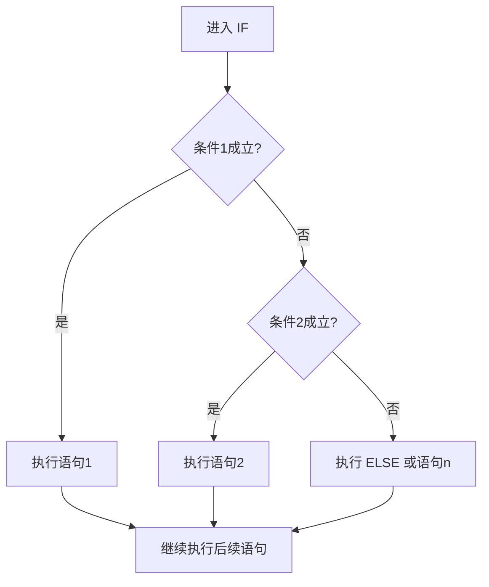
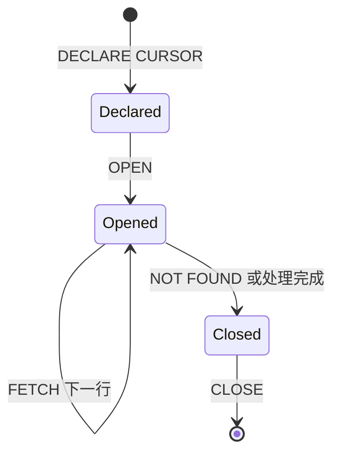
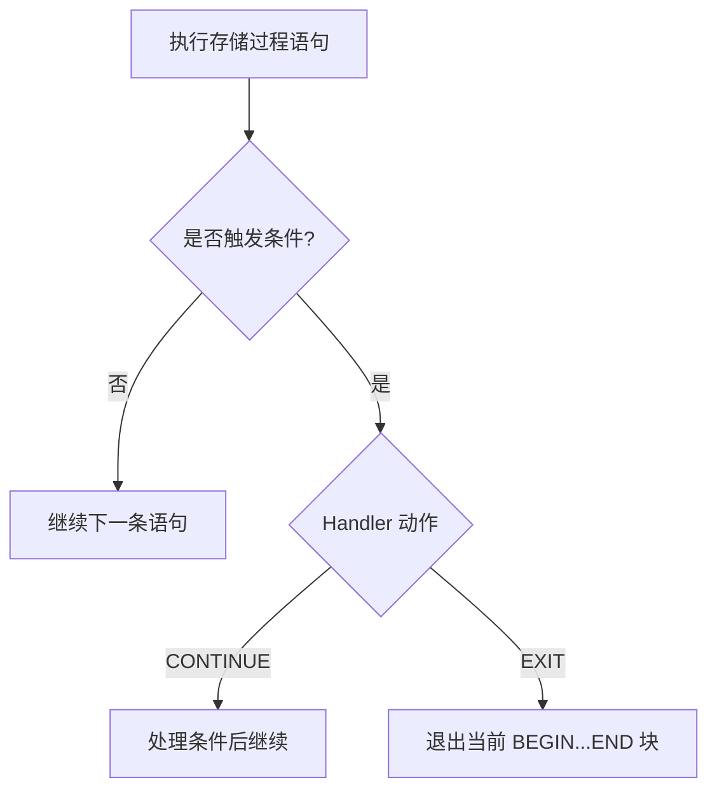

# 存储过程

> 本章深入学习如何把可复用的 SQL 逻辑封装在数据库中。


存储过程是事先经过编译并存储在数据库中的一段 SQL语句的集合，调用存储过程可以简化应用开发人员的很多工作，减少数据在数据库和应用服务器之间的传输，对于提高数据处理的效率是有好处的。

存储过程思想上很简单，就是数据库 SQL语言层面的代码封装与重用

**特点**：

- 封装，复用

- 可以接收参数，也可以返回数据

- 减少网络交互，效率提升

## 1.基本语法

创建

```SQL
CREATE PROCEDURE 存储过程名字([参数列表])
BEGIN
  SQL语句
END;
```

调用

```SQL
CALL 名称([参数]);
```

查看

```SQL
SELECT * FROM INFORMATION_SCHEMA.ROUTINES WHERE ROUTINE_SCHEMA='xx';     ##查询数据库的存储过程及状态信息
SHOW CREATE PROCEDURE 存储过程名称;    ##查询某个存储过程的定义
```

删除

```SQL
DROP PROCEDURE [IF EXISTS]存储过程名称;
```

**注意**：在命令行中，执行存储过程的SQL语句时，需要通过关键字`delimiter`指定SQL语句的结束符，如：`delimiter $$`，此会话之后所有的SQL语句遇到分号不会结束，结束符由分号替换成了$$

## 2.变量

### 2.1 系统变量

系统变量是MySQL服务器提供，不是用户定义的，属于服务器层面。分为全局变量(GLOBAL)、会话变量(SESSION)

查看系统变量

> 下列代码是语法模板，方括号表示可选部分，竖线表示多选一；实际执行时请改成具体关键字和值。

```SQL
SHOW [SESSION|GLOBAL] VARIABLES ;    --查看所有系统变量
SHOW [SESSION|GLOBAL] VARIABLES LIKE '...';    --可以通过LIKE模糊匹配方式查找变量
SELECT @@[SESSION.|GLOBAL.]系统变量名;    --查看指定变量的值
```

设置系统变量

```SQL
SET [SESSION|GLOBAL] 系统变量名 = 值;    --设置全局/会话变量
SET @@GLOBAL.系统变量名 = 值, @@SESSION.系统变量名 = 值;    --同时设置全局系统变量和会话系统变量
```

- 如果没有指定 session / global，默认 session，会话变量

- mysql 服务器重启之后，所设置的全局参数会失效，要想不失效，需要更改 /etc/my.cnf 中的配置。

### 2.2 用户定义变量

用户定义变量是用户根据需要自己定义的变量，用户变量不用提前声明，在用的时候直接用“@变量名”使用就可以。其作用域为当前连接

赋值

```SQL
SET @var_name = expr [,@var_name = expr]...;    --定义单个或多个变量
SET @var_name := expr [,@var_name := expr]...;

SELECT @var_name := expr [,@var_name = expr]...;
SELECT 字段名 INTO @var_name FROM 表名;    --将查询结果赋值给变量@var_name
```

使用

```SQL
SELECT @var_name;
```

- 用户定义的变量无需对其进行声明或者初始化，只不过获取到的值为 NULL

### 2.3 局部变量

局部变量是根据需要定义的在局部生效的变量，访问之前，需要DECLARE声明。可用作存储过程内的局部变量和输入参数，局部变量的范围是在其内声明的BEGIN .. END块

声明

```SQL
DECLARE 变量名 变量类型 [DEFAULT 默认值];
```

- 变量类型就是数据库字段类型：INT、BIGINT、CHAR、VARCHAR、DATE、TIME等

赋值

```SQL
SET 变量名=值;

SET 变量名:=值;

SELECT 字段名 INTO 变量名 FROM 表名 ...;    --将查询结果赋值给局部变量
```

## 3.if 判断

语法

```SQL
IF 条件1 THEN
        语句1
ELSEIF 条件2 THEN       -- 可选
        语句2
...
ELSE                   -- 可选
        语句n
END IF;
```

执行流程：先判断条件1是否成立，成立就执行语句1，否则判断条件2是否成立，成立就执行语句2，否则继续判断，最后执行语句n



案例

```SQL
create procedure p3()
begin
  declare score int default 58;
  declare result varchar(10);
  if score >= 85 then
    set result :='优秀';
  elseif score >= 60 then
    set result :='及格';
  else
    set result :='不及格';
  end if;
  select result;
end;
```

## 4.带参存储过程

|类型|含义|备注|
|---|---|---|
|IN|该类参数作为输入，也就是需要调用时传入值|默认|
|OUT|该类参数作为输出，也就是该参数可以作为返回值||
|INOUT|既可以作为输入参数，也可以作为输出参数||

用法

```SQL
CREATE PROCEDURE 存储过程名称([IN|OUT|INOUT 参数名 参数类型 ]...)
BEGIN
    SQL语句
END;
```

## 5.case语句

语法一

```SQL
CASE case_value
  WHEN when_value1 THEN statement_list1
  [WHEN when_value2 THEN statement_list2]...
  [ELSE statement_list ]
END CASE;
```

先得到case_value的值，依次与每个WHEN后的数值when_value比较，如果相等就执行相应的statement_list语句，然后结束CASE语句，如果没有一个when_value与case_value相等，会执行语句ELSE后的语句statement_list，然后结束CASE语句

语法二

```SQL
CASE
  WHEN search_condition1 THEN statement_list1
  WHEN search_condition2 THEN statement_list2
  [ELSE statement_list]
END CASE;
```

按照顺序判断每个WHEN后的条件search_condition，如果条件为true，就执行相应的语句statement_list，然后结束CASE语句，如果每个WHEN后的条件search_condition都为false，就执行ELSE后的语句statement_list，然后结束CASE语句

## 6.循环

### 6.1 while

while 循环是有条件的循环控制语句。满足条件后，再执行循环体中的SQL语句

语法

```SQL
--先判定条件，如果条件为true，则执行逻辑，否则，不执行逻辑
WHILE 循环条件 DO
  SQL逻辑...
END WHILE;
```

案例

```SQL
--计算从1累加到 n 的值
create procedure p7(in n int)
begin
  declare total int default 0;
  
  while n>0 do
    set total := total + n;
    set n:=n-1;
  end while;
  
  select total;
end;
call p7(100);
```

### 6.2 repeat

repeat是有条件的循环控制语句,当满足条件的时候退出循环

与 while 区别：

1. 先进行循环一次再判断。相当于 c 语言中的 do while();

2. 满足条件则退出

语法

```SQL
--先执行一次逻辑，然后判定逻辑是否满足，如果满足，则退出。如果不满足，则继续下一次循环
REPEAT
  SQL逻辑
  UNTIL 循环条件
END REPEAT;
```

案例

```SQL
--计算从1累加到 n 的值
create procedure p8(in n int)
begin
  declare total int default 0;
  
  repeat
    set total := total + n;
    set n := n - 1;
  until n <= 0
  end repeat;
  
  select total;
end;

call p8(100);
```

### 6.3 loop

LOOP 实现简单的循环，如果不在SQL逻辑中增加退出循环的条件，可以用其来实现简单的死循环。LOOP可以配合以下两个语句使用

1. LEAVE：配合循环使用，退出循环（类似break）

2. ITERATE：必须用在循环中，作用是跳过当前循环剩下的语句，直接进入下一次循环（类似continue）

语句

```SQL
--label：LOOP循环的名字
[begin label:] LOOP
  SQL逻辑
END LOOP [end label];

LEAVE label;  -- 退出指定标记的循环体
ITERATE label;  -- 直接进入下一次循环
```

案例

```SQL
--计算从1到n之间的偶数累加的值
create procedure p10(in n int)
begin 
  declare total int default 0;

  sum: loop
    if n <= 1 then
      leave sum;
    end if;

    if n %2 = 1 then
      set n := n - 1;
      iterate sum;
    end if;

    set total := total + n;
    set n := n - 1;
  end loop sum;

  select total;
end;
```

## 7.游标-cursor

游标(CURSOR)是用来存储查询结果集的数据类型，在存储过程和函数中可以使用游标对结果集进行循环的处理。游标的使用包括游标的声明、OPEN、FETCH和 CLOSE，其语法分别如下



声明游标

```SQL
DECLARE 游标名称 CURSOR FOR 查询语句;
```

- 游标的声明必须放到变量声明的后面，否则会出错无法运行成功

打开游标

```SQL
OPEN 游标名称;
```

获取游标记录

```SQL
FETCH 游标名称 INTO 变量[,变量];
```

关闭游标

```SQL
CLOSE 游标名称;
```

案例

```SQL
--根据传入的参数uage，来查询用户表tb_user 中， 所有的用户年龄小于uage的用户姓名（name)和专业（profession），
--并将用户的姓名和专业插入到所创建的一张新表(id,name,profession)中
create procedure p11(in uage int)
begin 
  declare uname varchar(100);
  declare upro varchar(100);
  --声明游标，存储查询结果集
  declare u_cursor cursor for select name, profession from tb_user where age <= uage;
  --创建表tb_user_pro存游标中的记录
  drop table if exists tb_user_pro;
  create table if not exists tb_user_pro(
    id int primary key auto_increment,
    name varchar(100),
    profession varchar(100)
  );
  --打开游标
  open u_cursor;
  --获取游标中的数据并将其插入到表tb_user_pro中，会发生错误02000，解决方法见 条件处理程序-handler的案例
  while true do
    fetch u_cursor into uname,upro;
    insert into tb_user_pro values(null, uname, upro);
  end while;
  close u_cursor;
end;
```

## 8.条件处理程序-handler

条件处理程序(Handler)可以用来定义在流程控制结构执行过程中遇到问题时相应的处理步骤



语法

```SQL
DECLARE handler_action HANDLER FOR condition_value1, condition_value2... statement;

handler_action
  CONTINUE: 继续执行当前程序
  EXIT: 终止执行当前程序，即退出当前的"BEGIN...END"块
  
condition_value
  SQLSTATE sqlstate_value：状态码，如 02000
  SQLWARNING：所有以01开头的SQLSTATE代码的简写
  NOT FOUND：所有以02开头的SQLSTATE代码的简写
  SQLEXCEPTION：所有没有被SQLWARNING 或 NOT FOUND捕获的SQLSTATE代码的简写
```

案例

```SQL
create procedure p11(in uage int)
begin 
  declare uname varchar(100);
  declare upro varchar(100);
  declare u_cursor cursor for select name, profession from tb_user where age <= uage;
  
  -- 监控到02000的状态码后，关闭游标后执行exit退出操作。
  declare exit handler for not found close u_cursor; 

  drop table if exists tb_user_pro;
  create table if not exists tb_user_pro(
    id int primary key auto_increment,
    name varchar(100),
    profession varchar(100)
  );
  
  open u_cursor;
  while true do
    fetch u_cursor into uname,upro;
    insert into tb_user_pro values(null, uname, upro);
  end while;
  close u_cursor;
end;
```

## 9.存储函数

存储函数是**有返回值**的存储过程，存储函数的**参数只能是IN类型**的

存储函数用的较少，能够使用存储函数的地方都可以用存储过程替换

语法

```SQL
CREATE FUNCTION 存储函数名称([ 参数列表 ])
RETURNS type [characteristic ...]
BEGIN
  SQL语句
  RETURN 返回值;
END ;

characteristic说明:
 DETERMINISTIC：相同的输入参数总是产生相同的结果
 NO SQL：不包含SQL语句。
 READS SQL DATA：包含读取数据的语句，但不包含写入数据的语句
```

案例

```SQL
--计算从1累加到 n 的值
create function fun1(n int)
returns int deterministic
begin
  declare total int default 0;

  while n > 0 do 
    set total := total + n;
    set n := n - 1;
  end while;
  
  return total;
end;
```
## 小练习

编写一个带输入参数的存储过程，根据部门编号查询员工，并处理不存在数据的情况。
