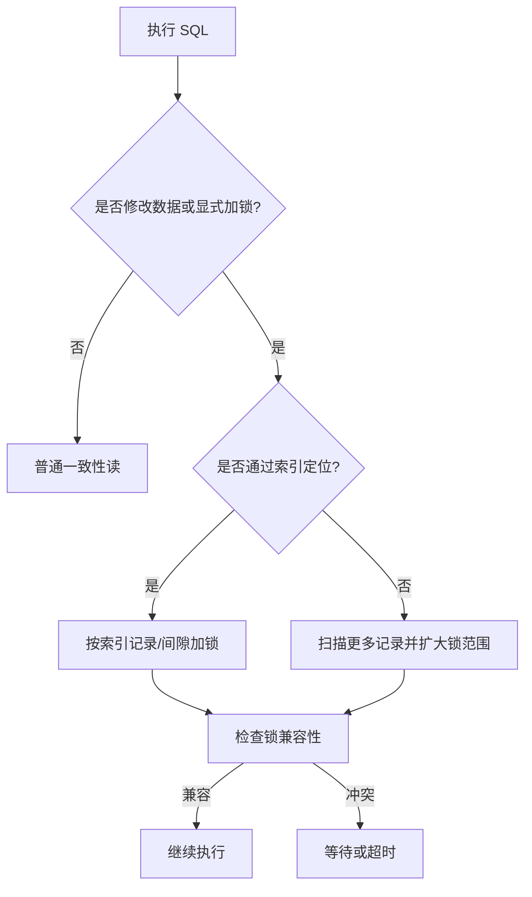

# 锁

> 本章从锁的粒度和兼容性出发，解释 MySQL 如何协调并发事务。


锁是计算机协调多个进程或线程并发访问某一资源的机制。在数据库中，除传统的计算资源(CPU、RAM、I/O)的争用以外，数据也是一种供许多用户共享的资源。如何保证数据并发访问的一致性、有效性是所有数据库必须解决的一个问题，锁冲突也是影响数据库并发访问性能的一个重要因素。从这个角度来说，锁对数据库而言显得尤其重要，也更加复杂

MySQL中的锁，按照锁的粒度分，分为以下三类：

1. 全局锁：锁定数据库中的所有表

2. 表级锁：每次操作锁住整张表

3. 行级锁：每次操作锁住对应的行数据

## 1.全局锁

全局锁就是对整个数据库实例加锁，加锁后整个实例就处于**只读状态**，后续的DML的写语句，DDL语句，已经更新操作的事务提交语句都将**被阻塞**。

其典型的使用场景是做全库的逻辑备份，对所有的表进行锁定，从而获取一致性视图，保证数据的完整性。

### 1.1 语句

使用全局锁

```SQL
flush tables with read lock;
```

拷贝数据库

```PowerShell
mysqldump [--single-transaction] -uroot -p itcast > itcast.sql
```

- 不属于MySQL命令，需要退出数据库管理系统后在命令行执行

- 只适用于支持 可重复读隔离级别的事务 的存储引擎

- -u后面跟用户名，如root用户，但要保证用户有足够权限拷贝数据库

- -p后面可以跟用户密码，也可以不跟，不跟命令执行后需要手动输入密码，建议不加密码

- itcast代表要拷贝的数据库，只写数据库名就可以了

- itcast.sql可以写绝对路径，但要保证路径存在，格式是`D:/backup/itcast.sql`或`D:\\backup\\itcast.sql`

释放全局锁

```SQL
unlock tables;
```

### 1.2 特点

数据库中加全局锁，是一个比较重的操作，存在以下问题:

1. 如果在主库上备份，那么在备份期间都不能执行更新，业务基本上就得停摆

2. 如果在从库上备份，那么在备份期间从库不能执行主库同步过来的二进制日志(binlog)，会导致主从延迟（该结构会在后续主从复制讲解）

**解决方法**：

在InnoDB引擎中，我们可以在备份时加上参数 `--single-transaction` 参数来完成不加锁的一致性数据备份，通过加上这个参数，确保了在备份开始时创建一个一致性的快照，通过启动一个新的事务来实现这一点（该事务的隔离级别是Repeatable Read级别），从而确保在备份数据库时可以对数据库数据进行操作。

## 2.表级锁

每次操作**锁住整张表**。锁定粒度大，发生锁的冲突的概率最高，并发度最低。应用在MyISAM、InnoDB、BDB等存储引擎中

对于表级锁，主要分为以下三类：

1. 表锁

2. 元数据锁（meta data lock，MDL）

3. 意向锁

### 2.1 表锁

对于表锁，分为两类：

1. 表共享读锁（read lock）：当前客户端和其他客户端都能读，当前客户端不能写，其他客户端写被阻塞

2. 表独占写锁（write lock）：当前客户端可以读和写，其他客户端的读和写会被阻塞

加锁

```SQL
lock tables 表名... read|write;
```

释放锁

```SQL
unlock tables;
```

- 用户端断开与数据库的连接会自动释放锁，如事务结束事务内加的锁全部释放

### 2.2 元数据锁（MDL）

MDL加锁过程是系统自动控制，无需显式使用，在访问一张表的时候会自动加上。MDL锁主要作用是维护表元数据的数据一致性，在表上有活动事务的时候，不可以对元数据进行写入操作。

- 元数据：描述数据库对象结构的信息，而不是实际的数据内容，是描述数据库对象的结构和属性的信息，如表结构、视图定义等

元数据锁是为了避免DML与DDL冲突，保证读写的正确性。

在MySQL 5.5中引入了MDL，当对一张表进行增删改查时，加**MDL读锁（共享）**；当对表结构进行变更时，加**MDL写锁（排他）**

|对应SQL|锁类型|说明|
|---|---|---|
|lock tables xxx read \| write|SHARED_READ_ONLY\|SHARED_NO_READ_WRITE||
|select 、 select … lock in share mode|SHARED_READ（共享读锁）|与SHARED_READ、SHARED_WRITE兼容，与EXCLUSIVE互斥|
|insert 、update、delete、select …for update|SHARED_WRITE（共享写锁）|与SHARED_READ、SHARED_WRITE兼容，与EXCLUSIVE互斥|
|alter table …|EXCLUSIVE（写锁）|与其他的MDL都互斥|

- SHARED_READ和SHARED_WRITE是兼容的，即可以同时存在，但是这两个锁和EXCLYSIVE是互斥的，即EXCLYSIVE和他们不能同时存在，会发生阻塞

查看元数据锁

```SQL

select object_type,object_schema,object_name,lock_type,lock_duration from performance_schema.metadata_locks;
```

### 2.3 意向锁

当线程A对基本表某一行加行锁后，如果线程B要对基本表加表锁，那么MySQL会检查基本表的每一行，判断是否有其他线程加的锁，如果有，会判断表锁和行锁是否冲突，如果不冲突会直接加锁，如果冲突会被阻塞，直到其他线程全部释放锁

为了避免DML在执行时，加的行锁与表锁的冲突，在InnoDB中引入了意向锁，使得表锁不用检查每行数据是否加锁，使用意向锁来减少表锁的检查

意向锁分为两类：

- **意向共享锁（IS）**：与表锁共享锁（read）兼容，与表锁排他锁（write）互斥

- **意向排他锁（IX）**：与表锁共享锁（read）和排他锁（write）都互斥，意向锁之间不会互斥

意向锁的好处：

1. 如果没有「意向锁」，那么加「独占表锁」时，就需要遍历表里所有记录，查看是否有记录存在独占锁，这样效率会很慢

2. 那么有了「意向锁」，由于在对记录加独占锁前，先会加上表级别的意向独占锁，那么在加「独占表锁」时，直接查该表是否有意向独占锁，如果有就意味着表里已经有记录被加了独占锁，这样就不用去遍历表里的记录

> 意向锁的目的是为了快速判断表里是否有记录被加锁

查看锁及元数据锁的加锁情况

```SQL
select object_schema,object_name,index_name,lock_type,lock_mode,lock_data from performance_schema.data_locks;
```

MySQL 8.0 推荐通过 Performance Schema 的 `data_locks` 和 `data_lock_waits` 查看锁与等待信息；旧版 `INFORMATION_SCHEMA.INNODB_LOCKS` 和 `INNODB_LOCK_WAITS` 已被它们取代。发生长时间等待时，可结合 `SHOW ENGINE INNODB STATUS\G` 定位死锁和事务等待。详见 [InnoDB Lock and Lock-Wait Information](https://dev.mysql.com/doc/refman/8.0/en/innodb-information-schema-understanding-innodb-locking.html)。

减少锁冲突的实用原则：缩短事务范围、为过滤条件建立合适索引、让多个事务以一致顺序访问多张表，并在应用层处理死锁重试。

添加意向共享锁

```SQL
select ... lock in share mode;
```

- 执行语句后，MySQL会先在表上加上意向共享锁，然后对读取的记录加共享锁，也就是说会加两个锁

添加意向独占锁

```SQL
insert、 update、 delete、 select ... for update
```

- 在执行增删改语句后会自动加上意向独占锁，不需要手动指定

- 执行语句后，MySQL会先在表上加上意向独占锁，然后对读取的记录加独占锁，也就是说会加两个锁

### 2.4 AUTO-INC锁


## 3.行级锁

行级锁，每次操作**锁住对应的行数据**。锁定粒度最小，发生锁冲突的概率最低，并发度最高。应用在InnoDB存储引擎中

InnoDB数据是基于索引组成的，行锁是通过对索引上的索引项加锁来实现的，而不是对记录加的锁

行级锁主要分为三类：

1. 行锁(Record Lock)：锁定单个行记录的锁，防止其他事务对此行进行update和delete。在RC、RR隔离级别下都支持

2. 间隙锁(GapLock)：锁定索引记录间隙(不含该记录)，确保索引记录间隙不变，防止其他事务在这个间隙进行insert，产生幻读。在RR隔离级别下都支持

3. 临键锁(Next-Key Lock)：行锁和间隙锁组合，同时锁住数据，并锁住数据前面的间隙Gap。在RR隔离级别下支持

### 3.1 Record Lock（行锁）

Record Lock 称为记录锁，锁住的是一行记录。而且记录锁是有 S 锁和 X 锁之分：

1. 共享锁(S)：允许一个事务去读一行，阻止其他事务获得相同数据集的排它锁。

    - 当前客户端和其他客户端都能读，当前客户端不能写，其他客户端写被阻塞

2. 排他锁(X)：允许获取排他锁的事务更新数据，阻止其他事务获得相同数据集的共享锁和排他锁。

    - 当前客户端可以读和写，其他客户端的读和写会被阻塞

||S(共享锁)|X(排他锁)|
|---|---|---|
|S(共享锁)|兼容|冲突|
|X(排他锁)|冲突|冲突|

行锁类型：

|SQL|行锁类型|说明|
|---|---|---|
|insert...，update...，delete …|排他锁|自动加锁|
|select...（正常）|不加任何锁||
|select … lock in share mode|共享锁|需要手动select之后加上lock in share mode|
|select … for update|排他锁|需要手动在select之后for update|

默认情况下，InnoDB在 REPEATABLE READ事务隔离级别运行，InnoDB使用 next-key锁进行搜索和索引扫描，以防止幻读。

1. 通过唯一索引进行检索时，对已存在的记录进行等值匹配时，将会**自动优化为行锁**

2. InnoDB 的行锁是针对索引记录或索引范围加的锁。如果不通过索引检索数据，可能扫描并锁住大量记录和间隙，但这不等于自动升级为真正的表锁。

查看意向锁及行锁的加锁情况

```SQL
select object_schema,object_name,index_name,lock_type,lock_mode,lock_data from performance_schema.data_locks;
```

### 3.2 Gap Lock（间隙锁）和Next-Key Lock（临键锁）

默认情况下，InnoDB在 REPEATABLE READ（可重复读）事务隔离级别运行，InnoDB使用 next-key 锁进行搜索和索引扫描，以防止幻读

1. 索引上的等值查询(唯一索引)：给不存在的记录加锁时, **优化为间隙锁**

    - 会在应存在的位置（间隙）插入一个间隙锁，其他事务访问这个间隙时会被阻塞

2. 索引上的等值查询(非唯一性索引)：向右遍历时最后一个值不满足查询需求时，next-key lock **退化为间隙锁**

    - 如果值存在，会把查询的节点加行锁，并且在查询的节点前后两个间隙都添加间隙锁

    - 如果值不存在，会在应存在的位置（间隙）插入一个间隙锁

3. 索引上的范围查询(唯一索引)：会访问到不满足条件的第一个值为止

    - 对查询范围内的所有行加行锁，对查询范围内的所有间隙加间隙锁

4. 索引上的范围查询(非唯一索引)：向左遍历时第一个范围不满足查询范围，向右遍历时最后一个范围不满足查询范围

    - 对查询范围内的所有行加行锁，对查询范围内的所有间隙以及起始点的前一个间隙和终止点的后一个间隙加间隙锁
### InnoDB 加锁判断



## 小练习

开启两个客户端，分别测试共享锁、排他锁和未命中索引时的锁行为，并记录阻塞现象。
