# InnoDB引擎

> 本章把 InnoDB 的存储结构、日志和 MVCC 串联起来，建立底层工作原理的整体图景。


## 1.逻辑存储结构

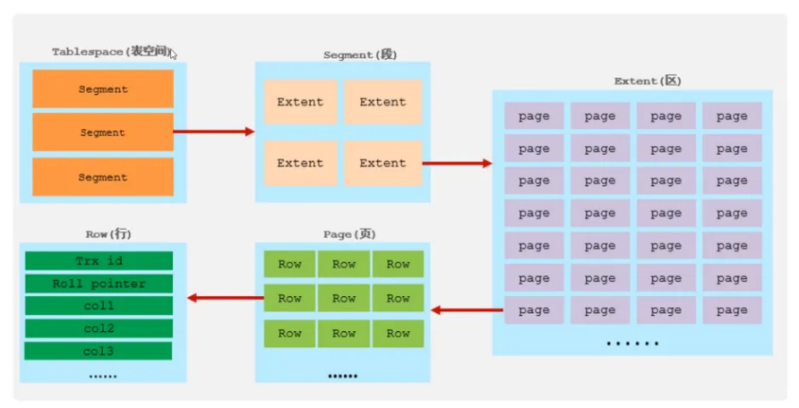

**表空间（ibd文件）**：一个mysql实例可以对应多个表空间，用于存储记录、索引等数据。

**段**：分为数据段（Leaf node segment）、索引段（Non-leaf node segment）、回滚段（Rollback segment），InnoDB 是索引组织表，数据段就是B+树的叶子节点， 索引段即为B+树的非叶子节点。段用来管理多个Extent（区）。

**区**：表空间的单元结构，每个区的大小为1M。 默认情况下， InnoDB存储引擎页大小为16K， 即一个区中一共有64个连续的页。

**页**：是InnoDB 存储引擎磁盘管理的最小单元，每个页的大小默认为 16KB。为了保证页的连续性，InnoDB 存储引擎每次从磁盘申请 4-5 个区。

**行**：InnoDB 存储引擎数据是按行进行存放的。

- `Trx_id`：每次对某条记录进行改动时，都会把对应的事务id赋值给trx_id隐藏列。

- `Roll_pointer`：每次对某条引记录进行改动时，都会把旧的版本写入到undo日志中，然后这个隐藏列就相当于一个指针，可以通过它来找到该记录修改前的信息。

## 2.架构

MySQL 5.5 版本开始，默认使用InnoDB存储引擎，它擅长事务处理，具有崩溃恢复特性，在日常开发中使用非常广泛。下面是InnoDB架构图，左侧为内存结构，右侧为磁盘结构：

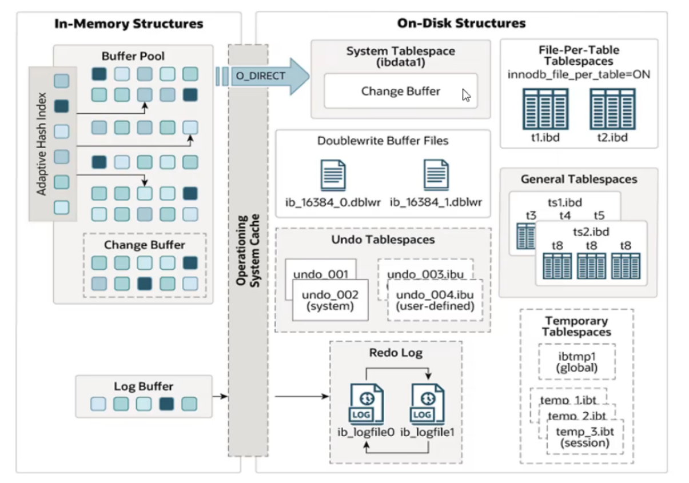

### 2.1 内存架构

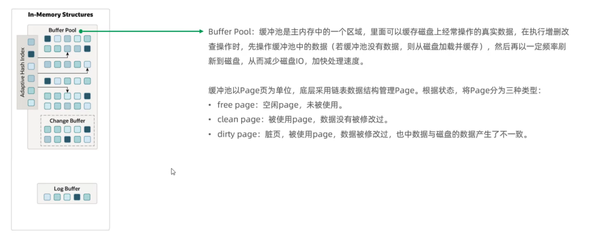

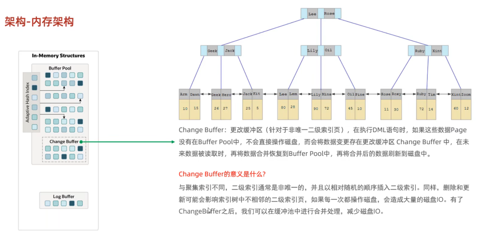

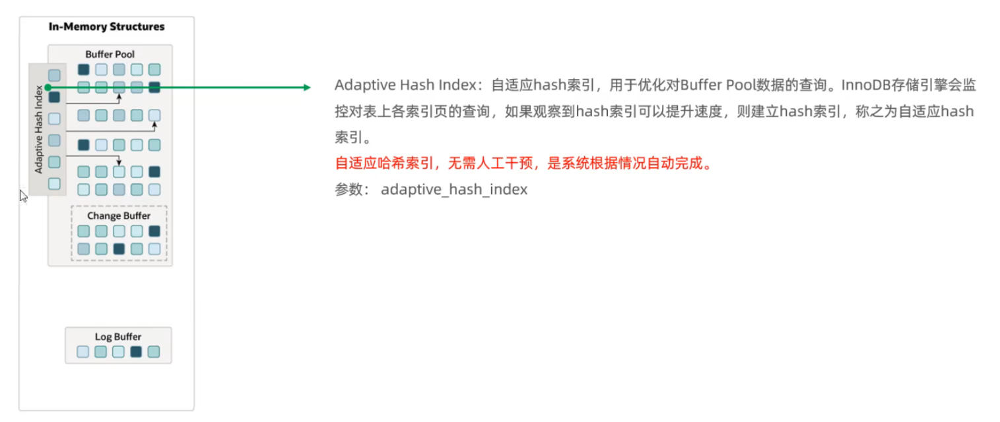

- `adaptive_hash_index`：控制是否启用自适应哈希索引，ON表示开启，OFF表示关闭，默认值是ON；具体操作参考系统变量。

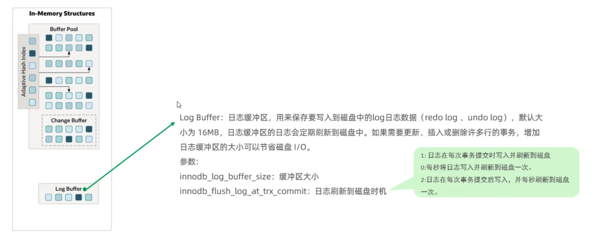

### 2.2 磁盘结构

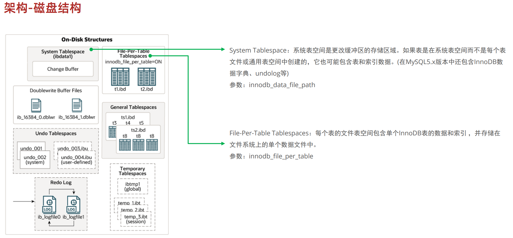

- `innodb_data_file_path`：用于定义InnoDB的系统表空间（System Tablespace）的文件路径、大小和属性。

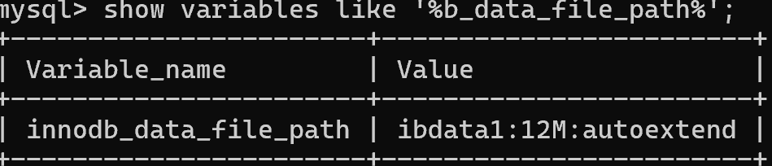

- `innodb_file_per_table`：控制InnoDB是否为每个表创建独立的表空间文件，ON表示每个表都有自己的表空间文件，OFF表示所有表的数据和索引存储在系统表空间中，默认值是ON。

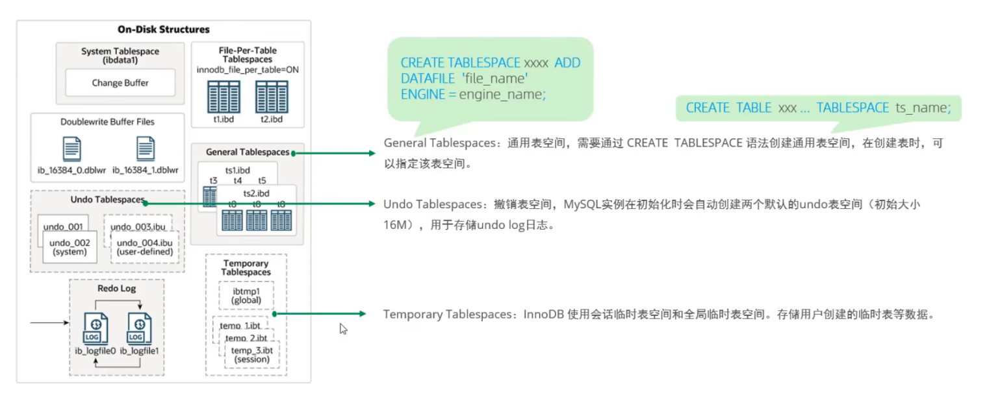

通用表空间：将多个表的数据存储在一个共享的文件中，方便管理和维护。

创建通用表空间文件

```SQL
CREATE TABLESPACE tablespace_name
ADD DATAFILE 'file_name.ibd'
[FILE_BLOCK_SIZE = value]
[ENGINE [=] InnoDB];

tablespace_name：通用表空间的名称
file_name.ibd：表空间文件的路径和名称，要确保指定的文件路径是MySQL可访问的，并且有足够的权限
FILE_BLOCK_SIZE：可选参数，指定表空间的文件块大小（通常与表的页大小一致），必须与表的页大小一致（例如16K）
ENGINE：指定存储引擎，默认为 InnoDB。
```

创建表时指定表空间

```SQL
CREATE TABLE ...[TABLESPACE tablespace_name];

tablespace_name：指定表存储的通用表空间名称
```

将现有表移动到通用表空间

```SQL
ALTER TABLE table_name TABLESPACE tablespace_name;
```

删除通用表空间

```SQL
DROP TABLESPACE tablespace_name;
```

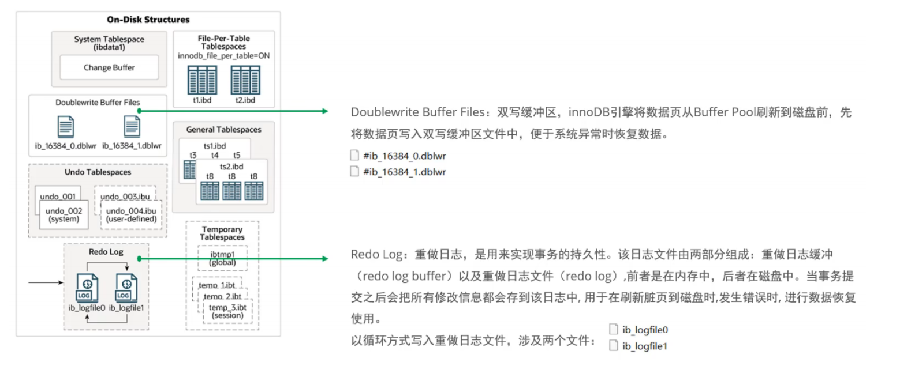

### 2.3 后台线程

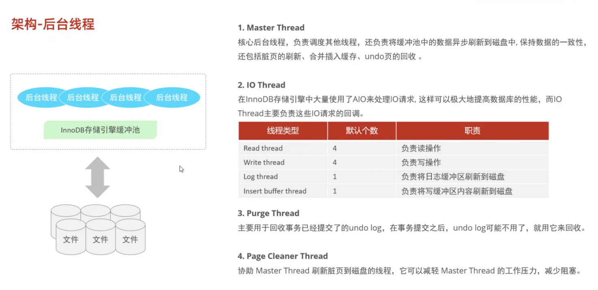

## 3.事务原理

特性原理分类图：


- 原子性通过undo log日志实现，持久性通过redo log日志实现，一致性通过undo log和redo log两个日志实现，隔离性通过锁和MVCC实现

更准确地说，`redo log` 主要服务于崩溃恢复和持久性，`undo log` 主要服务于事务回滚和 MVCC 的旧版本读取；一致性是事务、约束、日志和并发控制共同作用的结果。不要把 redo log 理解成“回滚日志”。

### 3.1 redo log

重做日志，记录的是事务提交时数据页的物理修改，是用来实现事务的**持久性**。

该日志文件由两部分组成:重做日志缓冲(redo log buffer)以及重做日志文件(redo log file)，前者是在内存中，后者在磁盘中。当事务提交之后会把所有修改信息都存到该日志文件中,用于在刷新脏页到磁盘,发生错误时,进行数据恢复使用。

Buffer Pool在产生脏页数据的时候，会先将数据存储到 redo log buffer，再按日志持久化策略写入 redo log。系统异常（比如突然断电）后，InnoDB 可以通过 redo log 重做已经提交但尚未刷入表空间的数据变更；事务回滚主要依赖 undo log。过程如下图：

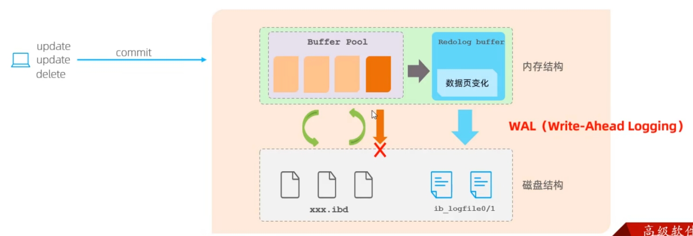

当用户执行UPDATE或DELETE操作时，数据页会被加载到内存的Buffer Pool中进行修改，同时生成Redo Log记录并暂存于Redo Log Buffer中。事务提交时，Redo Log Buffer中的日志会先写入磁盘的Redo Log文件（ib_logfile0/1），确保事务的持久性，而数据页的修改则通过后台线程异步刷入磁盘的表空间文件（.ibd）。这种WAL机制保证了即使系统崩溃，也能通过Redo Log恢复未刷盘的数据变更，从而确保数据的一致性和持久性。


问题：数据为什么要通过redolog写入ibd表空间文件，而不是直接从Buffer Pool直接刷新到磁盘ibd文件？

答：Buffer Pool 刷盘是**随机写**：数据页在磁盘上的位置是分散的、随机的，每次刷盘都需要寻址，性能较低。Redo Log 是**顺序写**：每次写入都是追加到日志文件的末尾，性能非常高。

### 3.2 undo log

回滚日志，用于记录数据被修改前的信息，作用包含：提供回滚 和 MVCC(多版本并发控制)。

undo log 和 redo log 记录物理日志不一样，它是逻辑日志。可以认为当 delete 一条记录时，undo log中会记录一条对应的insert记录，反之亦然，当 update 一条记录时，它记录一条对应相反的 update 记录。当执行 rollback 时，就可以从 undo log 中的逻辑记录读取到相应的内容并进行回滚。

- Undo log 销毁：undo log 在事务执行时产生，事务提交时并不会立即删除 undo log，因为这些日志可能还用于 MVCC

- Undo log 存储：undo log 采用段的方式进行管理和记录，存放在前面介绍的 rollback segment 回滚段中，内部包含1024个 undo log segment

### 3.3 MVCC

#### 3.3.1 基本概念

**当前读**：读取的是记录的最新版本，读取时还要保证其他并发事务不能修改当前记录，会对读取的记录进行加锁。对于我们日常的操作，如:select…lock in share mode(共享锁)，select… for update、update、insert、delete(排他锁)都是一种当前读

**快照读**：简单的select(不加锁)就是快照读，快照读，读取的是记录数据的可见版本，有可能是历史数据，不加锁，是非阻塞读

- Read committed：每次select，都生成一个快照读

- Repeatable Read：开启事务后第一个select语句才是快照读的地方

- Serializable：快照读会退化为当前读

**MVCC**：全称 Multi-Version Concurrency Control，多版本并发控制。指维护一个数据的多个版本，使得读写操作没有冲突，快照读为MySQL实现MVCC提供了一个非阻塞读功能。MVCC的具体实现，还需要依赖于数据库记录中的三个隐式字段、undo log日志、read View

#### 3.3.2 记录中的隐藏字段

每一张创建的表都有两个或三个隐藏字段：DB_TRX_ID、DB_ROLL_PTR、DB_ROW_ID（表没有主键时存在）

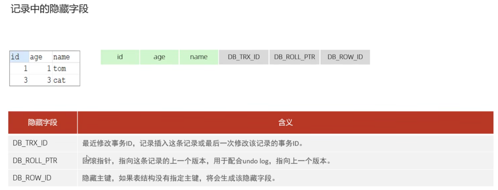

#### 3.3.3 undo log

回滚日志，在insert、update、delete的时候产生的便于数据回滚的日志。

当 insert 的时候，产生的 undo log 主要在回滚时需要，在事务提交且没有其他一致性读依赖后才可回收。

当update、delete的时候，产生的undo log日志不仅在回滚时需要，在快照读时也需要，不会立即被删除。

那么何时删除？

- 当所有依赖于该undo log的快照读取操作结束后，undo log才会被删除。这意味着如果有一个事务正在进行快照读取，并且依赖于某个undo log，那么这个undo log会一直保留直到该事务结束。

**undo log版本链**：

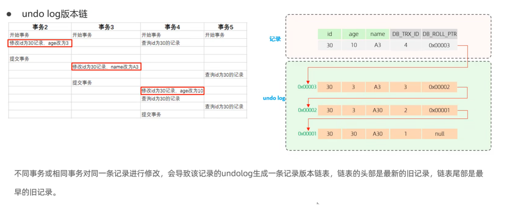

#### 3.3.4 readview

ReadView(读视图)是 快照读 SQL执行时MVCC提取数据的依据，记录并维护系统当前活跃的事务(未提交的)id

ReadView中包含了四个核心字段：

|字段|含义|
|---|---|
|m_ids|当前活跃的事务ID集合|
|min_trx_id|最小活跃事务ID|
|max_trx_id|预分配事务ID，当前最大事务ID+1（因为事务ID是自增的）|
|creator_trx_id|ReadView创建者的事务ID|

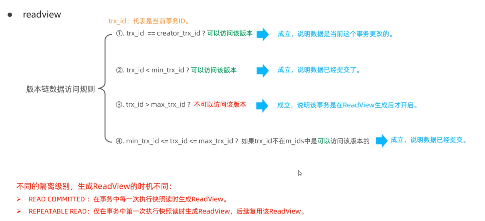

**READ COMMITTED**

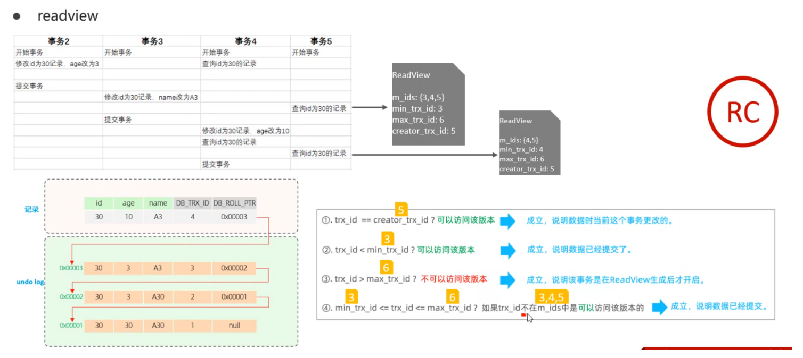

针对事务5的两条查询语句，第一条查询语句：记录一次ReadView读视图，拿着当前事务id即DB_TRX_ID=4根据版本链数据访问规则依次判断，判断到第4条发现trx_id=4在集合m_ids中，在链表结构找到下一个DB_TRX_ID=3，再次进行判断，发现3仍然在集合m_ids中，再次在链表结构找到下一个DB_TRX_ID=2，发现满足第2条规则，所以查询到0x00002指向的记录（id: 30, age: 3, name: A30）;

事务5的第二条查询语句重新记录一次ReadView读视图，然后根据新的ReadView读视图重新判断，直到找到满足版本链数据访问规则的一条版本记录为止，所以两次查询结果不一定一致

**REPEATABLE READ**

查询过程和READ COMMITTED相同，只是事务5的第二条查询语句不会重新生成ReadView读视图，会复用第一条查询语句的ReadView读视图，所以两次查询的结果一致

InnoDB 的事务和锁模型可参考 [InnoDB Transaction Model](https://dev.mysql.com/doc/refman/8.0/en/innodb-transaction-model.html)；日志、缓冲池和表空间的完整说明见 [InnoDB Storage Engine](https://dev.mysql.com/doc/refman/8.0/en/innodb-storage-engine.html)。
### InnoDB 事务日志与 MVCC

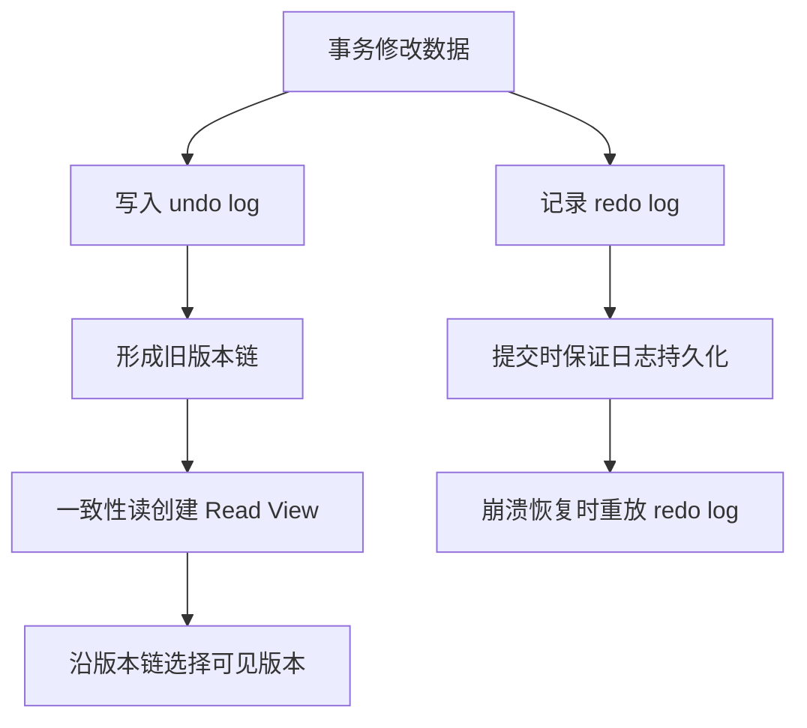

## 小练习

结合两个事务的读写操作，说明 undo log、Read View 和版本链分别发挥了什么作用。
