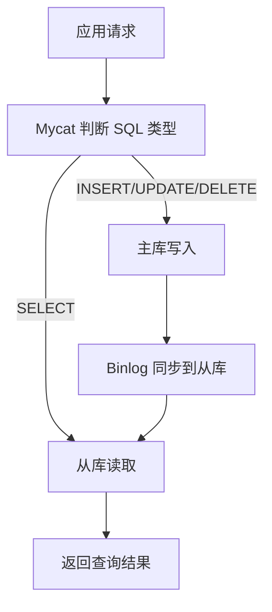

# 读写分离

> 本章说明如何让写请求进入主库、读请求进入从库，并理解 Mycat 在其中的作用。


## 1.介绍

主从复制在进行数据库操作时，客户端服务器会先判断目前操作是读还是写，再决定是分配到哪个服务器，压力较大。

读写分离,简单地说就是把对数据库的读和写操作分开,以对应不同的数据库服务器。主数据库提供写操作，从数据库提供读操作，这样能有效地减轻单台数据库的压力。

读写分离不是“自动获得强一致性”：写入主库后，副本可能尚未应用对应 Binlog。对刚写入数据有立即读取要求的请求，可以短时间固定访问主库，或在应用层根据复制位点/业务版本做一致性控制。

通过MyCat即可轻易实现上述功能，不仅可以支持MySQL，也可以支持Oracle和SQL Server。
## 2.一主一从

MySQL的主从复制，是基于二进制日志（binlog）实现的。
**环境准备**：

|主机|角色|用户名|密码|
|---|---|---|---|
|master-1|master|root|`your-password`|
|slave-1|slave|root|`your-password`|

主从复制的搭建，可以参考[十五、主从复制](https://mcnerzykwkel.feishu.cn/wiki/I8Tyw4doGimwFhkQ9imc02kfnVd?fromScene=spaceOverview#share-DXSRdYUp0ovDPMxDwwEcaO5unOg)

## 3.一主一从读写分离

### 3.1 配置

MyCat控制后台数据库的读写分离和负载均衡由schema.xml文件datahost标签的balance属性控制。
|参数值|含义|
|---|---|
|0|不开启读写分离机制 所有读操作都发送到当前可用的writeHost上|
|1|全部的readHost与writeHost备用的 都参与select语句的负载均衡（主要针对于双主双从模式）|
|2|所有的读写操作都随机在writeHost、readHost上分发|
|3|所有的读请求随机分发到writeHost对应的readHost上执行，writeHost不负担读压力|

### 3.2 测试

连接Mycat，并在Mycat中执行DML、DQL查看是否能够进行读写分离。

- 主节点Master宕机之后，业务系统就只能够读，而不能写入数据了，可以通过双主双从

## 4.双主双从

一个主机 Master1 用于处理所有写请求，它的从机 Slave1 和另一台主机 Master2 还有它的从机 Slave2 负责所有读请求。当 Master1 主机宕机后，Master2 主机负责写请求，Master1 、Master2 互为备机：
### 4.1 准备工作

我们需要准备5台服务器，具体的服务器及软件安装情况如下：

|编号|IP|安装软件|角色|
|---|---|---|---|
|1|mycat-host|Mycat、MySQL|Mycat中间件服务器|
|2|master-1|MySQL|M1|
|3|slave-1|MySQL|S1|
|4|master-2|MySQL|M2|
|5|slave-2|MySQL|S2|

测试环境中临时放通所需端口即可，不建议关闭防火墙；生产环境应使用最小端口和来源地址规则：

仅按部署需要放通 MySQL、Mycat 和管理端口，并限制来源地址；不要为了实验方便停用系统防火墙。

### 4.2 主库配置（ Master1-master-1 ）
### 4.3 主库配置（ Master2-master-2 ）
### 4.4 两台主库创建账户并授权
### 4.5 从库配置（ Slave1-slave-1 ）
### 4.6 从库配置（ Slave2-slave-2 ）
### 4.7 两台从库配置关联的主库
- MASTER_HOST跟从库所关联的主库IP，MASTER_USER跟用户名，MASTER_PASSWORD跟用户密码，MASTER_LOG_FILE和MASTER_LOG_POS可以在对应主库中通过show master status获得

两台从库 2 和 4 都要配置

### 4.8 两台主库相互复制
### 4.9 测试

分别在两台主库Master1、Master2上执行DDL、DML语句，查看涉及到的数据库服务器的数据同步情况

```SQL
create database db01;
use db01;
create table tb_user(
        id int(11) not null primary key,
        name varchar(50) not null,
        sex varchar(1)
)engine=innodb default charset=utf8mb4

insert into tb_user(id,name,sex) values(1,'Tom','1');
insert into tb_user(id,name,sex) values(2,'Trigger','0');
insert into tb_user(id,name,sex) values(3,'Dawn','1');
insert into tb_user(id,name,sex) values(4,'Jack Ma','1');
insert into tb_user(id,name,sex) values(5,'Coco','0');
insert into tb_user(id,name,sex) values(6,'Jerry','1');
```

## 5.双主双从读写分离

### 5.1 配置

MyCat控制后台数据库的读写分离和负载均衡由schema.xml文件datahost标签的balance属性控制，通过writeType及switchType来完成失败自动切换。
### 5.2 测试

登录MyCat，测试查询及更新操作，判定是否能够进行读写分离，以及读写分离的策略是否正确。

- 查询时，从哪个服务器查询时随机的，插入时，默认插入到master1当中，然后同步到其他三台服务器

当主库挂掉一个之后，是否能够自动切换。
### 读写分离流程



读写分离依赖复制状态；从库延迟时，刚写入的数据可能暂时无法立即读到。

## 小练习

为一个读多写少的业务画出读写分离架构，并列出主从延迟可能带来的一个问题及应对方式。
