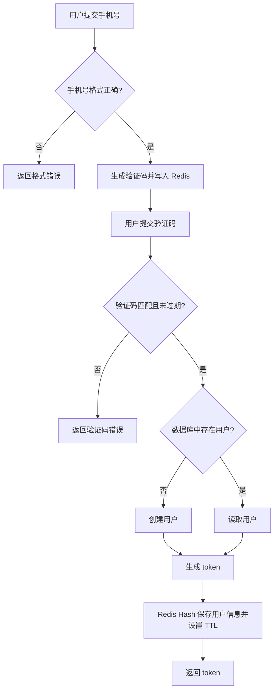
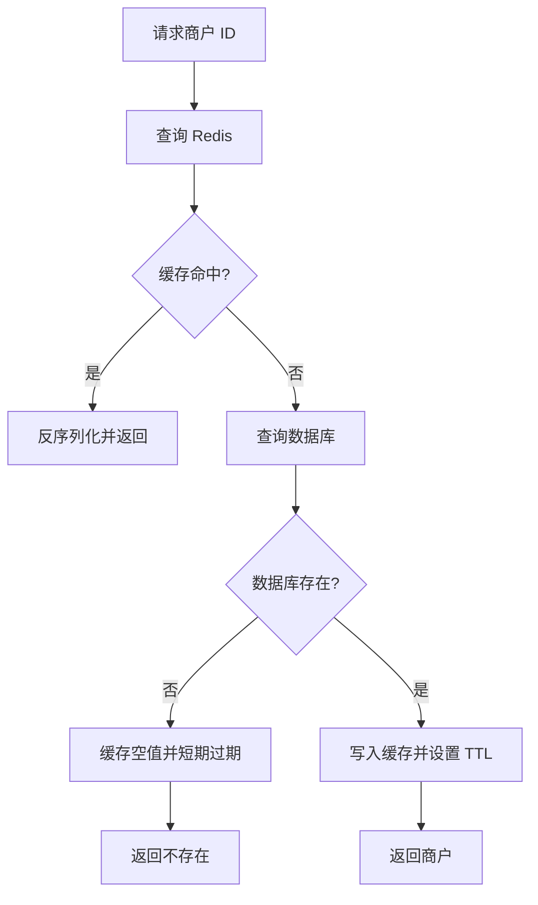
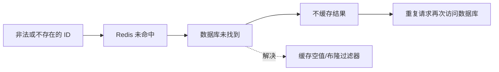
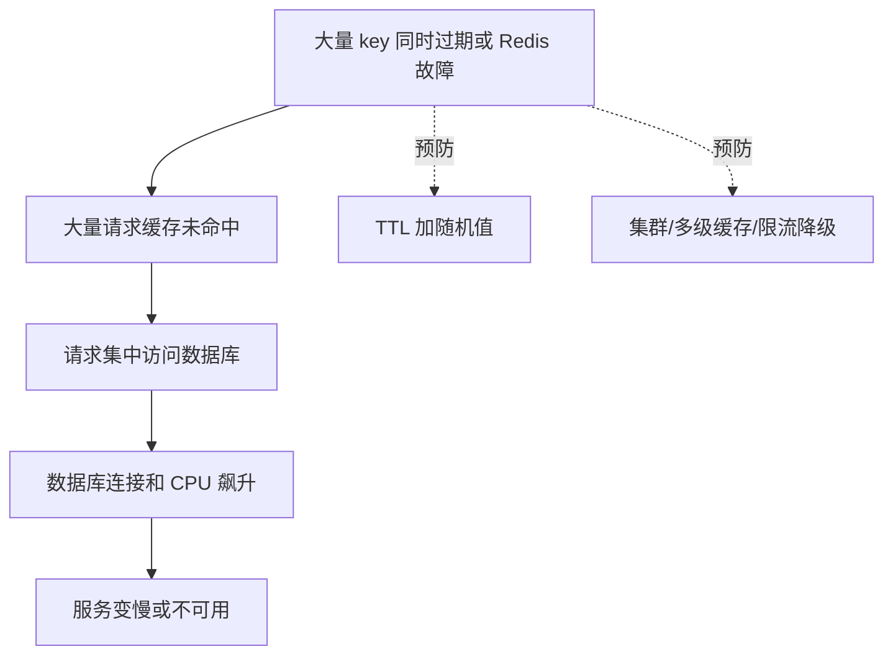
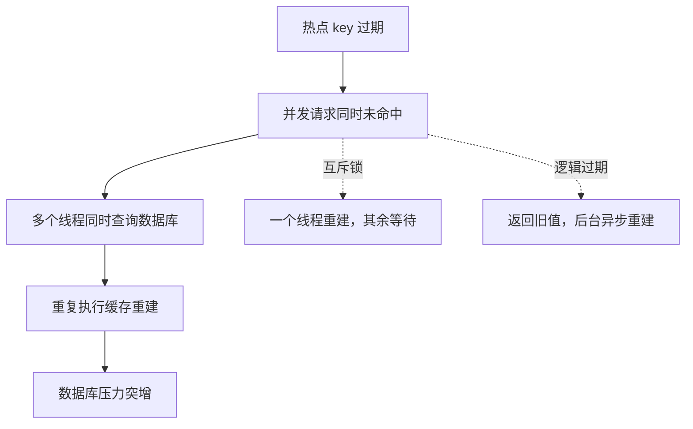

# Redis 实战：短信登录与缓存

## 1 短信登录

### 1.0 登录流程图



### 1.1 业务环境

短信登录通常包含发送验证码、验证码登录注册、校验登录状态三个步骤。数据库保存用户长期信息，Redis 保存验证码和登录 token 等临时信息。

### 1.2 发送验证码

流程：校验手机号 -> 生成 6 位验证码 -> 写入 Redis -> 设置过期时间 -> 调用短信服务。

```java
public Result sendCode(String phone) {
    if (RegexUtils.isPhoneInvalid(phone)) {
        return Result.fail("手机号格式错误");
    }
    String code = RandomUtil.randomNumbers(6);
    // 验证码使用 String，并设置短过期时间
    String key = "login:code:" + phone;
    stringRedisTemplate.opsForValue().set(key, code, 2, TimeUnit.MINUTES);
    log.debug("验证码：{}", code);
    return Result.ok();
}
```

### 1.3 登录与自动注册

用户提交手机号和验证码后，先从 Redis 获取正确验证码。验证通过后查询数据库；用户不存在则创建，再生成随机 token 保存用户信息。

```java
public Result login(String phone, String code) {
    String codeKey = "login:code:" + phone;
    String rightCode = stringRedisTemplate.opsForValue().get(codeKey);
    if (rightCode == null || !rightCode.equals(code)) {
        return Result.fail("验证码错误或已过期");
    }
    User user = userService.findByPhone(phone);
    if (user == null) {
        user = userService.createByPhone(phone); // 新用户自动注册
    }
    String token = UUID.randomUUID().toString();
    Map<String, String> userMap = Map.of(
            "id", user.getId().toString(),
            "nickName", user.getNickName());
    String tokenKey = "login:token:" + token;
    stringRedisTemplate.opsForHash().putAll(tokenKey, userMap);
    stringRedisTemplate.expire(tokenKey, 30, TimeUnit.MINUTES);
    return Result.ok(token);
}
```

### 1.4 Key-Value 设计

| 数据 | 类型 | Key 示例 | 过期时间 |
| --- | --- | --- | --- |
| 短信验证码 | String | `login:code:13800000000` | 2 分钟 |
| 登录用户 | Hash | `login:token:{token}` | 30 分钟 |
| 商户缓存 | String | `cache:shop:{id}` | 30 分钟左右 |

设计 key 时要保证唯一、便于定位，并控制 value 粒度，避免把无关字段全部放入缓存。

### 1.5 登录拦截与 token 刷新

拦截器从请求头读取 token，再查询 Redis Hash。查询成功则写入 ThreadLocal，并刷新过期时间；请求结束时清理 ThreadLocal。

```java
String token = request.getHeader("authorization");
if (StrUtil.isBlank(token)) {
    response.setStatus(401);
    return false;
}
String key = "login:token:" + token;
Map<Object, Object> userMap = stringRedisTemplate.opsForHash().entries(key);
if (userMap.isEmpty()) {
    response.setStatus(401);
    return false;
}
UserHolder.saveUser(convert(userMap));
stringRedisTemplate.expire(key, 30, TimeUnit.MINUTES); // 滑动过期
return true;
```

实际项目建议拆成两个拦截器：一个拦截所有请求并刷新 token，另一个只拦截必须登录的路径。

## 2 商户查询缓存

### 2.0 缓存查询主流程



### 2.1 缓存模型

读取商户时先查询 Redis，命中则直接返回；未命中再查询数据库，并把结果写入 Redis。

缓存是位于应用与数据库之间的高速数据副本。它不是最终数据源，所以缓存丢失后，系统应该能够重新从数据库构建缓存。

一次完整的缓存查询包含四个动作：

1. 根据业务对象拼接唯一 key。
2. 查询 Redis 并判断命中、空值或真正不存在。
3. 未命中时查询数据库。
4. 将数据库结果序列化后写入 Redis，并设置 TTL。

缓存命中表示 Redis 中有可用数据；缓存未命中表示 key 不存在或已过期；缓存空值表示数据库确认不存在该对象，但把这个结论短暂保存到了 Redis。

```java
public Shop queryShop(Long id) {
    String key = "cache:shop:" + id;
    String json = stringRedisTemplate.opsForValue().get(key);
    if (StrUtil.isNotBlank(json)) {
        return JSONUtil.toBean(json, Shop.class);
    }
    Shop shop = shopMapper.selectById(id);
    if (shop == null) {
        return null;
    }
    stringRedisTemplate.opsForValue().set(key,
            JSONUtil.toJsonStr(shop), 30, TimeUnit.MINUTES);
    return shop;
}
```

### 2.2 缓存优缺点

| 方面 | 说明 |
| --- | --- |
| 优点 | 降低数据库压力、提高响应速度 |
| 成本 | 需要处理一致性、过期、内存和额外运维 |
| 适合数据 | 读多写少、允许短暂不一致的数据 |
| 不适合数据 | 只能保存一份且不能丢失的核心数据 |

### 2.3 缓存更新策略

一般使用“先更新数据库，再删除缓存”，并给缓存设置过期时间。

#### 2.3.1 三种缓存读写模式

| 模式 | 谁负责读写缓存 | 谁负责保证一致性 | 优点 | 缺点 |
| --- | --- | --- | --- | --- |
| Cache Aside | 业务代码查询和更新缓存 | 业务代码 | 灵活、实现成本低、适合大多数 Java 服务 | 业务代码较多，双写失败需要补偿 |
| Read/Write Through | 业务只调用缓存服务，由缓存服务读写数据库 | 缓存服务 | 业务代码简单，一致性逻辑集中 | 需要额外的缓存服务或框架，改造成本高 |
| Write Behind | 业务只写缓存，由后台线程异步写数据库 | 缓存服务和异步任务 | 写入速度快，可合并多次写操作 | 数据存在延迟和丢失风险，实现复杂，不适合强一致数据 |

初学和普通 Spring Boot 项目优先掌握 Cache Aside：读时缓存未命中查数据库并回填，写时先更新数据库再删除缓存。

| 更新方案 | 优点 | 缺点 | 适用场景 |
| --- | --- | --- | --- |
| 只依赖内存淘汰 | 不需要编写更新代码，维护成本最低 | 一致性差，淘汰时机不可控 | 对实时性要求低的字典、分类数据 |
| 设置 TTL 被动过期 | 实现简单，能自动清理旧数据 | TTL 内可能读取旧值，过期瞬间可能击穿 | 允许短暂不一致的查询缓存 |
| 更新数据库并更新缓存 | 读取命中率高，数据更新后可立即读到 | 多次更新会产生无效写入，双写失败难处理 | 写入较少且对实时性要求高 |
| 更新数据库并删除缓存 | 写入次数少，下一次读取自动重建 | 删除后第一次访问会查数据库，仍需 TTL 兜底 | 大多数 Cache Aside 场景 |

为什么推荐“先更新数据库，再删除缓存”：如果先删除缓存，其他线程可能在数据库更新完成前读到旧数据并重新写入缓存；先提交数据库，再删除缓存，能明显缩短产生旧缓存的窗口。

```java
@Transactional
public void updateShop(Shop shop) {
    shopMapper.updateById(shop);
    stringRedisTemplate.delete("cache:shop:" + shop.getId());
}
```

### 2.4 缓存穿透、雪崩与击穿

#### 2.4.1 缓存穿透流程

缓存穿透是请求一个“缓存没有、数据库也没有”的数据。攻击者或异常参数会让每次请求都落到数据库。



##### 缓存穿透的解决方案对比

| 解决方案 | 工作方式 | 优点 | 缺点 | 适用场景 |
| --- | --- | --- | --- | --- |
| 参数校验 | 在进入缓存前拒绝格式错误、范围错误的请求 | 实现简单，完全不占 Redis 内存 | 只能拦截明显非法参数，不能判断合法但不存在的 ID | 接口参数校验 |
| 缓存空对象 | 数据库查不到时写入特殊空值，并设置较短 TTL | 实现简单，维护方便 | 额外占用内存，短时间内可能出现空值与数据库不一致 | 数据不存在概率较高但访问量可控 |
| 布隆过滤器 | 用多个哈希位判断 key 是否可能存在 | 内存占用小，不需要为每个不存在 ID 建 key | 实现复杂，存在误判；不能准确判断一定存在 | 海量 ID、防恶意枚举 |

布隆过滤器只能保证“不存在时一定不存在”，判断为“存在”时仍可能是误判，所以命中布隆过滤器后仍要继续查询 Redis 或数据库。

#### 2.4.2 缓存雪崩流程

缓存雪崩是大量 key 在同一时间失效，或 Redis 整体不可用，导致请求集中冲击数据库。



##### 缓存雪崩的解决方案对比

| 解决方案 | 优点 | 缺点 | 说明 |
| --- | --- | --- | --- |
| TTL 加随机值 | 改动小，能错开大量 key 的过期时间 | 只能缓解同时过期，不能解决 Redis 整体故障 | 适合作为基础措施 |
| Redis 高可用或集群 | 节点故障时仍可能提供服务，容量也可扩展 | 成本更高，部署和运维复杂 | 生产环境常用 |
| 限流与降级 | 保护数据库，避免故障扩散 | 部分请求会失败或返回兜底数据 | 与监控告警配合使用 |
| 多级缓存 | Redis 故障时可以使用本地缓存 | 数据一致性和失效策略更复杂 | 高频热点数据 |

#### 2.4.3 缓存击穿流程

缓存击穿只针对某个被高并发访问的热点 key 失效。与雪崩相比，影响范围更集中，但瞬时数据库压力同样很大。



##### 击穿的两种主要方案

| 解决方案 | 工作方式 | 优点 | 缺点 | 适用场景 |
| --- | --- | --- | --- | --- |
| 互斥锁 | 只有拿到锁的线程查询数据库并重建缓存，其他线程等待后重试 | 没有额外数据副本，能保证重建期间只有一个线程访问数据库 | 线程需要等待，吞吐下降；锁过期或异常处理不当可能造成风险 | 数据一致性要求高、重建耗时可控 |
| 逻辑过期 | Redis value 中保存业务数据和逻辑过期时间，过期后由后台线程重建，前台暂时返回旧数据 | 请求无需等待，性能好，适合热点 key | 返回的数据可能暂时不一致；需要线程池、锁和额外字段，实现复杂 | 读多写少、允许短暂旧数据 |

互斥锁的关键是“保护缓存重建”；逻辑过期的关键是“缓存 key 本身不真正过期”，否则请求无法读到旧数据。

| 问题 | 表现 | 常见解决方案 |
| --- | --- | --- |
| 缓存穿透 | 查询不存在的数据，缓存和数据库都被反复访问 | 缓存空值、布隆过滤器、参数校验 |
| 缓存雪崩 | 大量 key 同时过期或 Redis 故障 | 过期时间加随机值、集群、限流降级 |
| 缓存击穿 | 热点 key 过期瞬间大量请求访问数据库 | 互斥锁、逻辑过期、热点永不过期 |

缓存空值示例：

```java
String json = stringRedisTemplate.opsForValue().get(key);
if ("NULL".equals(json)) {
    return null;
}
if (json == null) {
    Shop shop = shopMapper.selectById(id);
    if (shop == null) {
        stringRedisTemplate.opsForValue().set(key, "NULL", 2, TimeUnit.MINUTES);
        return null;
    }
    stringRedisTemplate.opsForValue().set(key,
            JSONUtil.toJsonStr(shop), 30, TimeUnit.MINUTES);
    return shop;
}
return JSONUtil.toBean(json, Shop.class);
```

上面的空值方案只解决缓存穿透，不解决热点 key 同时失效。实际代码应根据问题类型组合使用：参数校验防非法请求，空值或布隆过滤器防穿透，随机 TTL 防雪崩，互斥锁或逻辑过期防击穿。

#### 2.4.4 互斥锁与逻辑过期的学习重点

互斥锁流程是“一个线程重建，其余线程等待后重试”。优点是实现后数据一致性更好、无需额外保存旧数据；缺点是等待会降低吞吐，锁超时或异常处理不当可能造成并发风险。

逻辑过期流程是“缓存不设置 Redis TTL，只在 value 中保存 expireTime”。发现逻辑过期后，一个线程异步重建，其余线程直接返回旧值。优点是请求几乎不等待、性能高；缺点是允许短暂脏数据、需要线程池和重建锁，且会额外占用内存。

## 3 本篇总结

1. Redis 可以把验证码、token 和缓存数据从单机 Session 中抽离出来。
2. 登录 token 使用 Hash 保存用户字段，并通过过期时间实现自动失效。
3. 缓存查询遵循先 Redis、后数据库、回写 Redis 的流程。
4. 缓存方案必须同时考虑一致性、穿透、雪崩和击穿。
