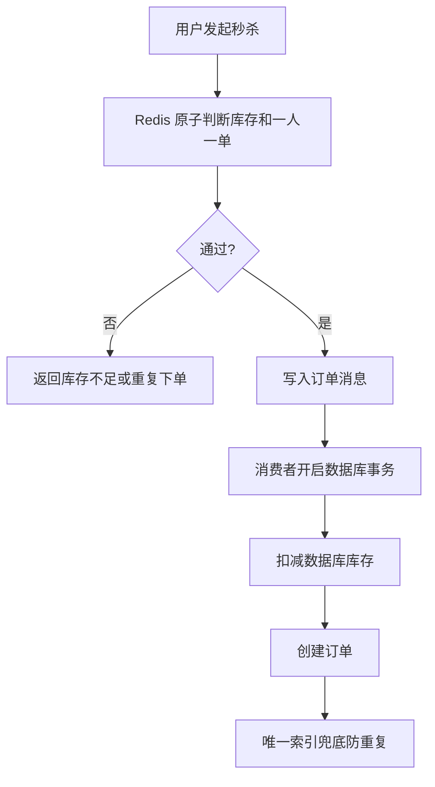
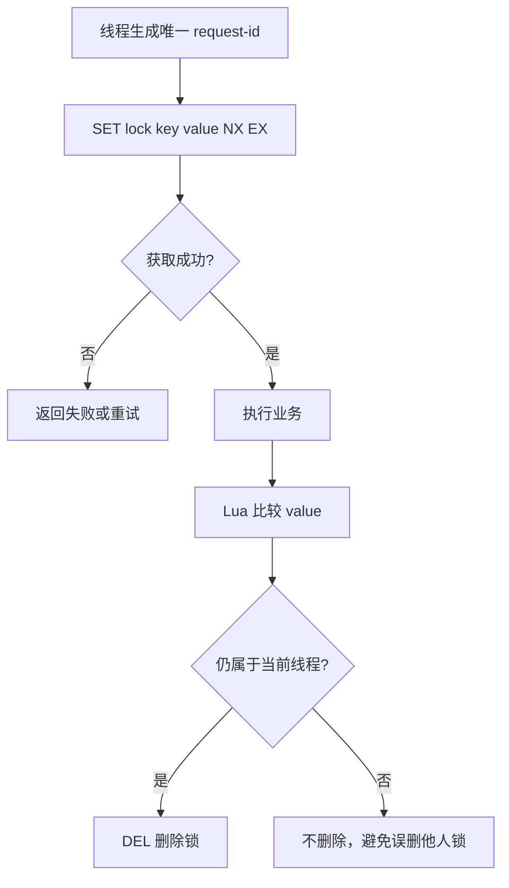
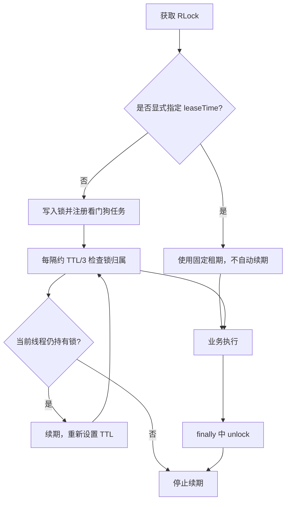

# Redis 实战：优惠券秒杀与分布式锁

## 1 优惠券秒杀基础

### 1.0 秒杀下单流程



### 1.1 全局唯一 ID

订单 ID 不能只使用数据库自增，因为多个服务或多个数据库实例可能产生冲突。常见做法是用时间戳、业务序列和机器标识组成 Redis 自增 ID。

全局唯一 ID 需要同时满足唯一性、趋势递增、信息安全和高性能。时间戳用于区分时间段，序列号用于保证同一时间段内不重复，机器标识用于区分不同实例。

```java
long timestamp = System.currentTimeMillis() - BEGIN_TIMESTAMP;
long sequence = stringRedisTemplate.opsForValue()
        .increment("icr:order:" + LocalDate.now());
long orderId = (timestamp << COUNT_BITS) | sequence;
```

实际生产环境还要考虑时钟回拨、序列溢出和分布式部署，必要时使用成熟的雪花算法组件。

### 1.2 秒杀资格判断

秒杀请求需要同时判断活动时间、库存和一人一单。库存扣减必须是原子操作，否则并发请求会导致超卖。

## 2 库存超卖问题

超卖是指库存为 1 时，多个并发请求都读到“还有库存”，最终却创建了多个订单。根因是“查询库存”和“扣减库存”之间存在时间间隔，多个线程可以同时通过查询。

### 2.1 悲观锁与乐观锁

| 方案 | 做法 | 优点 | 缺点 |
| --- | --- | --- | --- |
| 悲观锁 | 查询时加数据库行锁 | 简单直观 | 并发低、等待时间长 |
| 乐观锁 | 使用版本号或库存条件更新 | 并发性能更好 | 失败后需要重试或返回 |
| Redis 原子扣减 | 使用 Lua 一次完成判断和扣减 | 快、减少数据库压力 | 需要处理 Redis 与数据库一致性 |

选择原则：并发量较低且事务逻辑复杂时可以使用数据库锁；并发量较高时，把资格判断前移到 Redis，并用数据库唯一索引和事务作为最终兜底。

### 2.2 数据库乐观锁

```sql
UPDATE tb_seckill_voucher
SET stock = stock - 1
WHERE voucher_id = ? AND stock > 0;
```

如果更新行数为 0，说明库存不足或并发竞争失败。

## 3 一人一单

数据库应建立 `(user_id, voucher_id)` 唯一索引，Redis 预判断只能提高性能，不能替代最终一致性约束。

```sql
ALTER TABLE tb_voucher_order
ADD UNIQUE KEY uk_user_voucher (user_id, voucher_id);
```

## 4 Redis 分布式锁

分布式锁用于协调多个 JVM、多个服务器或多个进程之间的并发访问。Java 的 `synchronized` 只能锁住当前 JVM，Redis 锁才能让不同实例看到同一把锁。

### 4.0 加锁与解锁流程



### 4.1 基本原理

锁的本质是一个唯一 key：获取锁时仅当 key 不存在才写入；释放锁时删除 key。锁必须设置过期时间，防止持有锁的服务崩溃后永远不释放。

```text
SET lock:order:user:1001 request-id NX EX 10
```

`NX` 表示 key 不存在时才写入，`EX` 设置过期秒数。新代码应优先使用带 NX 和 EX 的 SET，而不是把 SETNX 与 EXPIRE 分成两步。

一个合格的分布式锁至少要考虑：互斥性、避免死锁、锁的归属、释放操作的原子性，以及业务执行时间超过 TTL 时的续期问题。

### 4.2 正确释放锁

不能直接 DEL lockKey，因为锁可能已经过期并被其他线程重新获取。释放时要比较 value 是否仍是当前线程的 request-id。

```lua
if redis.call('GET', KEYS[1]) == ARGV[1] then
    return redis.call('DEL', KEYS[1])
end
return 0
```

Lua 脚本让比较和删除在 Redis 内部一次完成，避免并发间隙。

### 4.3 Redisson

Redisson 将加锁、解锁、可重入计数、看门狗续期和等待重试封装成 Java API。`RLock` 是分布式锁对象，多个 JVM 使用相同的锁名称时会竞争同一个 Redis key。

```java
RLock lock = redissonClient.getLock("lock:order:" + userId);
boolean locked = lock.tryLock(1, 10, TimeUnit.SECONDS);
if (!locked) {
    return Result.fail("请稍后重试");
}
try {
    // 执行业务逻辑
} finally {
    if (lock.isHeldByCurrentThread()) {
        lock.unlock();
    }
}
```

不要在没有持有锁的线程中调用 unlock。生产项目优先使用经过验证的 Redisson，而不是重复手写完整锁实现。

### 4.4 看门狗机制

#### 4.4.1 定义

看门狗（Watchdog）是 Redisson 提供的自动续期机制，用来解决“业务代码还没有执行完，但锁的固定 TTL 已经到期”的问题。它会在锁被当前线程持有期间，定时把锁的有效期重新延长；业务完成并调用 `unlock()` 后，续期任务停止，锁被释放。

可以把它理解为一个定时检查器：只要持锁线程还活着、锁还属于当前线程，就继续延长 TTL；一旦线程释放锁或进程异常，续期停止，锁最终自动过期。

#### 4.4.2 触发条件

使用 `lock()` 或 `tryLock(waitTime, TimeUnit)`，并且没有显式传入 `leaseTime` 时，Redisson 通常会启用看门狗。默认锁租期由 `lockWatchdogTimeout` 控制，常见默认值为 30 秒，续期任务通常每隔租期的三分之一执行一次，也就是约 10 秒一次。

如果显式指定了租期，例如 `tryLock(1, 10, TimeUnit.SECONDS)`，表示锁最多持有 10 秒，Redisson 通常不会无限续期。业务执行时间可预测时可以指定租期；执行时间不确定时可使用看门狗，但仍要设置合理的超时和监控。

#### 4.4.3 工作流程



#### 4.4.4 看门狗解决的问题

```java
RLock lock = redissonClient.getLock("lock:order:" + userId);
lock.lock(); // 未指定 leaseTime，交给看门狗续期
try {
    createOrder(); // 即使执行超过 30 秒，锁也会被自动续期
} finally {
    lock.unlock(); // 业务完成，取消续期并释放锁
}
```

没有看门狗时，固定 10 秒租期可能在第 10 秒自动释放；此时另一个线程获得同一把锁，两个线程就可能同时执行临界区。看门狗只能延长“当前进程仍持有的锁”，不能替代 finally 解锁，也不能保证进程宕机时立即释放。

#### 4.4.5 优点与缺点

| 方案 | 优点 | 缺点 | 适用场景 |
| --- | --- | --- | --- |
| 固定 leaseTime | 生命周期明确，Redis 续期流量少 | 业务超时后锁会提前释放，可能产生并发安全问题 | 业务耗时稳定且可准确估算 |
| 看门狗自动续期 | 业务耗时不确定时仍能保持锁，进程异常后最终会自动过期 | 会产生定时续期开销；网络长时间中断时仍需评估风险 | 业务执行时间波动较大的临界区 |

使用看门狗时要避免把锁持有时间无限拉长：代码必须在 `finally` 中释放锁，并设置监控、超时和故障告警。

### 4.5 锁的常见问题

| 问题 | 原因 | 处理方式 |
| --- | --- | --- |
| 误删他人锁 | 只按 key 删除 | value 保存唯一标识并用 Lua 校验 |
| 锁永久不释放 | 服务宕机 | 设置过期时间 |
| 业务执行时间过长 | 固定 TTL 不足 | 看门狗续期或合理延长 TTL |
| 集群故障导致锁异常 | 单节点故障 | 使用成熟的 Redisson 或多节点方案 |

## 5 本篇总结

1. 秒杀系统要处理全局 ID、库存扣减和一人一单。
2. 数据库唯一索引是防止重复订单的最终保障。
3. Redis 分布式锁必须同时具备唯一 value、过期时间和原子释放。
4. Redisson 适合生产环境处理可重入锁、续期和重试。
5. 看门狗在未显式指定 leaseTime 时自动续期，业务完成后必须在 finally 中 unlock。
