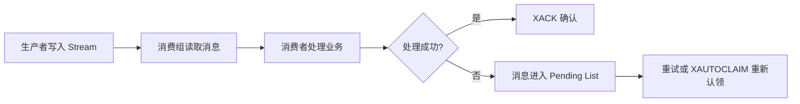

# Redis 实战：秒杀优化与消息队列

## 1 秒杀流程优化

### 1.1 同步下单的问题

同步流程把资格判断、库存扣减、订单写入和响应全部放在一次请求中，数据库压力大，接口响应时间长。优化思路是：Redis 快速完成资格判断，消息队列异步创建订单。

```text
请求 -> Redis 判断库存与一人一单 -> 写入消息 -> 立即返回
    -> 消费者异步创建订单并扣减数据库库存
```

同步下单的优点是代码直观、请求结束时可以直接返回订单结果；缺点是请求线程长时间占用数据库连接，突发流量会把数据库压垮。异步下单把“快速判断”和“慢速落库”拆开，用户先得到排队结果，消费者再完成最终订单。

### 1.2 Lua 脚本完成原子判断

```lua
-- KEYS[1] 库存 key，KEYS[2] 下单用户集合，ARGV[1] 用户 ID
local stock = tonumber(redis.call('GET', KEYS[1]))
if stock == nil or stock <= 0 then
    return 1
end
if redis.call('SISMEMBER', KEYS[2], ARGV[1]) == 1 then
    return 2
end
redis.call('DECR', KEYS[1])
redis.call('SADD', KEYS[2], ARGV[1])
return 0
```

Lua 脚本在 Redis 中连续执行，其他客户端不会插入命令，因此判断与修改具有原子性。

## 2 Redis 消息队列

消息队列的核心概念：生产者发送消息，队列暂存消息，消费者读取并处理消息。可靠消息还需要确认、重试、幂等和失败消息处理。

### 2.0 消息可靠性流程



### 2.1 List 队列

```text
# 生产者
RPUSH queue:order {"userId":1001,"voucherId":10}

# 消费者，阻塞等待消息
BLPOP queue:order 0
```

优点是简单；缺点是消息被取出后如果消费者宕机，消息可能丢失，也不方便确认和重试。

| 优点 | 缺点 | 适用场景 |
| --- | --- | --- |
| 命令少，学习成本低；支持阻塞读取 | 没有消费确认和消费组；取出后宕机可能丢消息 | 对可靠性要求低的简单任务 |

### 2.2 Pub/Sub

```text
# 订阅者
SUBSCRIBE order-channel

# 发布者
PUBLISH order-channel order-created
```

Pub/Sub 适合实时通知，但没有消息持久化和确认机制。订阅者离线期间发布的消息不会补发。

| 优点 | 缺点 | 适用场景 |
| --- | --- | --- |
| 一条消息可以广播给多个订阅者，实时性好 | 不保存历史消息，无法确认和重试 | 在线用户通知、配置变更广播 |

### 2.3 Stream

Stream 是追加式日志，支持消息 ID、消费组、待处理消息和确认机制。

```text
# 添加消息
XADD stream.orders * userId 1001 voucherId 10

# 创建消费组，0 表示从最早消息开始
XGROUP CREATE stream.orders order-group 0 MKSTREAM

# 消费者读取新消息
XREADGROUP GROUP order-group worker-1 COUNT 1 BLOCK 2000 STREAMS stream.orders >

# 处理成功后确认
XACK stream.orders order-group 1710000000000-0
```

Redis Streams 支持消费组内多个消费者分摊消息，并通过 XACK 确认处理完成；未确认消息可通过待处理列表重新认领。

| 优点 | 缺点 | 适用场景 |
| --- | --- | --- |
| 消息持久化、消费组、确认和重试机制较完整 | 命令和运维概念更多，需要处理 Pending List 和幂等 | 异步下单、订单事件、可靠任务 |

### 2.4 消息队列对比

| 方案 | 持久化 | 确认机制 | 适用场景 |
| --- | --- | --- | --- |
| List | 弱 | 无内置确认 | 简单任务队列 |
| Pub/Sub | 无 | 无 | 实时广播通知 |
| Stream | 有 | XACK、消费组 | 异步订单、可靠消费 |

## 3 异步秒杀下单

```java
// Web 请求线程只负责资格判断和发送消息
if (executeSeckillScript(userId, voucherId) != 0) {
    return Result.fail("库存不足或已经购买");
}
stringRedisTemplate.opsForStream().add(
        StreamRecords.newRecord().ofMap(message).withStreamKey("stream.orders"));
return Result.ok("排队成功");
```

消费者收到消息后执行数据库事务：创建订单、扣减库存、处理唯一索引冲突。消费失败时记录日志并重试，不能静默丢弃消息。

消费者必须保证幂等：同一条消息即使被重试两次，也只能创建一个订单。常见做法是使用订单唯一索引、业务状态判断或记录已处理消息 ID。

## 4 本篇总结

1. Redis 负责快速完成秒杀资格判断，数据库负责最终订单落库。
2. Lua 脚本适合把库存判断、扣减和一人一单合并成原子操作。
3. List 简单但可靠性弱，Pub/Sub 适合广播，Stream 更适合可靠异步任务。
4. 消费者必须考虑确认、重试、幂等和异常消息处理。
