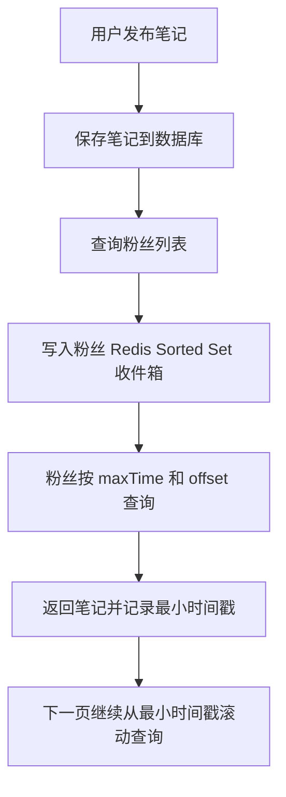

# Redis 实战：达人探店与好友关注

## 1 达人探店

达人探店模块的核心是“内容在数据库，互动状态在 Redis”。数据库保存笔记正文、图片和作者关系；Redis 保存点赞集合、点赞排序和热点状态。

### 1.1 发布探店笔记

笔记正文和图片地址保存在 MySQL，Redis 只适合保存热点、点赞数等高频访问数据。发布成功后可以把笔记 ID 加入热门列表。

### 1.2 查询探店笔记

查询列表时先分页查数据库，再批量查询作者信息和点赞状态，避免循环产生大量 SQL 请求。

```java
List<Blog> blogs = blogMapper.selectPage(page, query);
for (Blog blog : blogs) {
    blog.setLiked(stringRedisTemplate.opsForSet()
            .isMember("blog:liked:" + blog.getId(), userId));
}
```

### 1.3 点赞功能

Set 可以保存点赞用户，天然去重；String 可以保存点赞数量。

```text
# 点赞
SADD blog:liked:1001 2001
INCR blog:likes:1001

# 取消点赞
SREM blog:liked:1001 2001
DECR blog:likes:1001
```

取消点赞前应先判断用户是否点过赞，避免重复扣减数量。高并发场景可使用 Lua 将判断与修改合并。

| 方案 | 优点 | 缺点 | 适用场景 |
| --- | --- | --- | --- |
| 只修改数据库 | 数据来源单一，一致性直观 | 高并发下数据库压力大 | 低流量后台系统 |
| Redis Set 记录用户 + 数据库保存数量 | Set 自动去重，判断是否点赞很快 | Redis 与数据库可能短暂不一致 | 高并发点赞 |
| Redis Lua 原子更新 | 判断、添加和计数一次完成 | 脚本维护复杂，仍需异步落库 | 极高并发互动 |

### 1.4 点赞排行榜

Sorted Set 使用点赞时间作为 score，可以保留前几名点赞用户；如果只按点赞数排名，则使用点赞数量作为 score。

```text
ZADD blog:likes:1001 1710000000000 2001
ZREVRANGE blog:likes:1001 0 4
```

## 2 好友关注

关注关系是集合关系：用户 A 的关注集合与用户 B 的关注集合求交集，就能得到共同关注。Set 的价值在于自动去重和原生集合运算。

### 2.1 关注与取消关注

使用 Set 保存某个用户关注了谁：`follow:{userId}`。关注时 SADD，取消关注时 SREM。

```text
SADD follow:1001 2002
SREM follow:1001 2002
```

### 2.2 共同关注

两个用户的共同关注可以使用集合交集：

```text
SINTER follow:1001 follow:1002
```

如果结果很多，应限制查询数量或使用分页方案，避免一次返回过多数据。

## 3 Feed 流

### 3.0 Feed 推送与滚动分页



Feed 流用于把关注用户发布的内容推送给粉丝。常见方案有推模式、拉模式和推拉结合。

Feed 的本质是“每个用户的一份有序收件箱”。Sorted Set 的 score 保存发布时间，member 保存内容 ID；读取时再根据 ID 批量查询正文。

| 模式 | 做法 | 优点 | 缺点 |
| --- | --- | --- | --- |
| 推模式 | 发布时写入所有粉丝收件箱 | 读取快 | 粉丝多时写放大 |
| 拉模式 | 读取时合并关注者内容 | 发布简单 | 读取计算量大 |
| 推拉结合 | 普通用户推送，名人用户读取时拉取 | 平衡读写 | 实现复杂 |

推送到粉丝收件箱通常使用 Sorted Set，score 使用发布时间，member 使用笔记 ID：

```text
ZADD feed:1002 1710000000000 blog:9001
ZREVRANGEBYSCORE feed:1002 1710000000000 0 LIMIT 0 10
```

分页时保存最小时间戳和重复数量，避免仅使用固定 offset 导致新内容插入后分页错乱。

## 4 本篇总结

1. Set 适合点赞用户、关注关系和共同关注计算。
2. Sorted Set 适合点赞排行榜和按时间排序的 Feed 收件箱。
3. 业务正文放数据库，Redis 保存高频状态和排序索引。
4. Feed 设计要在推送成本和读取成本之间做权衡。
