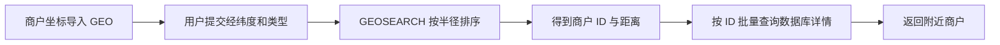
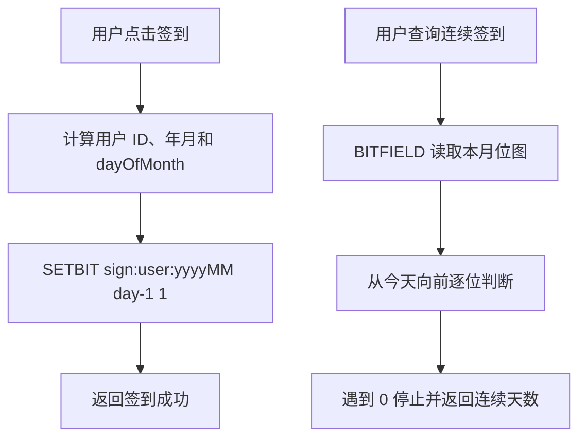
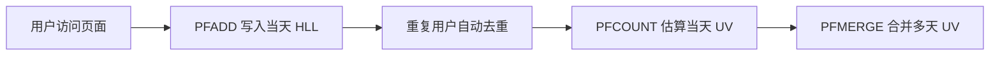

# Redis 实战：附近商户、签到与 UV 统计

## 1 附近商户

GEO 是“地理坐标 + 距离检索”的数据结构能力。它适合回答“某个位置附近有哪些对象”，不负责保存完整的商户详情，因此通常需要先查 GEO 得到 ID，再回数据库查询详情。

### 1.0 GEO 查询流程



### 1.1 GEO 数据结构

Redis GEO 基于 Sorted Set 保存经纬度，并提供按距离查询成员的命令。适合附近商户、附近门店和配送范围查询。

```text
# 添加商户经纬度，格式为 longitude latitude member
GEOADD shop:geo 120.1551 30.2741 shop:1001

# 查询当前位置 5 千米内的商户，并返回距离
GEOSEARCH shop:geo FROMLONLAT 120.1500 30.2700 BYRADIUS 5 km WITHDIST COUNT 20 ASC
```

经纬度顺序是经度、纬度，不要写反。Redis GEO 适合距离范围查询，不适合复杂地图分析。

### 1.2 导入商户数据

可以在应用启动时遍历数据库商户，把商户坐标批量写入 Redis。商户坐标为空时应跳过并记录日志。

```java
for (Shop shop : shops) {
    if (shop.getX() == null || shop.getY() == null) {
        continue;
    }
    stringRedisTemplate.opsForGeo().add("shop:geo",
            new Point(shop.getX(), shop.getY()), "shop:" + shop.getId());
}
```

## 2 用户签到

签到的关键是把二维信息压缩成一维位图：key 表示用户和月份，offset 表示当月第几天，bit 值 1 表示已签到。这样一个月最多只需要几十个 bit。

### 2.0 签到流程图



### 2.1 Bitmap

Bitmap 是对 String 的位操作。可以把一个月的每天映射到一个 bit：签到为 1，未签到为 0。

```text
# 6 月 1 日签到，日期从 1 开始，所以 offset 使用 0
SETBIT sign:1001:2026:06 0 1
GETBIT sign:1001:2026:06 0
BITCOUNT sign:1001:2026:06
```

Bitmap 节省内存，但只适合是否发生过这种布尔状态，不适合保存签到时间、备注等复杂信息。

### 2.2 连续签到

从当天 offset 向前读取位，可以用位移统计连续的 1；也可以在业务层循环查询。当需要复杂统计时，应评估计算成本。

## 3 UV 统计

UV 是独立访客数，同一个用户一天访问多次只计一次；PV 是页面访问次数，同一用户重复访问会重复计数。HyperLogLog 只能估算 UV 数量，不能列出具体用户，也不能用于精确账务。

### 3.0 UV 统计流程图



### 3.1 HyperLogLog

HyperLogLog 用极小内存估算集合基数，标准误差通常小于 1%，适合统计独立访客数，不适合要求精确名单的场景。

```text
PFADD uv:2026-06-01 user:1001 user:1002 user:1001
PFCOUNT uv:2026-06-01
PFMERGE uv:week:23 uv:2026-06-01 uv:2026-06-02 uv:2026-06-03
```

### 3.2 数据结构选择

| 需求 | 推荐结构 | 是否精确 | 典型命令 |
| --- | --- | --- | --- |
| 附近商户 | GEO | 距离查询精确到结构能力范围 | GEOADD、GEOSEARCH |
| 每日签到 | Bitmap | 精确 | SETBIT、BITCOUNT |
| 大规模 UV | HyperLogLog | 估算 | PFADD、PFCOUNT |

| 方案 | 优点 | 缺点 |
| --- | --- | --- |
| Set 统计 UV | 结果精确，可以查询具体用户 | 用户量大时占用大量内存 |
| Bitmap 统计签到 | 极度节省空间，统计精确 | 只能表达固定 offset 的 0/1 状态 |
| HyperLogLog 统计 UV | 内存占用极低，适合百万级以上访客 | 有误差，不能获取成员明细 |

## 4 本篇总结

1. GEO 用经纬度索引附近商户，注意经纬度参数顺序。
2. Bitmap 用一个 bit 表示一天签到状态，节省内存。
3. HyperLogLog 适合大规模 UV 估算，结果不是精确值。
4. 数据结构应根据精确性、内存和查询方式选择。
