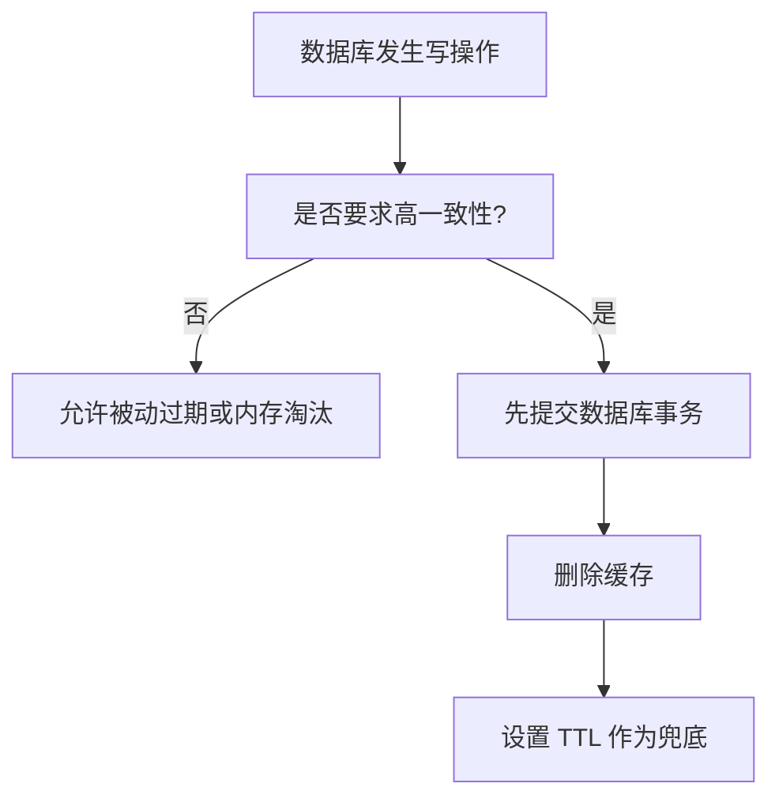
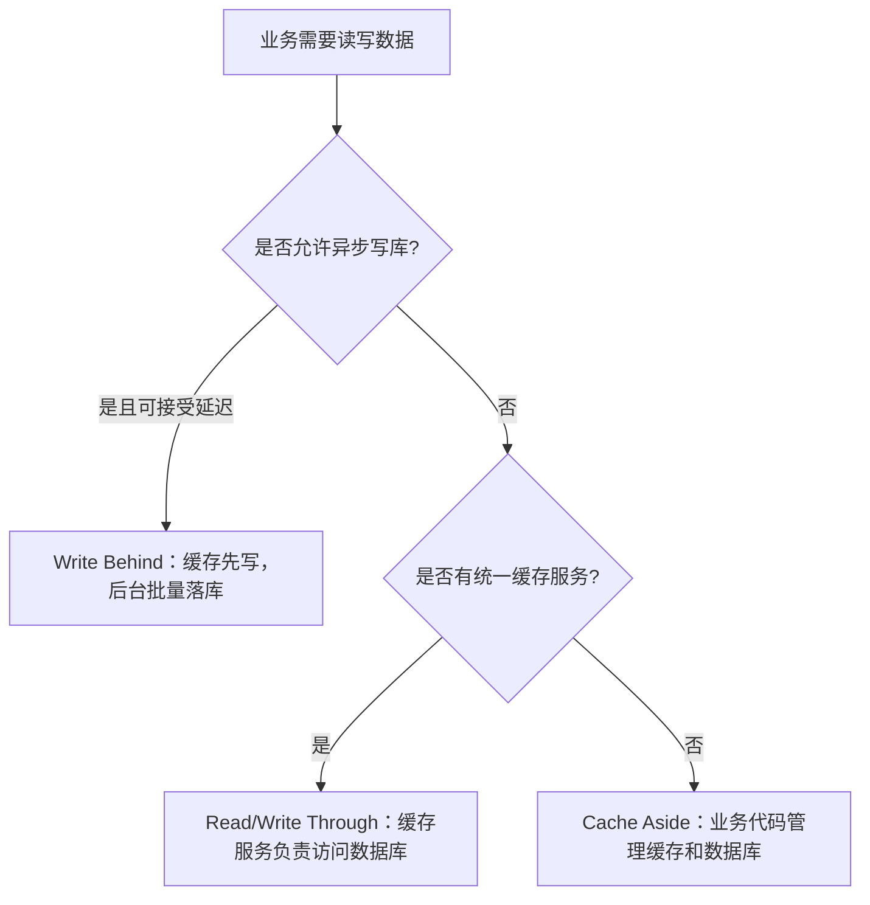

# Redis 实战：流程图与版本演进

## 1 三类缓存问题对比

| 问题 | 触发范围 | 直接后果 | 主要处理方式 |
| --- | --- | --- | --- |
| 缓存穿透 | 单个或大量不存在的 key | 请求持续打到数据库 | 缓存空值、布隆过滤器、参数校验 |
| 缓存击穿 | 一个热点 key 失效 | 并发重建同一份数据 | 互斥锁、逻辑过期、热点永不过期 |
| 缓存雪崩 | 大量 key 同时失效或 Redis 故障 | 大量请求冲击数据库 | TTL 随机化、集群、限流、多级缓存 |

## 2 缓存一致性决策流程

推荐使用 Cache Aside Pattern：读时缓存未命中再查库并回填；写时先更新数据库，再删除缓存。删除缓存比更新缓存写入次数更少，TTL 可以防止异常情况下的永久脏数据。

### 2.1 三种缓存模式的选择

| 模式 | 图片中的核心定义 | 优点 | 缺点 |
| --- | --- | --- | --- |
| Cache Aside | 缓存调用者在更新数据库的同时更新缓存 | 简单灵活、改造成本低 | 业务代码需要处理双写一致性 |
| Read/Write Through | 缓存与数据库整合为一个服务，由服务维护一致性 | 业务层简单，规则集中 | 需要专门服务或框架，接入成本高 |
| Write Behind | 调用者只写缓存，由异步线程持久化数据库 | 写入性能好，可批量合并 | 数据延迟，服务故障时存在丢数据风险 |

## 3 资料中的方案演进

### 3.1 短信登录：Session 版到 Redis 版

| 版本 | 保存位置 | 登录状态校验 | 局限与改进 |
| --- | --- | --- | --- |
| 第 1 版 | Tomcat Session | Cookie 携带 Session ID | 单机可用，集群请求可能访问到不同 Session |
| 第 2 版 | Redis String 保存验证码、Hash 保存用户 | Header 携带 token 查询 Redis | 多台 Tomcat 共享状态 |
| 第 3 版 | Redis + 刷新拦截器 | 所有请求刷新 token，业务拦截器负责鉴权 | 解决只访问公开接口导致 token 过期 |

### 3.2 商户缓存：直查数据库到抗风险缓存

| 版本 | 查询逻辑 | 解决的问题 |
| --- | --- | --- |
| 第 1 版 | 直接查询数据库 | 功能可用，但数据库压力大 |
| 第 2 版 | Redis 命中返回，未命中查库并回填 | 降低读压力 |
| 第 3 版 | 增加 TTL、更新数据库后删除缓存 | 控制内存并改善一致性 |
| 第 4 版 | 缓存空值、互斥锁、逻辑过期 | 处理穿透、击穿和热点重建 |

### 3.3 秒杀：同步下单到异步消息

| 版本 | 处理方式 | 瓶颈 |
| --- | --- | --- |
| 第 1 版 | 每次请求都查库、扣库存、创建订单 | 数据库压力大，容易超卖 |
| 第 2 版 | 数据库 CAS/悲观锁 + 唯一索引 | 能保证正确性，但吞吐有限 |
| 第 3 版 | Redis Lua 原子判断库存和一人一单 | 快速挡住无资格请求 |
| 第 4 版 | Stream/阻塞队列异步创建订单 | 缩短请求耗时，需处理确认、重试和幂等 |

### 3.4 分布式锁：手写锁到 Redisson

| 版本 | 实现 | 新增能力 |
| --- | --- | --- |
| 第 1 版 | SETNX 获取锁、DEL 释放 | 代码简单，但可能永久占锁、误删他人锁 |
| 第 2 版 | SET NX EX + 唯一 value + Lua 解锁 | 具备过期保护和原子释放 |
| 第 3 版 | Redisson RLock | 可重入、等待重试、看门狗续期、多锁组合 |

#### 3.4.1 看门狗机制的版本演进

| 阶段 | 锁的有效期方式 | 主要风险或改进 |
| --- | --- | --- |
| 固定 TTL | 获取锁时写入固定过期时间 | 业务执行超过 TTL 后锁提前释放 |
| 手动续期 | 业务线程定期调用 `EXPIRE` | 需要自己管理定时任务，容易漏续期或误续期 |
| Redisson 看门狗 | Redisson 自动检查锁归属并按约续期 | 代码简单，进程异常后锁仍会最终过期 |

看门狗不是永久锁：只有当前线程仍持有锁时才续期；调用 `unlock()` 后续期停止；进程宕机或网络故障导致无法续期时，锁会在最后一次 TTL 到期后释放。显式传入 `leaseTime` 时通常使用固定租期，不依赖看门狗。

### 3.5 消息队列：List、Pub/Sub 到 Stream

| 版本 | Redis 能力 | 可靠性 |
| --- | --- | --- |
| List | `LPUSH`/`BRPOP` 队列 | 消费后异常可能丢失 |
| Pub/Sub | 发布广播 | 无持久化，离线订阅者收不到 |
| Stream | 日志、消费组、Pending List、`XACK` | 支持至少一次投递和失败重试 |

## 4 Redis 与依赖版本变化

### 4.1 GEO 命令版本

- `GEORADIUS` 是旧式半径查询命令，Redis 6.2 起推荐使用 `GEOSEARCH`。
- `GEOSEARCHSTORE` 可以把查询结果保存到另一个 key，同样是 Redis 6.2 引入的能力。
- 资料中的 Spring Data Redis 2.3.9 不支持 `GEOSEARCH`，因此示例升级到 Spring Data Redis 2.6.2 和 Lettuce 6.1.6.RELEASE。

### 4.2 Stream 版本

- Redis Stream 在 Redis 5.0 引入。
- 直接用 `XREAD` 读取适合单消费者场景。
- 使用 `XREADGROUP`、`XACK` 和 Pending List 适合多个消费者协作处理订单。

### 4.3 命令兼容性

- `REPLICAOF` 是 Redis 5.0 后推荐的主从配置命令，旧资料中的 `SLAVEOF` 仍可能兼容，但新项目应使用 `REPLICAOF`。
- `SETEX`、`SETNX` 在新代码中可分别替换为 `SET key value EX seconds`、`SET key value NX`，便于将写入和过期条件放在一次操作中。

## 5 本篇总结

1. 资料中的实战代码呈现出“先实现功能，再逐步解决并发、一致性和可靠性”的演进路线。
2. 缓存穿透、击穿、雪崩的区别在于失效数据范围和请求形态，不能用同一种方案机械处理。
3. 秒杀和消息队列的优化重点是把高并发判断前移到 Redis，把耗时落库放到异步消费者。
4. 选择命令和依赖时要关注 Redis 服务端版本与 Spring Data Redis 客户端版本是否匹配。
